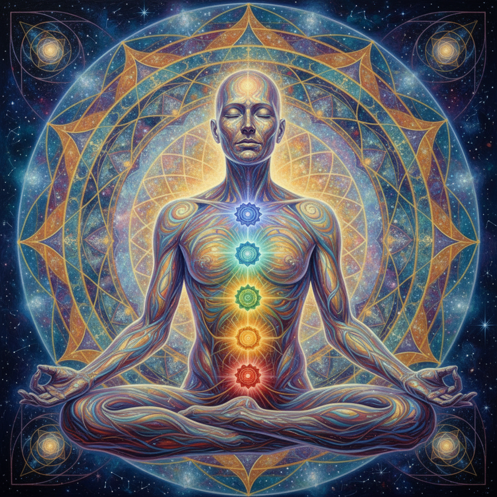

# Visionary Realism 幻视现实主义

> **时期：** 1960年代–至今  
> **关键词：** 灵性体验、精密技法、意识扩展、神秘主义、内在视觉

## 概述

Visionary Realism（幻视现实主义）是用写实技法描绘内在灵性体验的绘画流派。与幻想现实主义不同，它更强调冥想、意识扩展和神秘体验的视觉化——亚历克斯·格雷的透明人体、罗伯特·文图萨的宇宙曼陀罗——这些画家试图用精确的笔触记录肉眼看不见但心灵能感知的维度。

## 风格特征

- **精密写实**：照片级的技术精度
- **灵性主题**：冥想、脉轮、意识层次
- **透明叠加**：多层现实的同时呈现
- **对称构图**：曼陀罗式的宇宙秩序
- **发光效果**：内在光芒的视觉化

## 代表人物与作品

- 亚历克斯·格雷 神圣镜像系列
- 罗伯特·文图萨 宇宙意识
- 阿曼达·塞奇 灵性肖像
- 马克·海森 自然神秘

## 概念图

