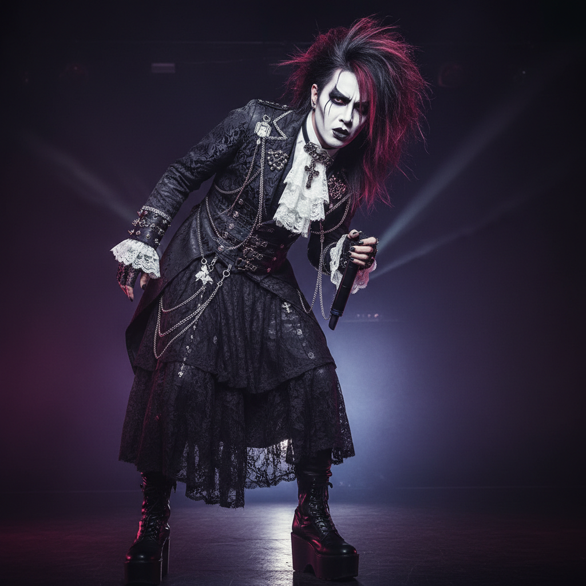

# Visual Kei 视觉系



> **"华丽妆容、哥特服装、性别模糊——日本摇滚的视觉革命。"**

## 概述

| 维度 | 描述 |
|------|------|
| 时期 | 1980s–至今 |
| 别名 | Visual Kei, V系, ヴィジュアル系 |
| 核心色彩 | 黑色、红色、银色、紫色、白色 |
| 关键元素 | 华丽妆容、夸张发型、哥特/洛可可服装、性别模糊 |
| 代表人物 | X Japan, Dir en grey, Malice Mizer, the GazettE |
| 关联风格 | Gothic, Glam Rock, Harajuku, J-Rock |

---

## 历史脉络

| 年份 | 事件 |
|------|------|
| 1982 | X Japan 成立——Visual Kei 先驱 |
| 1989 | X Japan 主流突破——Visual Kei 命名 |
| 1992 | Malice Mizer——哥特/洛可可 Visual Kei |
| 1999 | Dir en grey——重型 Visual Kei |
| 2000s | 全球传播——欧美粉丝社区 |
| 2010s | 新一代乐队继续传统 |

### 核心哲学

Visual Kei 的精神是**"音乐是视觉的——看起来如何和听起来如何同样重要"**：
- 视觉 = 音乐的一部分（不是附属品）
- 性别 = 流动的（"美不分男女"）
- 极端 = 表达（"越夸张越真实"）
- 日本 = 独特（"这是我们的摇滚"）
- "如果你不能震撼观众的眼睛，就不能震撼他们的耳朵"

---

## 视觉语法

### 色彩系统

```
主色：
  黑色 (#000000) — 哥特、力量
  红色 (#8B0000) — 血液、激情
  银色 (#C0C0C0) — 金属、未来
  紫色 (#4B0082) — 神秘、贵族
  白色 (#FFFFFF) — 面部、对比

辅色：
  金色 (#FFD700) — 洛可可、华丽
  蓝色 (#0000FF) — 冷酷
  粉色 (#FF69B4) — 甜美系

质感：
  蕾丝 — 哥特、洛可可
  皮革 — 摇滚、力量
  丝绒 — 贵族、华丽
  金属 — 链条、铆钉
  PVC — 未来、光泽
```

### 标志性元素

| 类别 | 元素 |
|------|------|
| 发型 | 极端造型、多色、不对称、大量发胶 |
| 妆容 | 浓重眼妆、白色底妆、唇色 |
| 服装 | 哥特/洛可可/朋克混搭、紧身裤 |
| 配饰 | 十字架、链条、戒指、耳环 |
| 分支 | Kote-kei(哥特)、Oshare-kei(甜美)、Nagoya-kei(重型) |
| 态度 | 华丽、极端、性别流动、艺术 |

---

## 与千禧怀旧的关系

### 日本亚文化的全球输出
- Visual Kei = 日本对"摇滚"的独特诠释
- 影响了全球的 Gothic/Emo/Scene 文化
- 与 Harajuku 时尚共同构成"日本酷"
- "日本的东西总是更极端、更有趣"

### 与西方 Glam/Gothic 的区别
- Glam Rock = 70s 英国、David Bowie
- Gothic = 80s 英国、Bauhaus
- Visual Kei = 融合两者 + 日本美学
- 更精致、更极端、更"美"

---

## 中国语境

- Visual Kei 在中国的粉丝社区
- 与中国"哥特"/"暗黑"亚文化的交叉
- 中国 cosplay 文化中的 Visual Kei 元素
- 与中国"古风"的某些视觉交叉（华丽感）

---

## 设计应用

| 场景 | 应用方式 |
|------|----------|
| 音乐 | 专辑封面+MV+舞台设计+海报 |
| 时尚 | 哥特+洛可可+朋克混搭+华丽 |
| 活动 | 演唱会+cosplay+主题派对 |
| 数字 | 暗色+华丽+哥特字体+金属质感 |

---

## 相关风格

← [Gothic 哥特美学](gothic.md) | [Harajuku 原宿](harajuku-y2k.md) →

↑ [返回千禧怀旧目录](README.md) | [返回总目录](../README.md)
