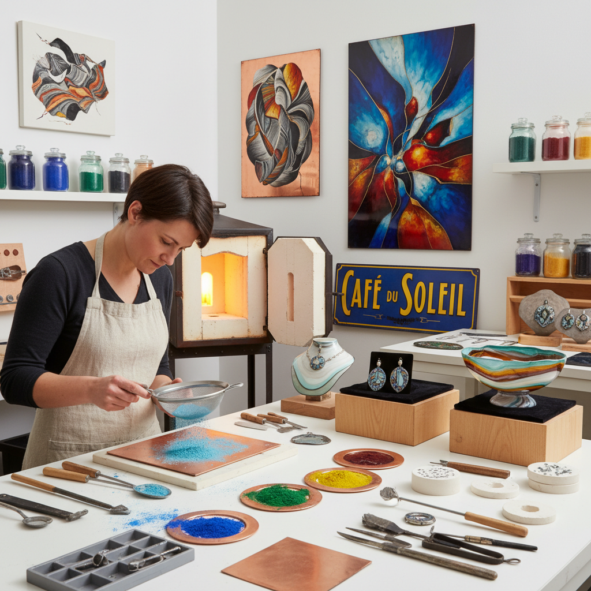

# Vitreous Enamel 玻璃质珐琅

> "Vitreous enamel is glass fused to metal — a marriage of fragility and strength that has preserved color with jewel-like brilliance for millennia, from Egyptian pectorals to modern architectural panels." — Unknown

## 概述

玻璃质珐琅（Vitreous Enamel）是将玻璃粉末（由二氧化硅、助熔剂和金属氧化物着色剂组成）熔融到金属基底上的装饰和保护技法。"Vitreous"意为"玻璃质的"——强调珐琅本质上是一层薄薄的玻璃。珐琅在750-850°C的高温下熔化，与金属表面形成化学结合，冷却后形成坚硬、光滑、色彩鲜艳的玻璃质表面。

玻璃质珐琅是所有珐琅技法的基础——无论是景泰蓝（cloisonné）、内填珐琅（champlevé）还是画珐琅（painted enamel），其核心材料都是玻璃质珐琅。玻璃质珐琅的优势在于：色彩永不褪色（因为颜色来自玻璃中的金属氧化物）、表面极其耐磨耐腐蚀、可以在各种金属上应用。从古埃及的首饰到现代的搪瓷锅具和建筑面板，玻璃质珐琅无处不在。

## 核心特征

| 特征 | 描述 |
|------|------|
| 玻璃质 | 本质是玻璃 |
| 熔融 | 高温熔融到金属 |
| 永久色彩 | 色彩永不褪色 |
| 耐久 | 极其耐磨耐腐蚀 |
| 通用 | 适用于多种金属 |
| 基础 | 所有珐琅技法的基础 |

## 视觉特征

- **光泽**：玻璃般的光泽
- **鲜艳**：鲜艳的色彩
- **光滑**：极其光滑的表面
- **透明/不透明**：可透明或不透明
- **深度**：色彩的深度感
- **宝石感**：宝石般的质感

## 代表作品

| 作品 | 艺术家 | 年代 | 意义 |
|------|--------|------|------|
| *Egyptian enamel jewelry* | 古埃及工匠 | 公元前 | 最早的珐琅应用 |
| *Byzantine enamel icons* | 拜占庭工匠 | 中世纪 | 宗教珐琅艺术 |
| *Industrial enamel signs* | Various | 19-20世纪 | 工业珐琅应用 |
| *Contemporary enamel art* | Various | 当代 | 当代珐琅艺术 |
| *Architectural enamel panels* | Various | 当代 | 建筑珐琅面板 |

## 历史时间线

| 时期 | 事件 |
|------|------|
| 公元前1500年 | 古埃及和迈锡尼的早期珐琅 |
| 拜占庭时期 | 珐琅在宗教艺术中的繁荣 |
| 中世纪 | 欧洲珐琅工艺的发展 |
| 18-19世纪 | 工业珐琅的兴起 |
| 20世纪 | 搪瓷制品的大规模生产 |
| 当代 | 珐琅在艺术和建筑中的复兴 |

## 中国语境

玻璃质珐琅在中国有悠久的历史——中国的景泰蓝（cloisonné）是世界上最著名的珐琅工艺之一。中国的珐琅工艺可追溯到元代（13世纪），在明代景泰年间达到高峰。中国的搪瓷工业在20世纪也有重要发展——搪瓷杯、搪瓷盆等日用品曾是中国家庭的标配。当代中国的珐琅艺术家在传统技法基础上进行创新，将珐琅应用于当代首饰、艺术品和建筑装饰。

## AI生成概念图

## 与其他风格的关系

- **Cloisonné** → 景泰蓝
- **Champlevé** → 内填珐琅
- **Painted Enamel** → 画珐琅
- **Limoges Enamel** → 利摩日珐琅
- **Torch Enameling** → 火炬珐琅
- **Industrial Design** → 工业设计

---

*浮光艺志 | Chronicle of Artistry*
