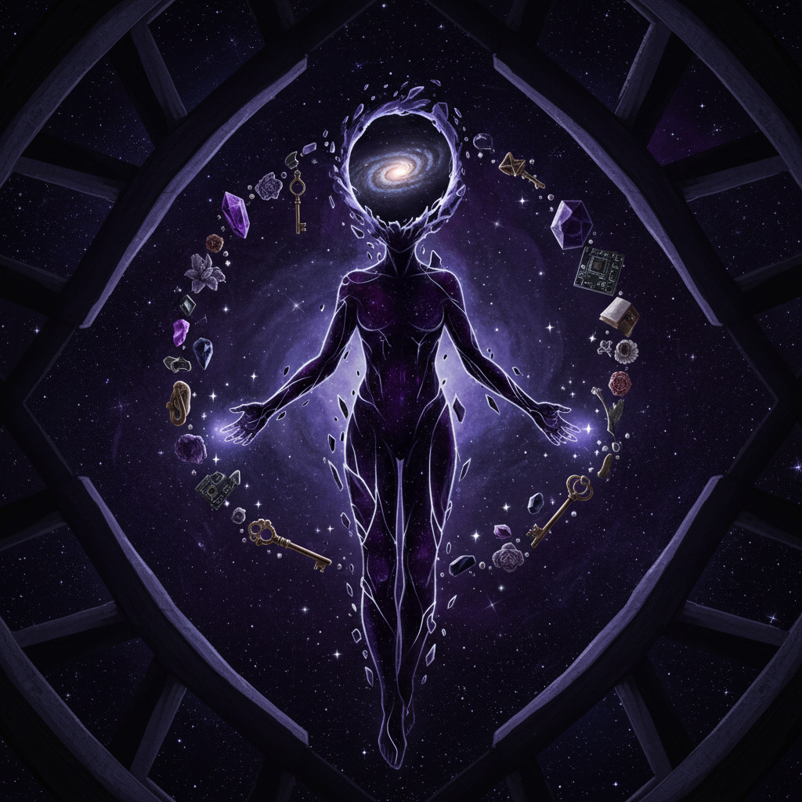

# Voidpunk Art 虚空朋克艺术

> "Voidpunk is the aesthetic of those who have been told they are not fully human — and who respond not by proving their humanity but by embracing the inhuman, the alien, the robotic, the monstrous, the void itself, finding liberation in the refusal to perform humanness for those who would deny it, creating art that celebrates the beauty of existing outside the boundaries of what society considers a proper person, and discovering that the void is not empty but full of possibility for those brave enough to inhabit it." — Unknown

## 概述

虚空朋克（Voidpunk）是一种起源于2010年代末的美学和身份运动，最初由无性恋（asexual）和无浪漫倾向（aromantic）社区发展，后来扩展到所有感觉自己被"去人性化"的群体。Voidpunk的核心理念是：既然社会否认某些人的"完整人性"，那么与其努力证明自己的人性，不如拥抱非人的身份——机器人、外星人、幽灵、虚空生物、抽象实体。

Voidpunk的视觉美学包括：非人形的角色设计、宇宙虚空和黑洞意象、机械和赛博格元素、幽灵和半透明的形态、以及对"人形"的有意解构。这种美学在数字艺术、角色设计、虚拟形象（avatar）设计和独立游戏中有广泛的应用。Voidpunk不仅是一种视觉风格，也是一种身份政治的表达——通过拥抱"非人"来挑战"人性"的规范性定义。

## 核心特征

| 特征 | 描述 |
|------|------|
| 非人 | 拥抱非人身份 |
| 虚空 | 虚空和黑洞意象 |
| 解构 | 人形的解构 |
| 赋权 | 通过非人获得赋权 |
| 数字 | 数字原生的美学 |
| 身份 | 身份政治的表达 |

## 视觉特征

- **虚空**：黑色和深紫色的虚空
- **非人**：非人形的角色
- **发光**：发光的眼睛和线条
- **碎片**：碎片化的身体
- **星空**：宇宙和星空元素
- **面具**：面具和无面孔

## 代表作品

| 作品 | 艺术家 | 年代 | 意义 |
|------|--------|------|------|
| *Voidpunk character designs* | Various | 2018起 | 社区角色设计 |
| *Avatar designs* | Various | 2020年代 | 虚拟形象设计 |
| *Indie games* | Various | 2020年代 | 独立游戏中的虚空朋克 |
| *Digital art communities* | Various | 2018起 | 在线社区的视觉文化 |
| *Zines and comics* | Various | 2020年代 | 独立出版物 |

## 历史时间线

| 时期 | 事件 |
|------|------|
| 2018 | Voidpunk概念的提出 |
| 2019 | 在线社区的形成 |
| 2020年代 | 美学的扩展和多样化 |
| 当代 | 与虚拟身份文化的融合 |

## 中国语境

虚空朋克在中国的直接传播有限，但其核心理念——通过拥抱"非人"来挑战规范性身份——在中国的网络亚文化中有共鸣。中国的一些数字艺术家和角色设计师在创作具有虚空朋克气质的作品——非人形的虚拟形象、宇宙虚空主题的插画、以及解构人形的角色设计。中国的虚拟主播（VTuber）文化中也有类似的实践——通过非人的虚拟形象来表达和探索身份。中国传统文化中的"化外之人"概念——超越人间规范的存在（如仙人、妖怪）——也与虚空朋克的精神有某种遥远的呼应。

## AI生成概念图

## 与其他风格的关系

- **Cyberpunk** → 赛博朋克
- **Gothic Art** → 哥特艺术
- **Digital Art** → 数字艺术
- **Queer Art** → 酷儿艺术
- **Posthumanism** → 后人类主义
- **Avatar Design** → 虚拟形象设计

---

*浮光艺志 | Chronicle of Artistry*
