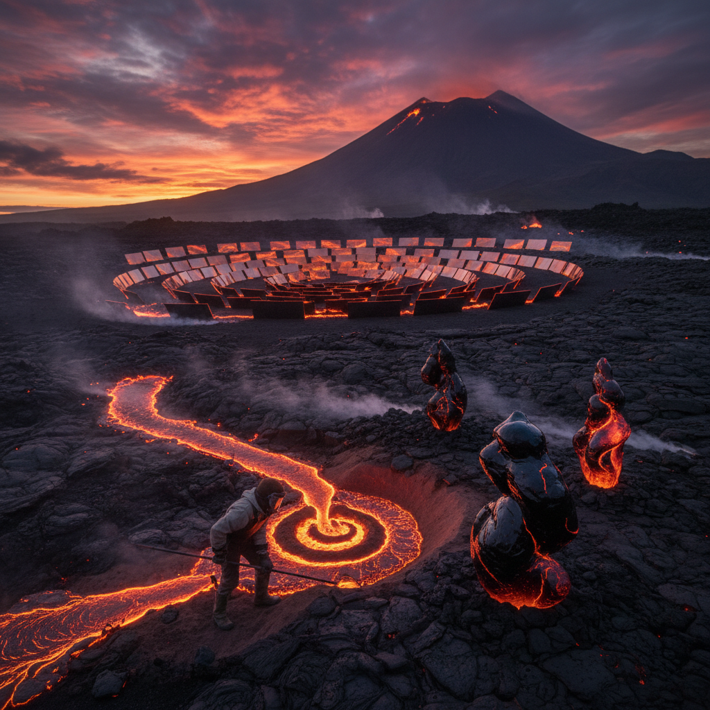

# Volcanic Art 火山艺术

> "Volcanic art works with the most primal creative force on Earth — the same force that built the continents, created the atmosphere, and made life possible. Magma is the original sculptor, lava the original painter, ash the original printmaker. Every volcanic eruption is an act of planetary creation, destroying one landscape to build another, and the volcanic artist simply joins this process already in progress, collaborating with forces that have been shaping the Earth for four and a half billion years." — Unknown

## 概述

火山艺术（Volcanic Art）是以火山活动——岩浆、熔岩、火山灰、火山岩、地热等——为灵感、材料和合作力量的艺术实践。火山是地球最强大的地质力量之一，能在数小时内创造新的地形、新的岛屿、新的矿物。

火山艺术的实践包括：1）熔岩铸造——将熔岩引导到模具中创造雕塑；2）火山材料——使用火山灰、浮石、黑曜石、玄武岩等火山材料创作；3）火山景观——以火山地貌为画布的大地艺术；4）地热艺术——利用地热能源和温泉进行创作；5）火山记录——记录和艺术化火山喷发过程；6）火山隐喻——用火山作为隐喻探索创造与毁灭、压力与释放。

## 核心特征

| 特征 | 描述 |
|------|------|
| 原始 | 原始的地球力量 |
| 创造 | 创造与毁灭并存 |
| 热量 | 极端的热量 |
| 材料 | 火山材料 |
| 地质 | 地质时间尺度 |
| 危险 | 危险与美并存 |

## 视觉特征

- **红黑**：熔岩的红与黑
- **流动**：熔岩的流动形态
- **纹理**：火山岩的丰富纹理
- **烟雾**：火山烟雾和蒸汽
- **晶体**：火山矿物晶体
- **荒凉**：火山荒原的壮美

## 代表作品

| 作品 | 艺术家 | 年代 | 意义 |
|------|--------|------|------|
| *Lava sculptures* | Various | 2000年代 | 熔岩铸造雕塑 |
| *Volcanic landscape art* | Various | 2010年代 | 火山景观艺术 |
| *Obsidian works* | Various | 古代至今 | 黑曜石艺术 |
| *Geothermal installations* | Various | 2010年代 | 地热装置 |
| *Eruption documentation* | Various | 当代 | 喷发记录艺术 |

## 历史时间线

| 时期 | 事件 |
|------|------|
| 古代 | 黑曜石工具和艺术品 |
| 79 AD | 庞贝火山灰铸模 |
| 19世纪 | 火山绘画传统 |
| 2000年代 | 当代熔岩铸造实验 |
| 当代 | 火山艺术与气候的对话 |

## 中国语境

火山艺术在中国有独特的地质和文化背景。中国拥有丰富的火山地质资源——从长白山天池（中国最著名的火山湖）到五大连池（世界地质公园）、从腾冲火山群到海南琼北火山群。中国传统文化中虽然没有"火山崇拜"的传统（不同于日本的富士山信仰），但火山材料在中国艺术中有重要地位——浮石用于园林假山、玄武岩用于建筑和雕刻、火山灰用于陶瓷釉料。中国当代的一些艺术家在探索火山艺术：在五大连池的熔岩地貌上创作大地艺术、用长白山火山石进行雕刻、以及将中国火山地质的壮美与当代装置艺术结合。

## AI生成概念图

## 与其他风格的关系

- **Land Art** → 大地艺术
- **Fire Art** → 火艺术
- **Geological Art** → 地质艺术
- **Material Art** → 材料艺术
- **Ephemeral Art** → 短暂艺术
- **Eco-Art** → 生态艺术

---

*浮光艺志 | Chronicle of Artistry*
