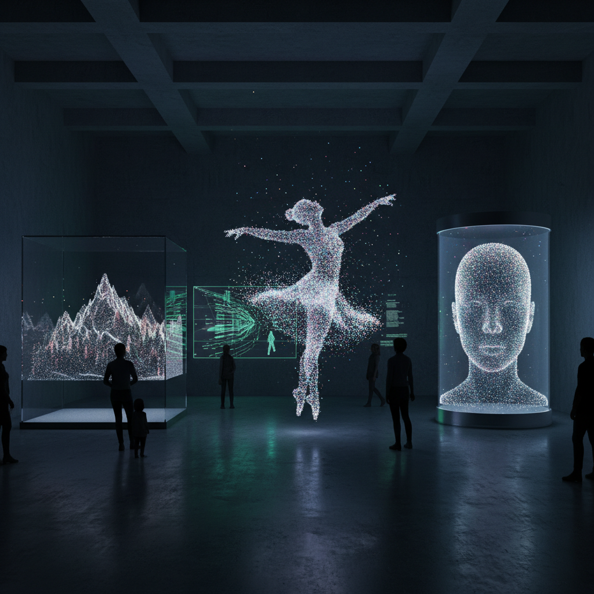

# Volumetric Art 体积艺术

> "Volumetric art captures the full three-dimensional reality of a moment — not a flat photograph, not a polygon mesh, but a true volume of light and color frozen in space and time. When you walk around a volumetric capture, you are walking around a moment that actually happened, seeing it from angles that no camera recorded, discovering details that no photographer noticed. It is the closest we have come to bottling reality itself." — Unknown

## 概述

体积艺术（Volumetric Art）是利用体积捕捉（volumetric capture）和体积显示技术创作的三维艺术形式。与传统3D建模不同，体积捕捉记录的是真实空间中的完整三维信息——每个点的位置、颜色和密度——创造出可以从任意角度观看的真实三维再现。

体积艺术的实践包括：1）体积捕捉表演——用多摄像头阵列捕捉表演者的完整三维形态；2）体积显示——使用全息显示、光场显示等技术在空间中呈现三维图像；3）体积雕塑——用3D扫描和体积数据创作数字雕塑；4）医学体积艺术——将CT/MRI等医学体积数据艺术化；5）体积视频——可自由视角观看的三维视频；6）点云艺术——用激光扫描的点云数据创作。

## 核心特征

| 特征 | 描述 |
|------|------|
| 三维 | 真正的三维 |
| 真实 | 真实捕捉 |
| 自由 | 自由视角 |
| 密度 | 空间密度信息 |
| 技术 | 高技术门槛 |
| 沉浸 | 沉浸式观看 |

## 视觉特征

- **点云**：点云的粒子质感
- **深度**：真实的空间深度
- **全息**：全息般的呈现
- **扫描**：扫描线的美学
- **透明**：可穿透的体积
- **光场**：光场的柔和质感

## 代表作品

| 作品 | 艺术家 | 年代 | 意义 |
|------|--------|------|------|
| *Volumetric performances* | Various | 2010年代 | 体积捕捉表演 |
| *Point cloud art* | Various | 2010年代 | 点云艺术 |
| *Holographic displays* | Various | 2020年代 | 全息显示艺术 |
| *Medical volume art* | Various | 2000年代 | 医学体积艺术 |
| *Light field art* | Various | 2020年代 | 光场艺术 |

## 历史时间线

| 时期 | 事件 |
|------|------|
| 1960年代 | 全息术的发明 |
| 1990年代 | 早期体积显示研究 |
| 2010年代 | 体积捕捉技术成熟 |
| 2020年代 | 消费级体积显示 |
| 当代 | 体积艺术的独立发展 |

## 中国语境

体积艺术在中国有快速发展的技术基础和应用场景。中国在全息显示、光场技术和3D扫描领域有大量研发投入。中国的文化遗产数字化项目大量使用体积捕捉技术——敦煌莫高窟的三维数字化、故宫文物的高精度扫描、中国传统戏曲表演的体积捕捉等。中国的演出市场也在探索体积显示——虚拟偶像的全息演唱会、体积捕捉的舞蹈表演等。中国当代的一些艺术家在探索体积艺术：用体积捕捉技术保存中国非物质文化遗产（如传统武术、戏曲身段）、将中国古代雕塑的三维扫描数据作为创作素材、以及用点云美学重新诠释中国传统山水的空间感。

## AI生成概念图

## 与其他风格的关系

- **Holographic Art** → 全息艺术
- **3D Scanning Art** → 3D扫描艺术
- **Digital Sculpture** → 数字雕塑
- **Spatial Computing Art** → 空间计算艺术
- **Light Field Art** → 光场艺术
- **Point Cloud Art** → 点云艺术

---

*浮光艺志 | Chronicle of Artistry*
