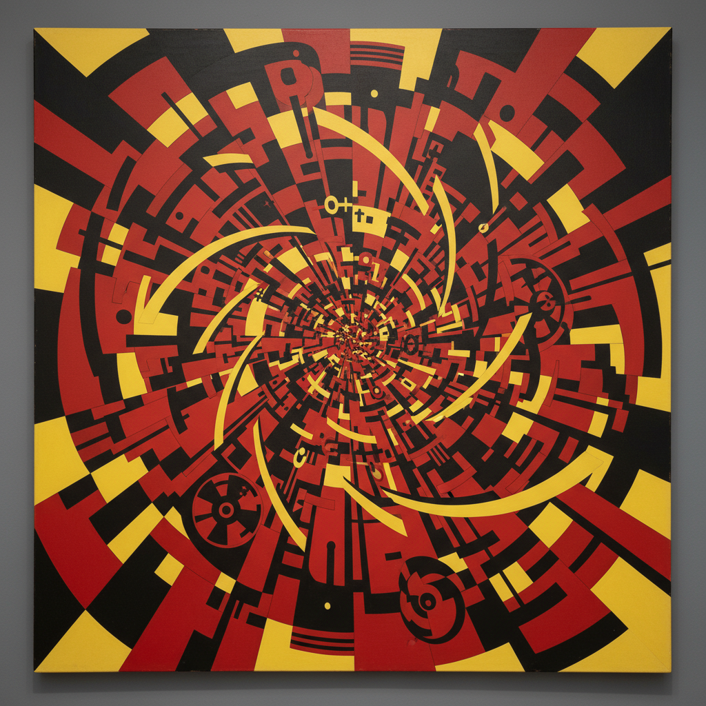

# Vorticism 漩涡主义

> "The Vorticist is at his maximum point of energy when stillest." — Wyndham Lewis

## 概述

漩涡主义（Vorticism）是1914–1915年间在英国短暂绽放的前卫艺术运动，由画家兼作家温德姆·刘易斯（Wyndham Lewis）领导。它是英国对意大利未来主义和法国立体主义的激进回应——既吸收了机器时代的动态能量，又拒绝未来主义对速度的盲目崇拜。

漩涡主义以"漩涡"（Vortex）为核心隐喻：漩涡的中心是静止的最大能量点，周围是旋转的混沌。这代表了艺术家在现代性风暴中心保持创造力的姿态。

## 核心特征

| 特征 | 描述 |
|------|------|
| 几何抽象 | 锐利的角度、对角线、机械形态 |
| 能量与静止 | 在动态中寻找静止的力量核心 |
| 机器美学 | 工业时代的齿轮、涡轮、建筑 |
| 反感伤 | 拒绝维多利亚时代的情感主义 |
| 攻击性 | 宣言式的文化战争姿态 |
| 英国性 | 有意区别于法国和意大利前卫 |

## 视觉特征

- **色彩**：大胆的原色对比——红、黑、黄、蓝
- **线条**：锐利的对角线和锯齿形
- **形态**：机械化的人体和建筑
- **构图**：向中心汇聚的动态张力
- **空间**：碎片化但有结构的几何空间
- **质感**：硬边、平面、无笔触痕迹

## 代表作品

| 作品 | 艺术家 | 年代 | 意义 |
|------|--------|------|------|
| *Workshop* | Wyndham Lewis | 1914-15 | 漩涡主义的视觉宣言 |
| *The Mud Bath* | David Bomberg | 1914 | 人体的几何化 |
| *Rock Drill* | Jacob Epstein | 1913-15 | 机器与人体的融合雕塑 |
| *The Crowd* | Wyndham Lewis | 1914-15 | 城市群体的几何抽象 |
| *In the Hold* | David Bomberg | 1913-14 | 碎片化的劳动场景 |
| *Abstract Composition* | Edward Wadsworth | 1915 | 港口工业的抽象化 |

## 历史时间线

| 时期 | 事件 |
|------|------|
| 1913 | Omega Workshops分裂，Lewis与Fry决裂 |
| 1914年6月 | BLAST杂志第一期出版——漩涡主义宣言 |
| 1914年8月 | 一战爆发，运动受到致命打击 |
| 1915年6月 | BLAST第二期（"War Number"）出版 |
| 1915年6月 | 唯一的漩涡主义群展在Doré Galleries举办 |
| 1916-18 | 成员分散参战，运动实质终结 |
| 1920 | Lewis试图以"Group X"复兴，未成功 |

## 子类型

| 子类型 | 特征 |
|--------|------|
| 绘画漩涡主义 | Lewis、Wadsworth——硬边几何抽象 |
| 雕塑漩涡主义 | Epstein、Gaudier-Brzeska——机械化形体 |
| 文学漩涡主义 | Ezra Pound——意象主义诗歌的激进化 |
| 版画漩涡主义 | Wadsworth——木刻版画的几何力量 |

## 中国语境

漩涡主义对中国艺术的直接影响有限，但其"在传统与前卫之间寻找第三条路"的姿态与中国现代艺术的困境相通。1930年代上海的决澜社在精神上与漩涡主义有相似之处——都试图在本土语境中创造属于自己的现代主义。

## 争议与遗产

- **争议**：被批评为"未来主义的英国翻版"（Lewis极力否认）
- **短命**：一战使运动仅存活约18个月
- **BLAST杂志**：其激进的排版设计影响了后来的平面设计
- **遗产**：为英国抽象艺术和构成主义传统奠基
- **当代回响**：数字时代的参数化设计和生成艺术中的几何动态

## AI生成概念图

## 与其他风格的关系

- **Futurism** → 漩涡主义吸收但批判了未来主义的速度崇拜
- **Cubism** → 立体主义的碎片化空间是漩涡主义的起点
- **Constructivism** → 构成主义与漩涡主义共享几何抽象和机器美学
- **Art Deco** → 装饰艺术继承了漩涡主义的几何锐利感
- **Precisionism** → 美国精确主义与漩涡主义的工业美学相通
- **De Stijl** → 风格派与漩涡主义共享硬边几何的追求

---

*浮光艺志 | Chronicle of Artistry*
