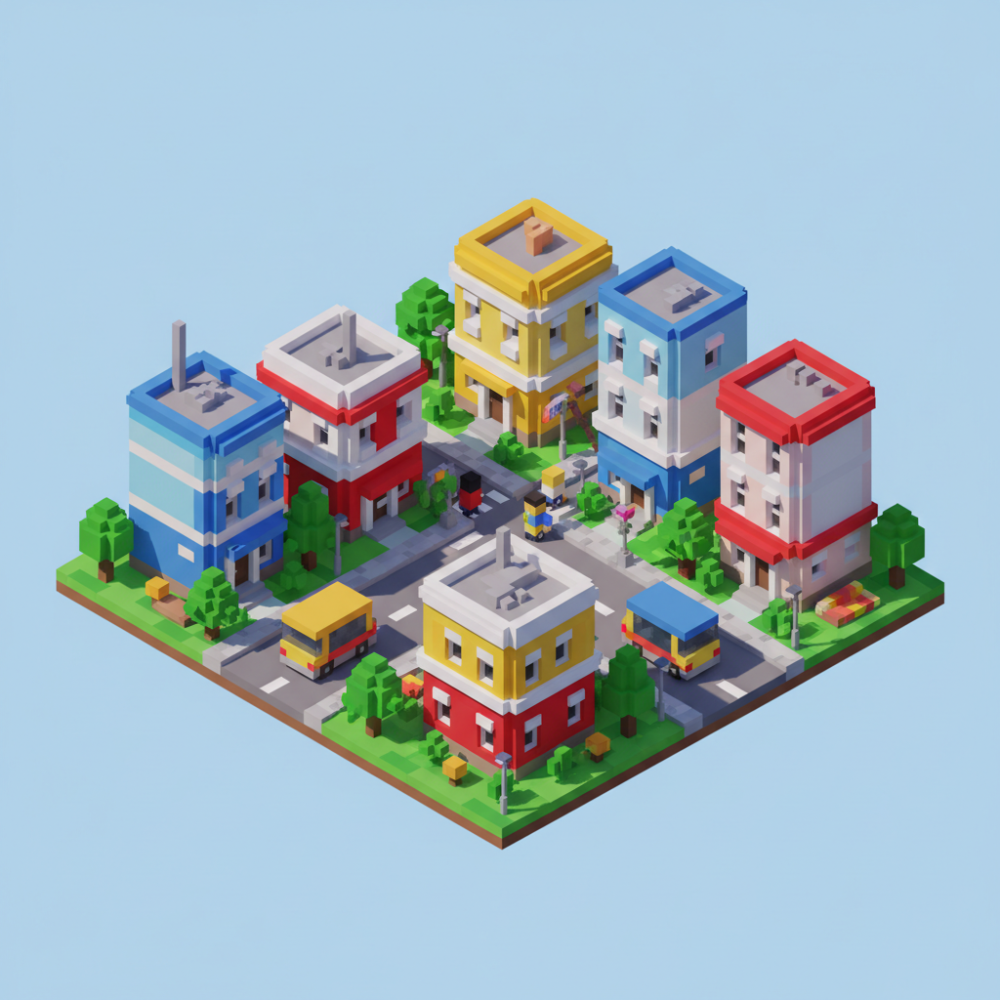

# Voxel Art 体素艺术

> "Voxels are the atoms of digital worlds." — Sir Carma

## 概述

体素艺术（Voxel Art）是使用三维像素（volumetric pixel，即voxel）构建的数字艺术形式。如果像素是2D的最小单元，体素就是3D的最小立方体单元。体素艺术以其独特的"乐高积木"般的块状美学，在游戏、动画和数字收藏品领域拥有独特地位。

体素艺术是像素艺术的三维进化——它保留了像素艺术的简约和怀旧感，同时增加了深度和空间感。

## 核心特征

| 特征 | 描述 |
|------|------|
| 立方体单元 | 所有形体由小立方体堆砌 |
| 三维像素 | 像素艺术的3D延伸 |
| 块状美学 | 有意的低分辨率——"数字乐高" |
| 等距视角 | 常用等距投影展示 |
| 色彩鲜明 | 有限调色板的鲜明色块 |
| 可交互 | 常用于游戏和虚拟世界 |

## 视觉特征

- **形状**：所有物体由立方体组成
- **边缘**：锐利的、阶梯状的边缘
- **色彩**：鲜明的、平涂的色块
- **光影**：简化的光影——环境光遮蔽
- **视角**：等距投影或低角度透视
- **比例**：可爱的、Q版的比例变形

## 代表作品

| 作品 | 年代 | 意义 |
|------|------|------|
| *Minecraft* 世界 | 2011– | 体素美学的大众化 |
| *3D Dot Game Heroes* | 2009 | 体素致敬经典游戏 |
| *Crossy Road* | 2014 | 体素的移动游戏 |
| *MagicaVoxel* 社区作品 | 2015– | 体素艺术创作工具 |
| *The Sandbox* | 2021– | 体素元宇宙 |

## 真实作品（公共领域）

| 作品 | 来源 |
|------|------|
| MagicaVoxel 社区 | [ephtracy.github.io](https://ephtracy.github.io/) |
| Voxel Art 社区 | [Sketchfab Voxel](https://sketchfab.com/tags/voxel) |
| 体素艺术展示 | [ArtStation Voxel](https://www.artstation.com/search?sort_by=relevance&query=voxel) |

## AI生成概念图

## 与其他风格的关系

- **Pixel Art** → 像素艺术的三维进化
- **Low Poly** → 共享简化3D的美学
- **Minecraft Aesthetic** → Minecraft普及了体素视觉
- **NFT Art** → 体素作品在NFT市场活跃
