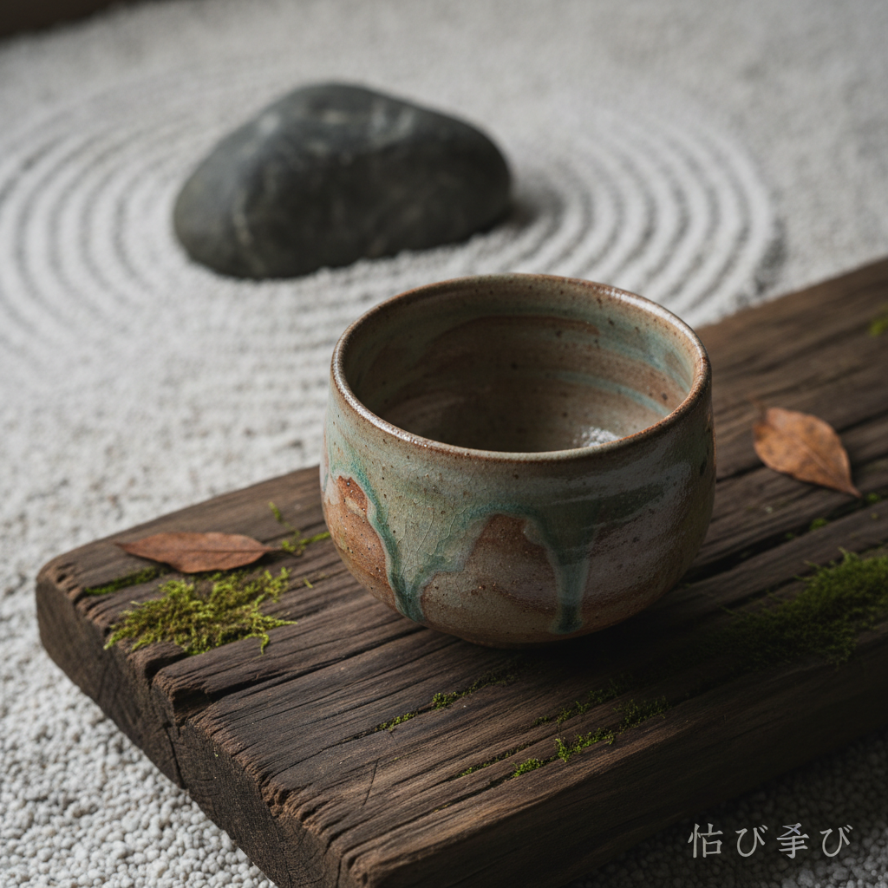

# Wabi-Sabi 侘寂 | 侘び寂び

> **"不完美即完美——在残缺、朴素和无常中发现最深的美。"**

## 概述

侘寂（Wabi-Sabi / 侘び寂び わびさび）是日本美学的核心概念，欣赏不完美、无常和不完整之美。"侘"（wabi）原指孤独荒凉之感，后演变为在简朴中发现丰富；"寂"（sabi）指时间流逝带来的美——锈蚀、风化、磨损。侘寂根植于禅宗和茶道（千利休），影响了日本建筑、陶艺、花道、庭园和当代设计。侘寂不是一种视觉风格，而是一种看待世界的方式——接受万物的无常（無常 mujō），在"不足"中发现"足够"。

## 核心原则

| 原则 | 日语 | 含义 |
|------|------|------|
| 不完美 | 不完全 fukanzen | 接受缺陷 |
| 无常 | 無常 mujō | 万物变化 |
| 不完整 | 未完成 mikansei | 留有余地 |
| 朴素 | 素朴 soboku | 简单自然 |
| 寂静 | 静寂 seijaku | 内在平静 |
| 自然 | 自然 shizen | 不造作 |

## 核心特征

- **接受不完美**：裂痕、磨损、不规则
- **自然材料**：木、石、土、纸
- **时间痕迹**：锈蚀、风化、苔藓
- **简朴**：去除多余装饰
- **不对称**：避免完美对称
- **留白**：空间的力量

## 典型表现

| 领域 | 表现 |
|------|------|
| 茶道 | 朴素茶碗、草庵茶室 |
| 陶艺 | 乐烧、志野烧的不规则 |
| 建筑 | 草庵、枯山水 |
| 花道 | 一枝花的寂静 |
| 庭园 | 苔藓、枯叶、石头 |
| 当代设计 | 极简、自然材料 |

## 视觉特征

- 朴素的自然色调
- 不规则的形状和质感
- 时间留下的痕迹
- 大量的留白和空间
- 粗糙的自然材料质感
- 安静而深沉的氛围

## 与其他风格的关系

| 风格 | 关系 |
|------|------|
| Kintsugi金缮 | 侘寂美学的直接体现 |
| 民藝 Mingei | 共享朴素美学 |
| 极简主义 | 受侘寂影响 |
| Brutalism | 共享材料真实性 |
| 北欧设计 | 共享简朴自然美学 |

## 概念图

---

*浮光艺志 | Chronicle of Artistry*
