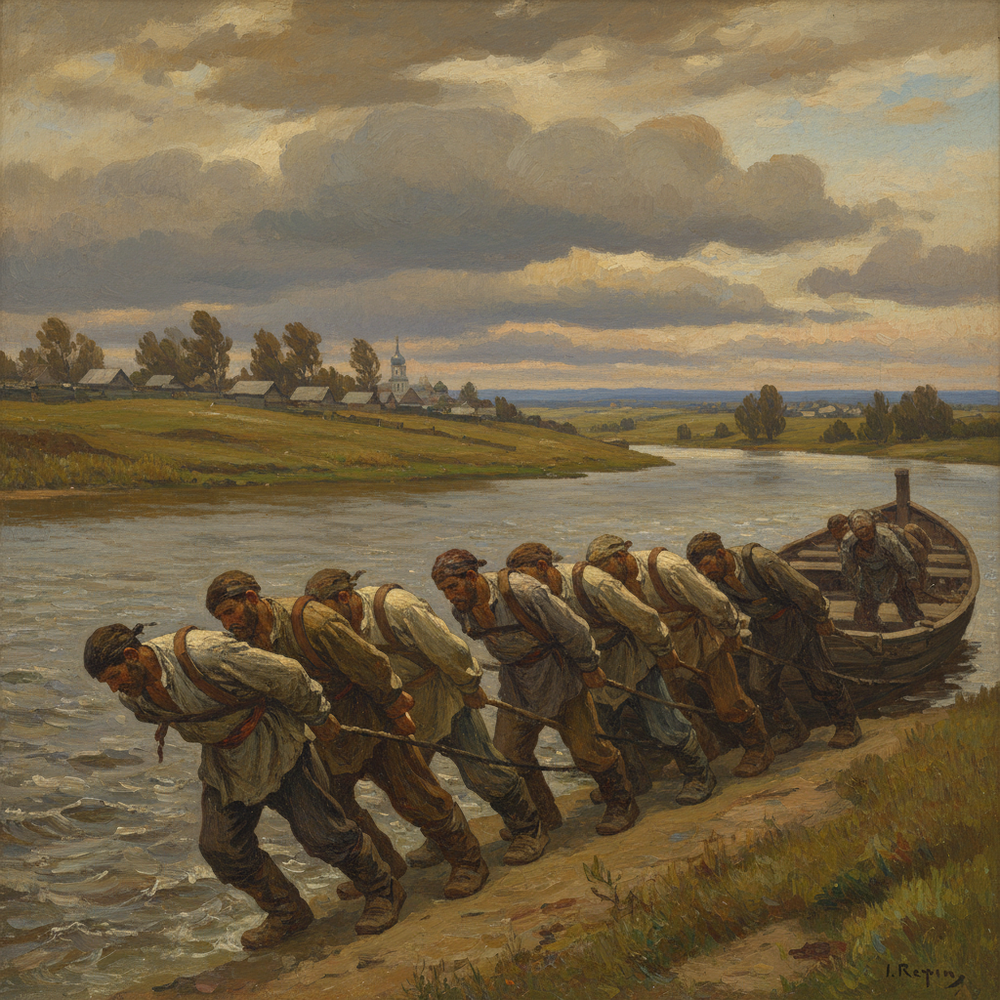

# Wanderers Movement 巡回展览画派

> **时期：** 1870年–1923年  
> **关键词：** 俄罗斯现实主义、社会批判、民族觉醒、巡回展览、人民艺术

## 概述

Wanderers（巡回展览画派，俄语Передвижники）是1870年代俄罗斯最重要的艺术运动——一群画家脱离帝国美术学院的束缚，组织巡回展览将艺术带到莫斯科和圣彼得堡以外的城市。他们用写实主义描绘俄罗斯的土地、人民和社会不公，将绘画变为民族良心的镜子。

## 风格特征

- **社会现实主义**：描绘底层人民的真实生活
- **风景抒情**：俄罗斯大地的诗意再现
- **心理深度**：人物内心世界的细腻刻画
- **叙事性**：画面讲述完整的故事
- **民族主题**：俄罗斯历史和民间传说

## 代表人物与作品

- 伊利亚·列宾《伏尔加河上的纤夫》
- 伊万·希什金 森林风景
- 瓦西里·苏里科夫 历史画
- 伊萨克·列维坦 抒情风景

## 概念图

