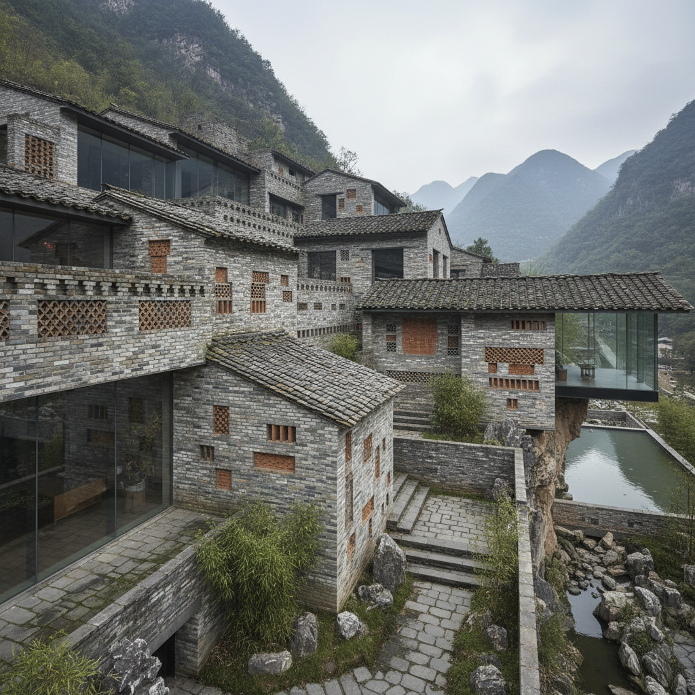

# Wang Shu 王澍

> **时期：** 1963–至今  
> **关键词：** 回收材料、中国传统、业余建筑、山水营造

## 概述

Wang Shu 是中国建筑师，首位获得普利兹克奖的中国公民。他用从拆迁工地回收的旧砖瓦建造新建筑，将中国传统园林的空间智慧与当代建筑结合——他的建筑如同一座座用废墟重建的山水画，既是对快速城市化的批判，也是对传统的创造性延续。

## 风格特征

- **回收材料**：大量使用拆迁废料——旧砖、旧瓦、旧木
- **山水意境**：建筑群的布局如同山水画的构图
- **手工痕迹**：保留材料的历史痕迹和工匠的手工感
- **园林空间**：借鉴中国园林的曲折、借景和层次
- **批判性实践**：对中国城市化速度的反思

## 代表作品

- *中国美术学院象山校区*（2004–2007）
- *宁波博物馆*（2008）
- *富阳文村*（2016）
- *临安博物馆*（2019）

## 概念图

