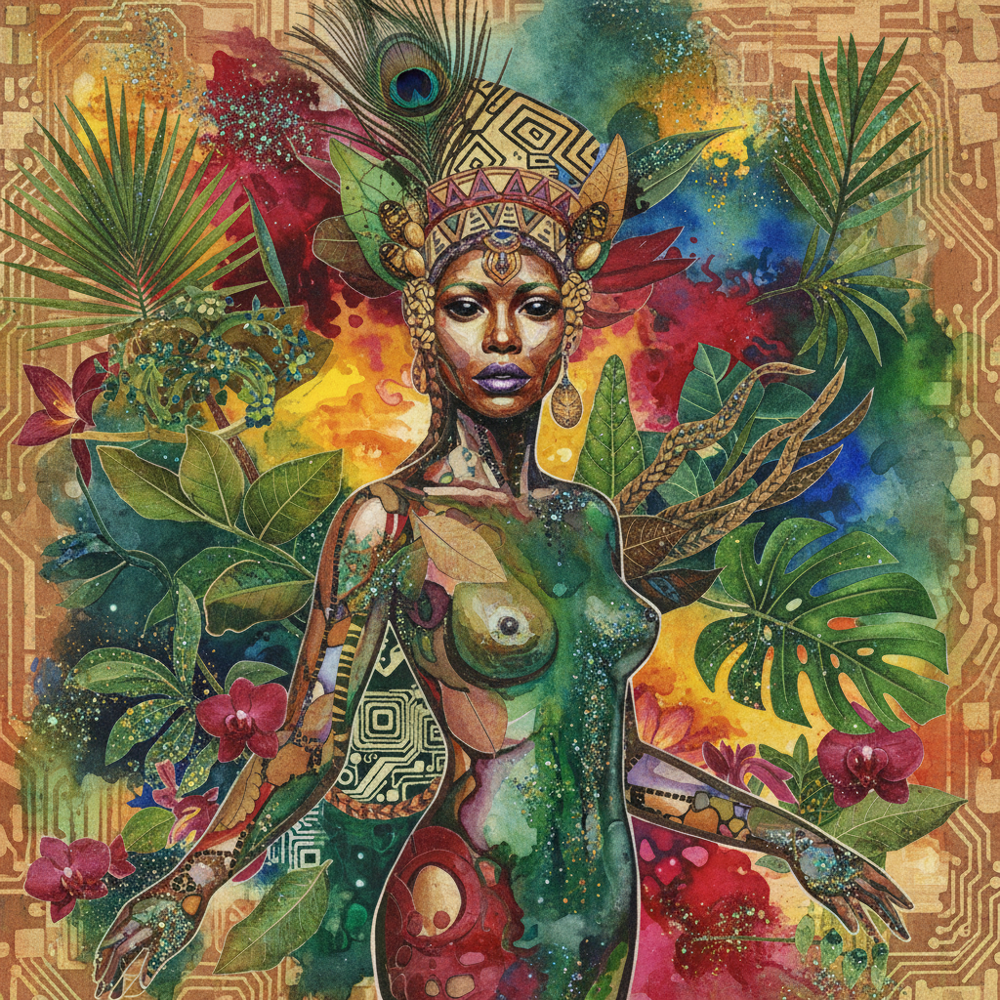

# Wangechi Mutu 万格奇·穆图

> **流派**: 当代艺术 · 拼贴 · 雕塑  
> **时期**: 1972–至今 肯尼亚/美国  
> **关键词**: 混合身体、非洲未来主义、女性变形、拼贴美学

## 概述

万格奇·穆图以大型拼贴画和雕塑闻名，她将时尚杂志、医学图谱、色情图片和非洲传统图案混合在一起，创造出变形的女性身体——既美丽又怪异，既脆弱又强大。她的作品探索黑人女性身体如何被殖民主义、消费文化和医学话语所建构和异化。

## 视觉特征

- **混合拼贴**: 杂志剪切、墨水、闪粉、植物材料混合
- **变形女体**: 人体与动物、机械、植物融合
- **丰富色彩**: 深红、金色、翠绿的热带色调
- **流动线条**: 墨水和水彩创造的有机流动感
- **非洲元素**: 部落装饰、面具图案的当代转化

## 代表作品

- 《水之女》(The Water Woman) 系列
- 大都会博物馆外墙青铜雕塑 (2019)
- 《一百零一个》(One Hundred Lavish Months of Bushwhack, 2004)
- 《坐着的人》(The Seated) 系列雕塑

## 历史影响

穆图为非洲女性艺术家在全球当代艺术中开辟了重要空间。她的拼贴美学影响了一代年轻艺术家思考身体、种族和性别的方式。

## 相关风格

- [Afrofuturism 非洲未来主义](afrofuturism.md)
- [Collage Art 拼贴艺术](collage-art.md)
- [Feminist Art 女性主义艺术](feminist-art.md)
