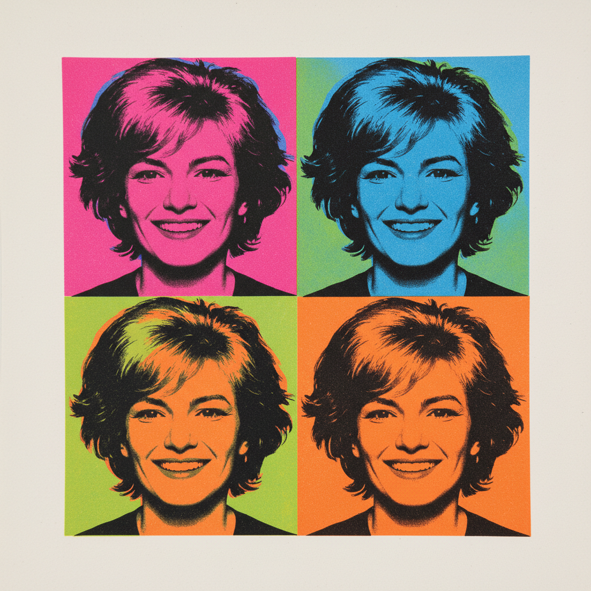

# Andy Warhol 安迪·沃霍尔

> "In the future, everyone will be world-famous for 15 minutes." — Andy Warhol

## 概述

安迪·沃霍尔（Andy Warhol，1928–1987）是波普艺术运动的核心人物，也是20世纪最具影响力的艺术家之一。他以丝网印刷技术将商业图像和名人肖像转化为高级艺术，模糊了艺术与商业、高雅与通俗的界限。

沃霍尔的"工厂"不仅生产艺术，更生产了一种全新的艺术家身份——艺术家作为品牌、作为明星、作为机器。

## 核心特征

| 特征 | 描述 |
|------|------|
| 丝网印刷 | 机械复制取代手工绘画 |
| 重复 | 同一图像的无限重复——消解意义 |
| 商业图像 | 汤罐头、可乐瓶——消费品即艺术 |
| 名人崇拜 | 玛丽莲、猫王、毛泽东的图像化 |
| 去个性化 | "我想成为一台机器" |
| 荧光色彩 | 非自然的、印刷般的平涂色彩 |

## 视觉特征

- **技法**：丝网印刷的平面感和套色偏移
- **色彩**：荧光粉、电光蓝、酸性绿——非自然色
- **重复**：网格排列的同一图像
- **图像**：照片转印的高对比度效果
- **平面**：完全消除深度和笔触
- **主题**：消费品、名人、灾难、死亡

## 代表作品

| 作品 | 年代 | 意义 |
|------|------|------|
| *Campbell's Soup Cans* | 1962 | 波普艺术的宣言 |
| *Marilyn Diptych* | 1962 | 名人崇拜与死亡 |
| *Eight Elvises* | 1963 | 重复的力量 |
| *Brillo Boxes* | 1964 | 艺术与商品的边界 |
| *Shot Sage Blue Marilyn* | 1964 | 最贵的20世纪艺术品 |

## 真实作品（公共领域）

| 作品 | 来源 |
|------|------|
| *Campbell's Soup Cans* | [MoMA](https://www.moma.org/collection/works/79809) |
| *Marilyn Diptych* | [Tate](https://www.tate.org.uk/art/artworks/warhol-marilyn-diptych-t03093) |
| *Brillo Boxes* | [Andy Warhol Museum](https://www.warhol.org/) |

> ⚠️ 本条目优先使用真实作品。

## AI生成概念图

## 与其他风格的关系

- **Pop Art** → 波普艺术的定义者
- **Dada** → 继承了达达的反艺术精神
- **Conceptual Art** → 观念先于手工
- **NFT Art** → 数字复制时代的精神先祖
