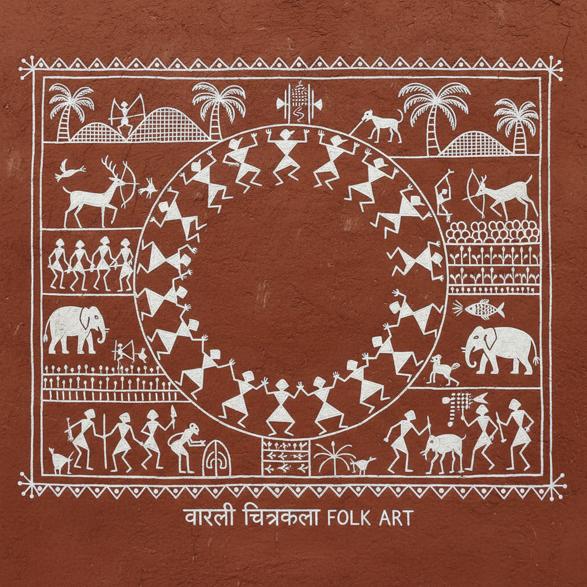

# Warli Art 瓦尔利画 | वारली चित्रकला

> **"白色的记忆——印度部落用米糊在泥墙上画出最简洁的生命故事。"**

## 概述

瓦尔利画（Warli Art / वारली चित्रकला）是印度马哈拉施特拉邦北部瓦尔利部落（Warli / वारली）的传统壁画艺术。这种艺术使用极简的几何形状——圆形（太阳/月亮）、三角形（山/树）、方形（土地/圣地）——在红棕色泥墙上用白色米糊绘制人物、动物和日常生活场景。瓦尔利画的人物由两个三角形组成（上身和下身），极度简化却充满动感。这种艺术有2000-3000年的历史，与印度河文明的岩画有相似之处。

## 核心特征

- **白色米糊**：在红棕色泥墙上绘制
- **几何简化**：圆、三角、方形
- **火柴人**：两个三角形组成的人物
- **叙事性**：描绘日常生活和仪式
- **集体创作**：女性在节日时集体绘制
- **非透视**：平面化的构图

## 常见题材

| 题材 | 特征 |
|------|------|
| Tarpa舞蹈 | 围成圆圈的集体舞 |
| 婚礼 | 婚礼仪式场景 |
| 狩猎 | 弓箭狩猎 |
| 农耕 | 播种收割 |
| 动物 | 牛、马、鸟、鱼 |
| 生命之树 | 中心大树 |

## 视觉特征

- 白色在红棕色底上的对比
- 极简的几何人物造型
- 重复排列的节奏感
- 圆形构图（Tarpa舞蹈）
- 平面化的叙事场景
- 原始而现代的视觉力量

## 当代影响

| 领域 | 特征 |
|------|------|
| 当代艺术 | Jivya Soma Mashe等艺术家 |
| 平面设计 | Warli图案的商业应用 |
| 时装 | Warli印花面料 |
| 室内设计 | Warli壁画装饰 |
| 动画 | Warli风格的动画 |

## 与其他风格的关系

| 风格 | 关系 |
|------|------|
| Rangoli地画 | 共享印度装饰传统 |
| 岩画 Cave Art | 共享原始绘画传统 |
| Keith Haring | 共享简化人物和动感 |
| Mudcloth泥染布 | 共享几何符号系统 |
| 当代极简 | Warli的现代美学价值 |

## 概念图

---

*浮光艺志 | Chronicle of Artistry*
