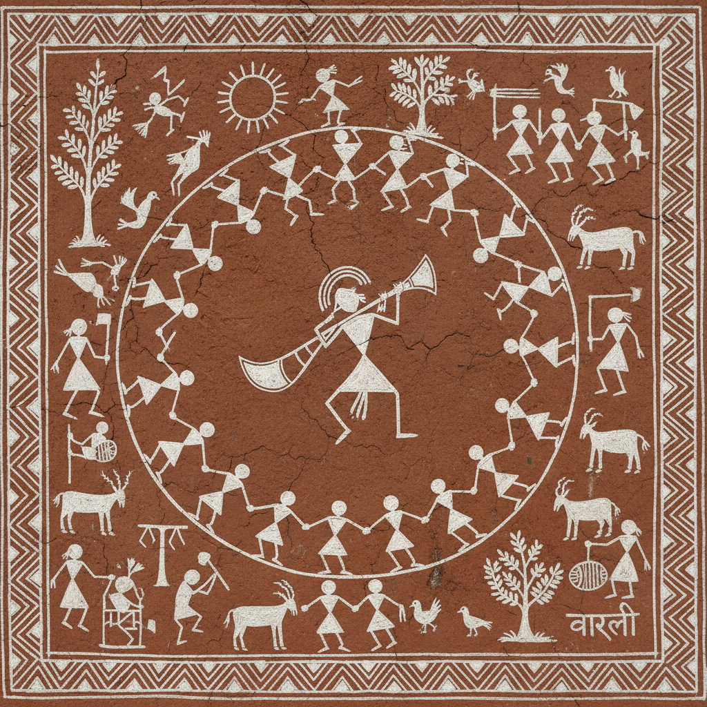

# Warli 瓦尔利画 | वारली चित्रकला

> **"白色的舞蹈——印度瓦尔利族用米糊在泥墙上画出围成圆圈跳舞的火柴人。"**

## 概述

瓦尔利画（Warli Painting / वारली चित्रकला）是印度马哈拉施特拉邦（Maharashtra）瓦尔利族（Warli）的传统壁画艺术，用白色米糊（rice paste）在红褐色泥墙上绘制简洁的几何人物和场景。瓦尔利画的人物由三角形（身体）和圆形（头部）组成，极度简化却充满动感——最经典的画面是人们围成圆圈跳塔尔帕舞（Tarpa dance）。这种艺术有2500年以上的历史，与印度河谷文明的岩画有渊源关系。瓦尔利画传统上只在婚礼和丰收节时绘制，由部落女性完成。

## 核心特征

- **白色米糊**：在红褐色泥墙上绘制
- **几何人物**：三角形身体+圆形头部
- **极简造型**：火柴人般的简洁
- **圆圈舞蹈**：Tarpa舞的经典构图
- **仪式功能**：婚礼和丰收节
- **女性传统**：部落女性绘制

## 常见题材

| 题材 | 特征 |
|------|------|
| Tarpa舞 | 围圈跳舞 |
| 婚礼 | 新娘新郎 |
| 狩猎 | 弓箭猎人 |
| 农耕 | 播种收割 |
| 动物 | 牛、鸟、鱼 |
| 生命之树 | 中心构图 |

## 视觉特征

- 红褐色底上的白色图案
- 三角形和圆形的几何人物
- 围圈跳舞的动态构图
- 极简的线条和形状
- 叙事性的场景排列
- 原始艺术的力量感

## 与其他风格的关系

| 风格 | 关系 |
|------|------|
| Madhubani | 共享印度部落绘画 |
| Aboriginal Art | 共享原住民叙事画 |
| Keith Haring | 共享简化人物和动感 |
| 岩画 Rock Art | 瓦尔利画的远祖 |
| 当代插画 | 瓦尔利的全球影响 |

## 概念图

---

*浮光艺志 | Chronicle of Artistry*
