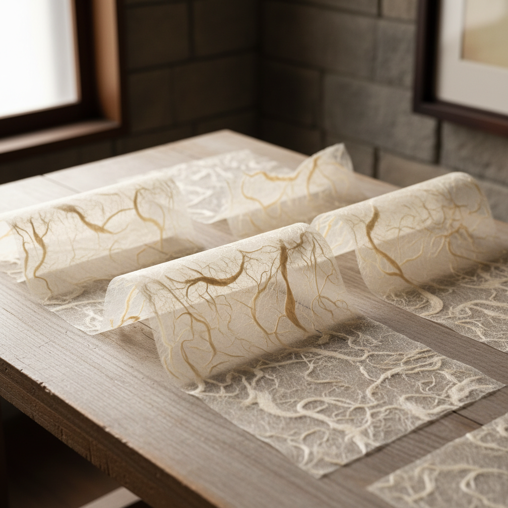

# Washi 和纸艺术

> "Washi is not just paper — it is light, breath, and the patience of water." — Unknown

## 概述

和纸艺术（Washi/和紙）是基于日本传统手工纸的艺术创作——和纸以其独特的纤维质感、半透明性、柔韧性和持久性成为独立的艺术媒介。从障子门的柔和光线到灯笼的温暖光晕，从书道的墨韵到当代的纸艺装置，和纸不仅是承载艺术的材料，它本身就是艺术。2014年，日本手漉和纸被列入UNESCO非物质文化遗产。

和纸的哲学在于：纸不是被动的载体——它有自己的生命、质感和光线，是创作的积极参与者。

## 核心特征

| 特征 | 描述 |
|------|------|
| 手工 | 传统手工抄纸 |
| 纤维 | 可见的植物纤维 |
| 半透明 | 独特的半透明性 |
| 柔韧 | 极其柔韧不易撕裂 |
| 持久 | 可保存数百年 |
| 多用途 | 从书写到建筑的广泛用途 |

## 视觉特征

- **纤维**：可见的楮、三椏等植物纤维
- **透光**：柔和的透光效果
- **质感**：丰富的表面质感
- **柔和**：柔和温暖的视觉感受
- **自然**：自然材料的有机美感
- **层次**：纤维分布的自然层次

## 代表作品

| 作品 | 艺术家 | 年代 | 意义 |
|------|--------|------|------|
| *Shoji screens* | 匿名 | 传统 | 障子门的光影 |
| *Washi lanterns* | 匿名 | 传统 | 和纸灯笼 |
| *Paper installations* | Tokujin Yoshioka | 2000s+ | 当代和纸装置 |
| *Washi art* | Various | 当代 | 当代和纸艺术 |
| *UNESCO recognition* | — | 2014 | 和纸列入非遗 |

## 历史时间线

| 时期 | 事件 |
|------|------|
| 7世纪 | 造纸术从中国传入日本 |
| 平安时代 | 和纸的独特发展 |
| 传统 | 和纸在日本文化中的核心地位 |
| 明治时代 | 西方纸的冲击 |
| 20世纪 | 和纸的保护和复兴 |
| 2014 | UNESCO认定和纸为非遗 |
| 当代 | 和纸在当代艺术中的应用 |

## 中国语境

和纸与中国的宣纸有深厚的历史渊源——日本造纸术源自中国，但发展出了独特的材料和技法。中国的宣纸（安徽泾县）同样是UNESCO非物质文化遗产，以其"墨韵万变"著称。中国传统纸艺包括宣纸、皮纸、竹纸等多种类型，各有独特的艺术特性。当代中国的纸艺术家也在探索传统手工纸的当代表达。

## AI生成概念图

## 与其他风格的关系

- **Origami** → 折纸使用和纸
- **Calligraphy** → 书法依赖纸的品质
- **Ink Wash** → 水墨画与纸的互动
- **Light Art** → 和纸的透光性
- **Installation Art** → 纸艺装置
- **Fiber Art** → 纤维艺术的纸质分支

---

*浮光艺志 | Chronicle of Artistry*
