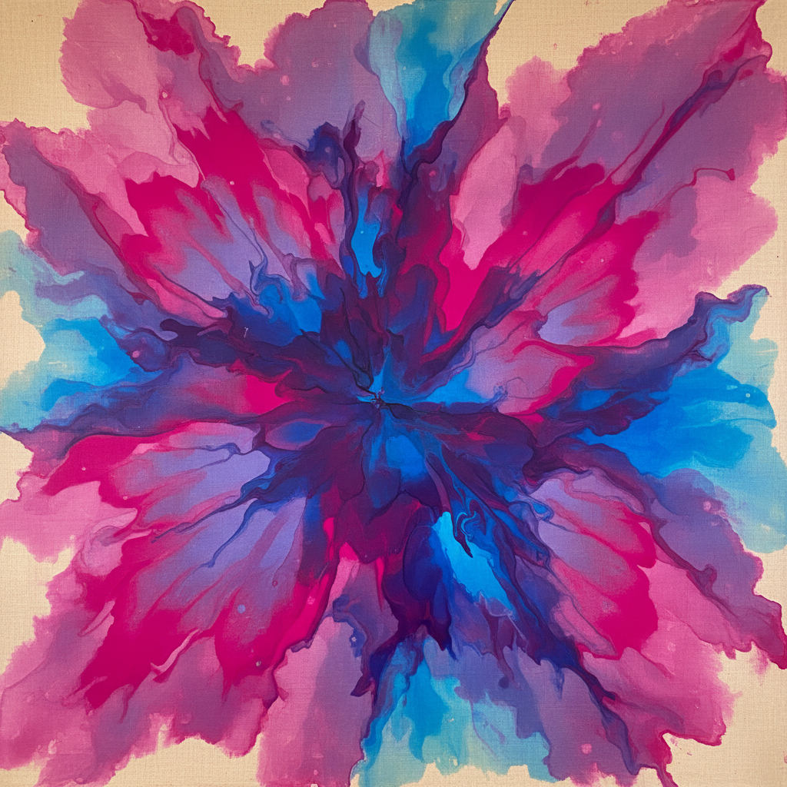

# Washington Color School 华盛顿色彩画派

> **时期：** 1950年代末–1970年代  
> **关键词：** 色域绘画、硬边抽象、华盛顿特区、纯色体验、反纽约

## 概述

Washington Color School（华盛顿色彩画派）是1950年代末在华盛顿特区兴起的抽象绘画运动，与纽约的抽象表现主义形成鲜明对比。莫里斯·路易斯将稀释的丙烯颜料倾倒在未上底的画布上，肯尼斯·诺兰用精确的同心圆和V形条纹——他们追求的是纯粹的色彩体验，没有笔触，没有姿态，只有颜色本身的光辉。

## 风格特征

- **色彩浸染**：颜料渗入未上底的画布
- **硬边几何**：精确的色彩边界
- **去笔触**：消除艺术家手的痕迹
- **大面积纯色**：色彩作为唯一主题
- **光学效果**：色彩并置产生的视觉振动

## 代表人物与作品

- 莫里斯·路易斯 倾倒画
- 肯尼斯·诺兰 靶心与条纹
- 吉恩·戴维斯 条纹画
- 托马斯·唐宁 圆点网格

## 概念图

