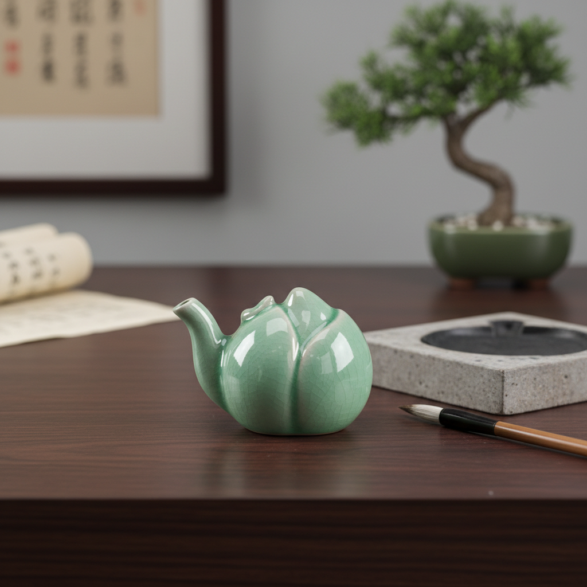

# Water Dropper Art 水滴艺术

> "The water dropper is ceramics at its most playful and precise — a vessel smaller than a fist yet engineered with the sophistication of a scientific instrument, its tiny spout dispensing single drops of water onto an inkstone with the control of an eyedropper, its form often disguised as a peach, a toad, a lotus pod, or a sleeping scholar, function hidden inside whimsy, the smallest object on the desk yet often the most inventive." — Unknown

## 概述

水滴艺术（Water Dropper Art）是一种以文房用具——水滴（砚滴/水注）——为核心的陶瓷艺术形式。水滴是中国传统文房四宝的辅助器具，用于向砚台上滴注少量清水以研墨。水滴虽然体积小巧（通常仅拳头大小），但其设计需要精确控制出水量——每次只滴出一两滴水。这种精密的功能需求催生了极其精巧的造型设计，使水滴成为文房器具中最具创意和趣味的品类。

水滴艺术的核心要素包括：1）精密出水——精确控制滴水量；2）小巧造型——通常仅拳头大小；3）象形设计——常模仿自然物或动物；4）文房功能——研墨时的辅助器具；5）把玩性——适合手中把玩；6）收藏价值——文人收藏的重要品类；7）工艺精湛——小尺寸中的精湛工艺。

## 核心特征

| 特征 | 描述 |
|------|------|
| 精密控水 | 精确控制出水量 |
| 小巧精致 | 通常仅拳头大小 |
| 象形造型 | 模仿自然物的造型 |
| 文房器具 | 书房中的实用器 |
| 把玩趣味 | 适合手中把玩欣赏 |
| 工艺精湛 | 小中见大的工艺 |

## 视觉特征

- **动物造型**：蟾蜍、龟、鱼等动物形
- **植物造型**：桃、莲蓬、葫芦等植物形
- **人物造型**：童子、仙人等人物形
- **精巧细节**：微小尺寸中的精细雕刻
- **釉色温润**：适合把玩的温润釉面
- **出水口设计**：巧妙隐藏的出水口

## 代表作品

| 作品 | 艺术家/文化 | 年代 | 意义 |
|------|-------------|------|------|
| *青瓷蟾蜍水滴* | 中国 | 宋代 | 经典蟾蜍造型 |
| *白瓷桃形水滴* | 中国景德镇 | 明代 | 桃形水滴经典 |
| *青花水注* | 中国景德镇 | 明清 | 青花水滴传统 |
| *韩国青瓷水滴* | 韩国高丽 | 12世纪 | 韩国水滴传统 |
| *当代水滴* | 各地陶艺家 | 当代 | 水滴的当代创作 |

## 历史时间线

| 时期 | 事件 |
|------|------|
| 汉代 | 早期水滴的出现 |
| 魏晋 | 青瓷水滴的发展 |
| 宋代 | 水滴造型的丰富化 |
| 明清 | 水滴收藏文化的繁荣 |
| 当代 | 水滴作为文房艺术品 |

## 中国语境

水滴是中国文房文化的独特产物——它的存在完全依赖于中国的毛笔书写和研墨传统。中国历代文人对水滴有特殊的情感——它是书房中最小却最有趣的器物，是文人雅趣的微型载体。中国各大窑口——从越窑到龙泉窑，从景德镇到宜兴——都烧制过精美的水滴。水滴的造型设计体现了中国文人的审美趣味：既有高雅的仿古造型，也有诙谐的动物形象，还有寓意吉祥的植物造型。虽然现代书写方式的改变使水滴失去了实用功能，但作为文房艺术品和收藏品，水滴仍然受到广泛珍视。

## AI生成概念图

## 与其他风格的关系

- **Scholar's Object** → 文房器
- **Miniature Ceramics** → 微型陶瓷
- **Celadon** → 青瓷
- **Figurative Ceramics** → 象形陶瓷
- **Inkstone** → 砚台
- **Brush Washer** → 笔洗

---

*浮光艺志 | Chronicle of Artistry*
