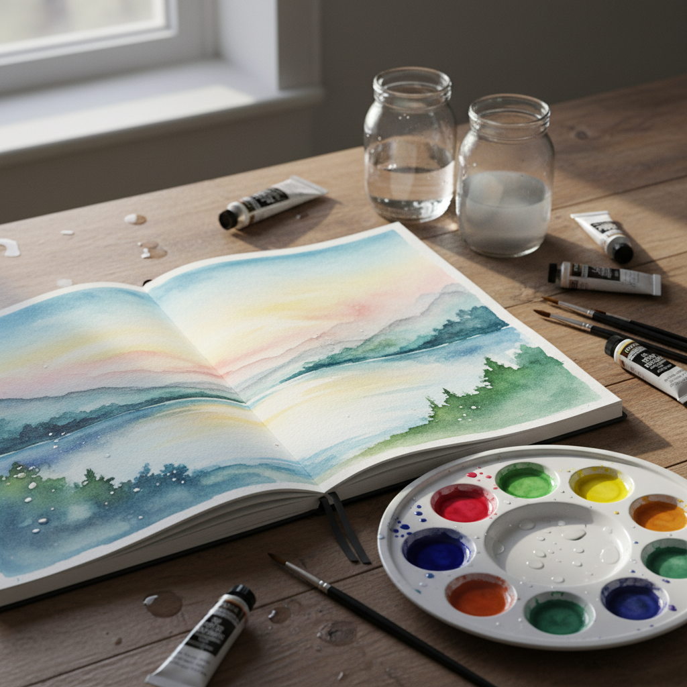

# Watercolor Art 水彩艺术

> "Watercolor is a swim in the metaphysics of life... a mirror of one's own character." — Winslow Homer

## 概述

水彩艺术（Watercolor Art）是使用水溶性颜料在纸上作画的艺术形式。水彩的独特之处在于它的透明性——颜料薄薄地覆盖在白纸上，光线穿过颜料层反射回来，创造出其他媒介无法复制的明亮和通透感。

水彩既是最容易入门的媒介（只需颜料、水和纸），也是最难精通的——因为水的不可控性和不可逆性，每一笔都是决定性的。

## 核心特征

| 特征 | 描述 |
|------|------|
| 透明性 | 颜料层透明，白纸透出 |
| 水媒介 | 以水为溶剂和稀释剂 |
| 即时性 | 干燥快，难以修改 |
| 偶然性 | 水的流动带来偶然效果 |
| 轻盈性 | 视觉上的轻盈和通透 |
| 便携性 | 材料轻便，适合户外写生 |

## 视觉特征

- **透明**：颜料层的透明和叠加
- **留白**：白纸作为最亮的"颜色"
- **渗透**：湿画法的自然渗透和晕染
- **流动**：水的流动痕迹
- **轻盈**：整体的轻盈和空气感
- **色彩**：明亮、清新、通透的色彩

## 代表作品

| 作品 | 艺术家 | 年代 | 意义 |
|------|--------|------|------|
| *The Great Piece of Turf* | Albrecht Dürer | 1503 | 水彩写实的先驱 |
| *Rain, Steam and Speed* | J.M.W. Turner | 1844 | 水彩的大气效果（油画但受水彩影响） |
| *Seascapes* | Winslow Homer | 1880s-1900s | 美国水彩的巅峰 |
| *Klee watercolors* | Paul Klee | 1910s-30s | 水彩的现代主义表达 |
| *Cézanne watercolors* | Paul Cézanne | 1890s-1900s | 水彩的结构性探索 |
| *Sargent watercolors* | John Singer Sargent | 1900s-10s | 水彩的virtuoso技法 |

## 历史时间线

| 时期 | 事件 |
|------|------|
| 古代 | 水彩用于手稿装饰和地图 |
| 1500s | Dürer——水彩作为独立艺术形式 |
| 1700s-1800s | 英国水彩画派的黄金时代 |
| 1804 | 英国水彩画家协会成立 |
| 1850s-1900s | Homer、Sargent——美国水彩传统 |
| 1910s-30s | 现代主义水彩——Klee、Kandinsky |
| 2000s-至今 | 水彩在插画和设计中的复兴 |

## 中国语境

水彩在中国有独特的发展路径。中国传统水墨画与水彩共享水媒介的特性——透明、流动、留白。20世纪中国水彩画家如王肇民、关广志等将西方水彩技法与中国审美融合。当代中国水彩在写实和表现两个方向都有出色的发展，中国水彩画家在国际水彩展中屡获殊荣。

## AI生成概念图

## 与其他风格的关系

- **Ink Wash Painting** → 中国水墨画与水彩共享水媒介特性
- **Impressionism** → 印象派的光线追求与水彩的透明性相通
- **Plein Air** → 户外写生是水彩的重要传统
- **Illustration** → 水彩是插画的重要媒介
- **Minimalism** → 水彩的留白与极简精神相通
- **Expressionism** → 表现主义水彩强调情感的直接表达

---

*浮光艺志 | Chronicle of Artistry*
