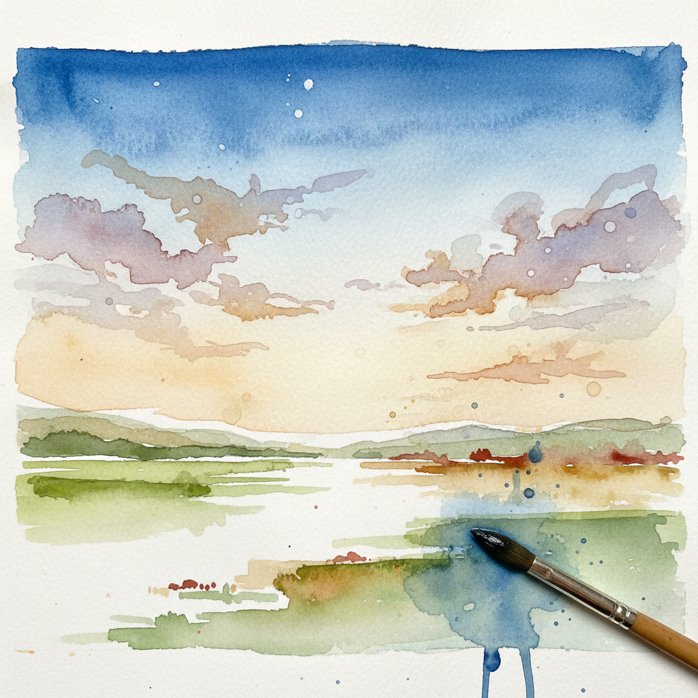

# Watercolor Wash 水彩渲染

> "Watercolor is like life. Better get it right the first time — you can't go back." — 水彩谚语

## 概述

水彩渲染（Watercolor Wash）是水彩画中最基本也最具魅力的技法——将大量水与透明水彩颜料混合，在纸面上铺出均匀或渐变的透明色层。水的流动性和颜料的透明性共同创造了一种轻盈、空灵、不可完全控制的独特美感。

从英国水彩画传统（Turner、Cotman）到中国水墨画的"渲染"，水彩渲染是东西方共享的、以水为媒介的诗意表达方式。

## 核心特征

| 特征 | 描述 |
|------|------|
| 透明性 | 颜料透明，白纸透过色层发光 |
| 水的流动 | 水的自然流动创造不可预测的效果 |
| 不可逆 | 无法像油画那样覆盖修改 |
| 留白 | 白色来自纸面——不使用白色颜料 |
| 湿接湿 | 湿色层相互渗透融合 |
| 轻盈空灵 | 独特的轻盈、透明、空气感 |

## 渲染类型

| 类型 | 描述 | 效果 |
|------|------|------|
| Flat Wash | 均匀的单色平涂 | 天空、背景 |
| Graded Wash | 从深到浅的渐变 | 日落、远山 |
| Variegated Wash | 多色的自然融合 | 花卉、云彩 |
| Wet-in-Wet | 在湿纸上滴入颜料 | 柔和的、不可控的扩散 |
| Dry Brush | 干笔在粗纸上擦过 | 质感、树皮、草地 |

## 视觉特征

- **透明**：光线穿过颜料层从白纸反射回来
- **流动**：水的自然流动痕迹
- **柔和**：湿接湿产生的柔和边缘
- **留白**：白纸作为最亮的光
- **偶然**：水的不可控性带来的美丽意外
- **轻盈**：整体的轻盈和空气感

## 代表人物

| 画家 | 水彩特点 | 时期 |
|------|---------|------|
| J.M.W. Turner | 大气的光线和色彩渲染 | 英国浪漫主义 |
| John Sell Cotman | 简洁的平涂色块 | 诺里奇画派 |
| Winslow Homer | 加勒比海的阳光和水 | 美国写实 |
| John Singer Sargent | 快速自信的水彩写生 | 美国印象派 |
| Paul Cézanne | 未完成的、呼吸的水彩 | 后印象派 |
| Joseph Zbukvic | 当代大气水彩 | 当代 |

## 与其他技法的关系

- **Chinese Ink Wash** → 中国水墨画的"渲染"是东方对应物
- **Plein Air** → 水彩是户外速写的理想媒介
- **Turner** → 透纳是水彩渲染的最高成就
- **Sfumato** → 湿接湿的柔和效果类似晕涂
- **Alla Prima** → 水彩本质上是一次完成的

## 概念图

---

*浮光艺志 | Chronicle of Artistry*
