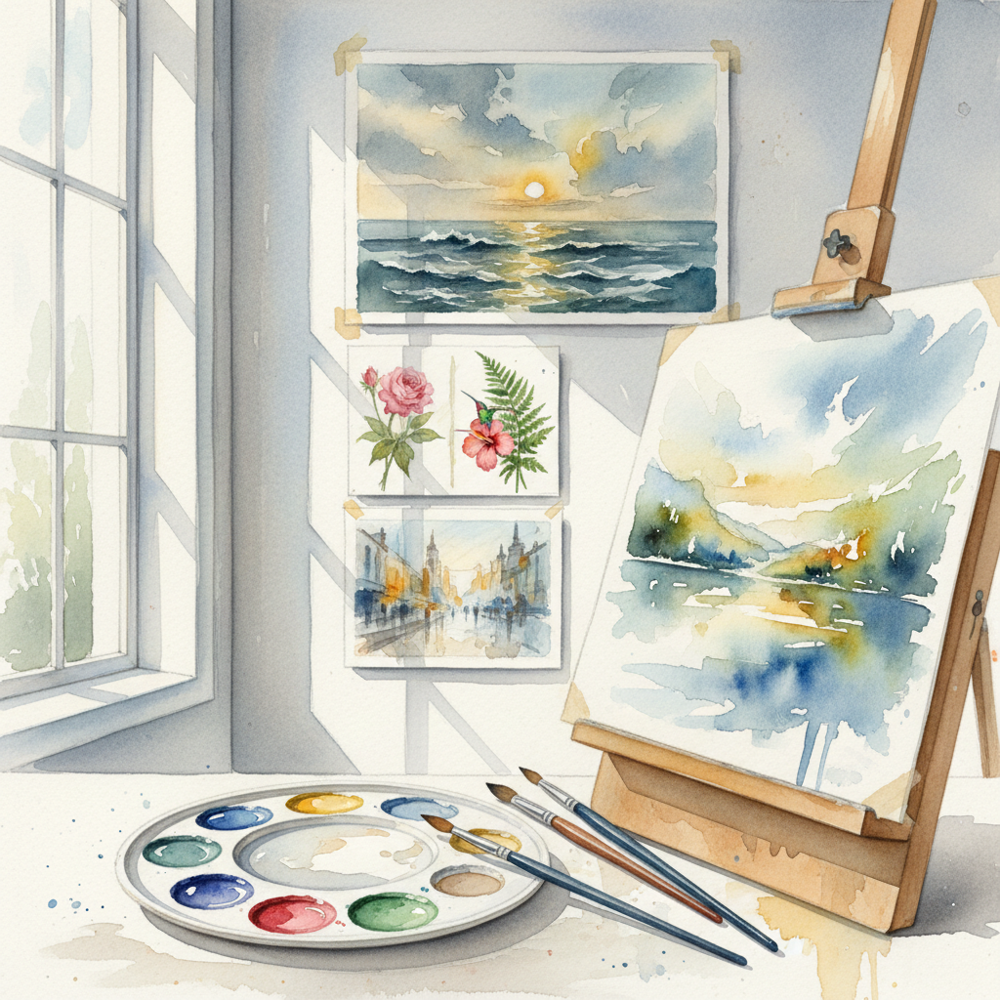

# Watercolor 水彩画

> "Watercolor is the art of controlled surrender — the painter guides the water, but the water has its own will, and the best paintings honor both." — Unknown

## 概述

水彩画（Watercolor）是使用水溶性透明颜料在纸上作画的技法。水彩画的核心在于"透明"——颜料薄薄地覆盖在白色纸面上，光线穿透颜料层反射回来，赋予水彩画独特的明亮、清透和空灵感。水彩画家利用水的流动性创造出柔和的渐变、湿润的边缘和偶然的水痕——这些"意外"往往成为水彩画最迷人的部分。水彩画要求画家对水分的控制极其精确——太多水会失控，太少水会干涩。白色来自纸面本身的留白，而非白色颜料的覆盖。

水彩画的哲学在于：与水共舞——在控制与放手之间找到平衡，接受水的流动带来的偶然之美。

## 核心特征

| 特征 | 描述 |
|------|------|
| 透明 | 颜料透明 |
| 流动 | 水的流动性 |
| 留白 | 白色来自纸面 |
| 轻盈 | 轻盈空灵的质感 |
| 偶然 | 水痕的偶然美 |
| 不可逆 | 难以修改覆盖 |

## 视觉特征

- **透明**：透明的色层
- **明亮**：明亮清透的色彩
- **流动**：水的流动痕迹
- **柔和**：柔和的湿边
- **空灵**：空灵的氛围
- **留白**：大胆的留白

## 代表作品

| 作品 | 艺术家 | 年代 | 意义 |
|------|--------|------|------|
| *The Great Wave* (study) | Turner | 1840s | 英国水彩巅峰 |
| *Dürer watercolors* | Albrecht Dürer | 1500s | 最早的水彩杰作 |
| *John Singer Sargent watercolors* | Sargent | 1900s | 大师级水彩 |
| *Winslow Homer seascapes* | Homer | 1880s+ | 美国水彩 |
| *Paul Klee watercolors* | Klee | 1920s+ | 现代水彩 |

## 历史时间线

| 时期 | 事件 |
|------|------|
| 古代 | 古埃及纸莎草画 |
| 15世纪 | Dürer的水彩写生 |
| 18世纪 | 英国水彩画派兴起 |
| 19世纪 | Turner将水彩推向巅峰 |
| 20世纪 | 现代水彩的多样化 |
| 当代 | 全球水彩艺术的繁荣 |

## 中国语境

水彩画在中国有深厚的传统——中国水墨画本身就是一种"水彩"。西方水彩画在19世纪末传入中国后，与中国水墨画传统产生了深刻的对话。中国水彩画家如王肇民、关广志、李剑晨等将西方水彩技法与中国审美意境结合，形成了独特的"中国水彩"风格。中国水彩画协会是全国性的专业组织。当代中国水彩画在国际水彩界有重要地位，许多中国画家在国际水彩大赛中获奖。

## AI生成概念图

## 与其他风格的关系

- **Gouache** → 水粉画（不透明版本）
- **Ink Wash** → 水墨画（东方对应）
- **Wet-on-Wet** → 湿画法
- **Plein Air** → 户外写生
- **Illustration** → 插画
- **Landscape** → 风景画

---

*浮光艺志 | Chronicle of Artistry*
