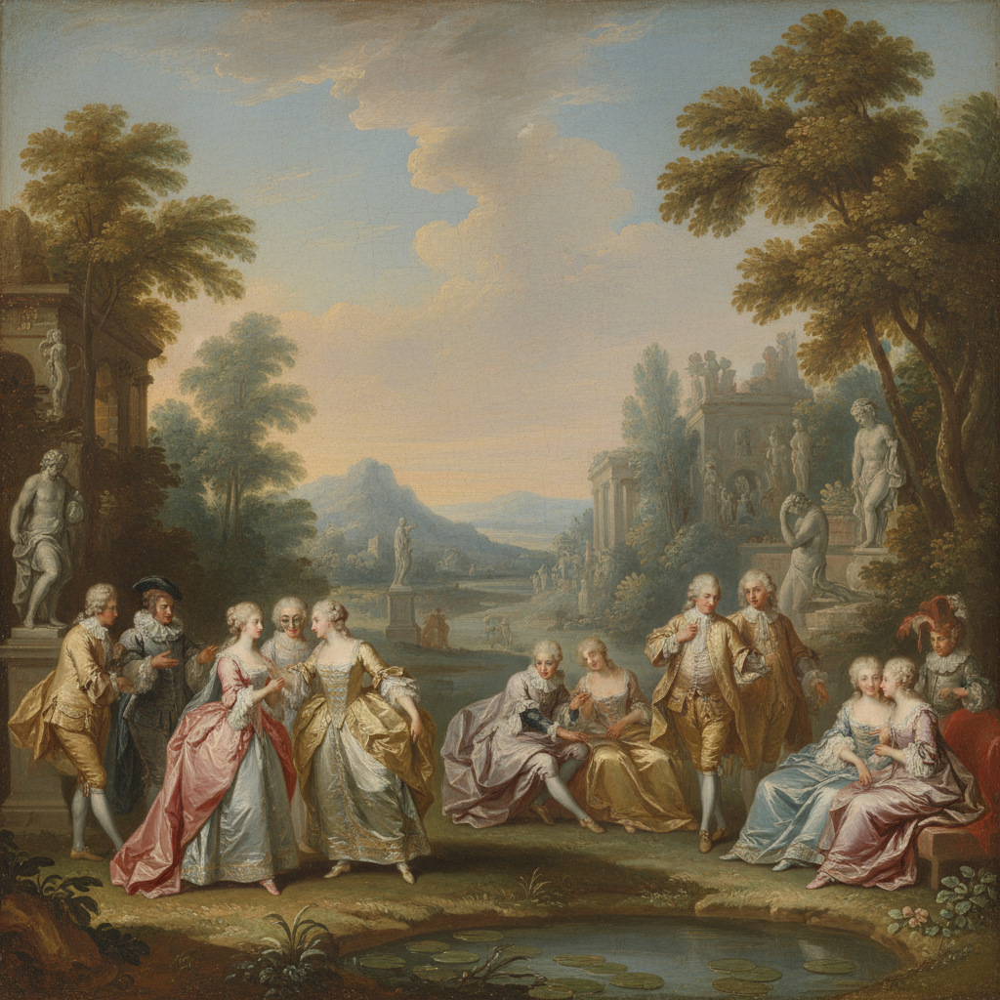

# Antoine Watteau 华托

> "He came, he painted, he died." — Edmond de Goncourt on Watteau

## 概述

安托万·华托（Antoine Watteau，1684–1721）是法国洛可可绘画的奠基人，发明了"雅宴画"（fête galante）这一全新画种——描绘贵族男女在理想化的花园中调情、演奏音乐和跳舞的场景。他的画面充满诗意的忧郁和转瞬即逝的美。

## 核心特征

| 特征 | 描述 |
|------|------|
| 雅宴画 | 贵族在花园中的优雅消遣 |
| 诗意忧郁 | 欢乐中隐含的短暂与哀愁 |
| 丝绸光泽 | 对织物质感的精湛描绘 |
| 戏剧元素 | 意大利即兴喜剧的人物 |
| 柔和色彩 | 珍珠般的粉、蓝、金 |
| 自然背景 | 理想化的公园与树林 |

## 代表作品

| 作品 | 年代 | 意义 |
|------|------|------|
| *Pilgrimage to Cythera* | 1717 | 雅宴画的定义之作 |
| *Pierrot (Gilles)* | 1718–19 | 小丑的孤独——喜剧中的悲剧 |
| *The Shop Sign of Gersaint* | 1720 | 最后的杰作 |
| *Fêtes Vénitiennes* | 1718–19 | 威尼斯式的优雅幻想 |

## AI生成概念图

## 与其他风格的关系

- **Rococo** → 洛可可绘画的创始人
- **Boucher / Fragonard** → 直接继承者
- **Rubens** → 受鲁本斯色彩影响
- **Impressionism** → 雷诺阿深受其启发
