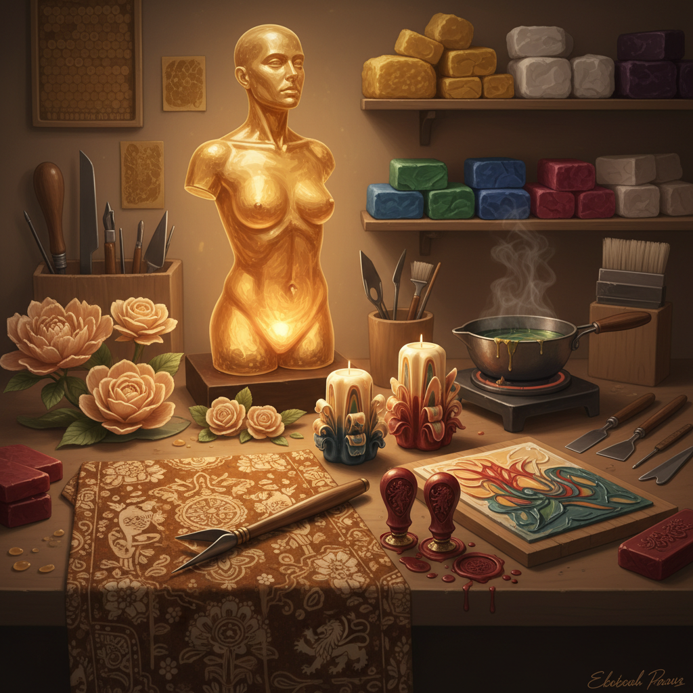

# Wax Art 蜡艺术

> "Wax is the most obedient of materials — it yields to warmth, accepts color, holds shape, and captures light. It can be as transparent as glass or as opaque as stone, as smooth as skin or as textured as bark. It melts and reforms endlessly, making it the material of transformation itself — always becoming, never fixed, a substance that exists in the space between solid and liquid." — Unknown

## 概述

蜡艺术（Wax Art）是以蜡为主要材料进行艺术创作的实践——利用蜡的可塑性、半透明性、色彩承载力和热敏特性创造各种艺术形式。蜡艺术涵盖从古老的蜡染到当代蜡雕塑的广泛实践。

蜡艺术的实践包括：1）蜡雕——用蜡进行雕塑创作（包括失蜡铸造的蜡原型）；2）蜡染——用蜡作为防染剂的纺织品染色技法（batik）；3）蜡烛艺术——将蜡烛制作提升为艺术形式；4）蜡像——用蜡制作的逼真人像（如杜莎夫人蜡像馆）；5）蜡封——用蜡封印的装饰艺术；6）蜡画（encaustic）——用热蜡作为绑定剂的绘画技法；7）蜡花——用蜡制作的仿真花卉。

## 核心特征

| 特征 | 描述 |
|------|------|
| 可塑 | 加热后极易塑形 |
| 半透明 | 天然的半透明性 |
| 温暖 | 温暖的质感和色调 |
| 可逆 | 可反复熔化重塑 |
| 多变 | 可着色、可混合 |
| 光敏 | 对光线敏感 |

## 视觉特征

- **半透明**：蜡的半透明光感
- **温暖**：蜂蜡的温暖金色
- **光滑**：光滑的表面质感
- **柔和**：柔和的边缘和形态
- **层次**：多层蜡的深度效果
- **光影**：光线穿透的效果

## 代表作品

| 作品 | 艺术家 | 年代 | 意义 |
|------|--------|------|------|
| *Fayum mummy portraits* | 古埃及 | 1-3世纪 | 蜡画（encaustic） |
| *Madame Tussauds* | Marie Tussaud | 1835至今 | 蜡像艺术 |
| *Batik textiles* | 爪哇传统 | 古代至今 | 蜡染纺织 |
| *Wax sculptures* | Various | 当代 | 当代蜡雕塑 |
| *Encaustic paintings* | Jasper Johns等 | 20世纪 | 现代蜡画 |

## 历史时间线

| 时期 | 事件 |
|------|------|
| 古埃及 | 蜡画（encaustic）的使用 |
| 古代 | 失蜡铸造中的蜡原型 |
| 中世纪 | 蜡封和蜡烛艺术 |
| 18世纪 | 蜡像艺术的兴起 |
| 当代 | 蜡作为当代艺术媒介 |

## 中国语境

蜡艺术在中国有丰富的文化传统。中国的蜡染（batik）是贵州、云南等地少数民族的传统工艺——苗族、布依族的蜡染以其精美的图案和深邃的蓝白色调著称，已被列入国家级非物质文化遗产。中国传统的"蜡笺"——用蜡处理的书写纸——是书法和绘画的高级用纸。中国古代的"蜡烛"不仅是照明工具，也是节庆装饰的艺术品。中国当代的一些艺术家在探索蜡艺术：将传统蜡染的美学与当代纺织设计结合、用蜡的半透明性创作光影装置、以及将蜡画（encaustic）技法与中国水墨美学对话。

## AI生成概念图

## 与其他风格的关系

- **Encaustic Art** → 蜡画艺术
- **Batik Art** → 蜡染艺术
- **Lost Wax Art** → 失蜡铸造艺术
- **Candle Art** → 蜡烛艺术
- **Textile Art** → 纺织艺术
- **Sculpture** → 雕塑

---

*浮光艺志 | Chronicle of Artistry*
