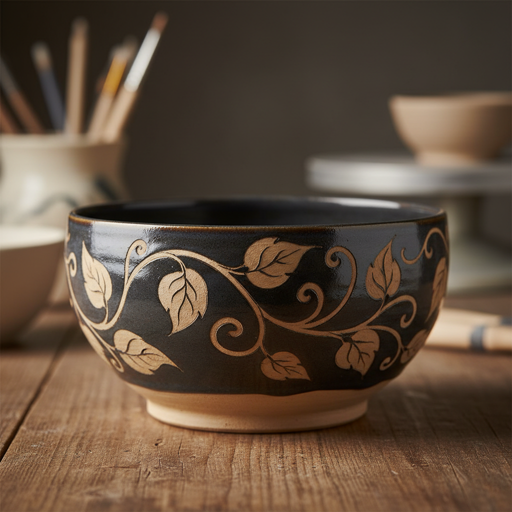

# Wax Resist Art 蜡防艺术

> "Wax resist is drawing with absence — melted wax brushed onto clay or bisque in patterns that repel the glaze or slip applied over them, the wax burning away in the kiln to reveal the bare clay beneath in negative silhouette, the decorator painting not what will be colored but what will remain untouched, thinking in reverse like a printmaker cutting away the non-image." — Unknown

## 概述

蜡防艺术（Wax Resist Art）是一种利用蜡的防水特性来创造装饰图案的陶瓷技法。将熔化的蜡或蜡乳液涂在坯体或素烧坯的特定区域，然后施釉或施化妆土——蜡覆盖的区域会排斥釉料，形成"留白"效果。烧制时蜡燃烧消失，露出下方的坯体或底釉，与上方的釉形成图案对比。蜡防是一种"负空间"装饰技法——画的是不要颜色的地方。

蜡防艺术的核心要素包括：1）蜡料——熔化的蜡或蜡乳液；2）涂蜡——在需要留白的区域涂蜡；3）施釉——在蜡上施釉，蜡排斥釉料；4）烧制——蜡在烧制中燃烧消失；5）负空间——画的是不要颜色的区域；6）对比效果——蜡防区域与施釉区域的对比；7）多层应用——可多次蜡防和施釉形成层次。

## 核心特征

| 特征 | 描述 |
|------|------|
| 防水原理 | 利用蜡的防水特性 |
| 负空间 | 画不要颜色的区域 |
| 对比效果 | 留白与施釉的对比 |
| 多层可能 | 可多次蜡防形成层次 |
| 有机线条 | 蜡笔触的自然流动 |
| 烧制消失 | 蜡在烧制中完全消失 |

## 视觉特征

- **留白图案**：蜡防区域的留白效果
- **有机边缘**：蜡笔触的自然边缘
- **对比鲜明**：施釉与未施釉的对比
- **层次感**：多次蜡防的层次效果
- **流动线条**：蜡的流动性形成的线条
- **负形美感**：负空间的独特美感

## 代表作品

| 作品 | 艺术家/文化 | 年代 | 意义 |
|------|-------------|------|------|
| *滨田庄司蜡防作品* | 滨田庄司 | 20世纪 | 民艺运动中的蜡防 |
| *Bernard Leach蜡防* | Bernard Leach | 20世纪 | 西方蜡防先驱 |
| *当代蜡防陶瓷* | 各地陶艺家 | 当代 | 当代蜡防创作 |
| *非洲蜡防陶器* | 非洲传统 | 传统 | 传统蜡防技法 |
| *蜡防与多层釉* | 当代陶艺家 | 当代 | 多层蜡防探索 |

## 历史时间线

| 时期 | 事件 |
|------|------|
| 古代 | 蜡防技法在纺织中的起源 |
| 传统时期 | 非洲和亚洲的蜡防陶瓷 |
| 20世纪 | 工作室陶艺中蜡防的普及 |
| 民艺运动 | 滨田庄司等推广蜡防 |
| 当代 | 蜡防作为基础装饰技法 |

## 中国语境

蜡防技法在中国有悠久的历史——中国的蜡染（batik）是世界上最古老的蜡防纺织技法之一，主要流行于中国西南少数民族地区。这一原理被应用到陶瓷装饰中，形成了陶瓷蜡防技法。中国当代陶艺教育中，蜡防是基础装饰课程的重要内容——它简单易学但效果丰富，是学生最早接触的装饰技法之一。中国陶艺家将蜡防与中国传统的水墨美学结合——蜡防的"留白"概念与中国画中的"计白当黑"有深刻的相通。

## AI生成概念图

## 与其他风格的关系

- **Batik** → 蜡染
- **Paper Resist** → 纸防
- **Sgraffito** → 刮花
- **Negative Space** → 负空间
- **Mishima** → 三岛手
- **Slip Decoration** → 化妆土装饰

---

*浮光艺志 | Chronicle of Artistry*
