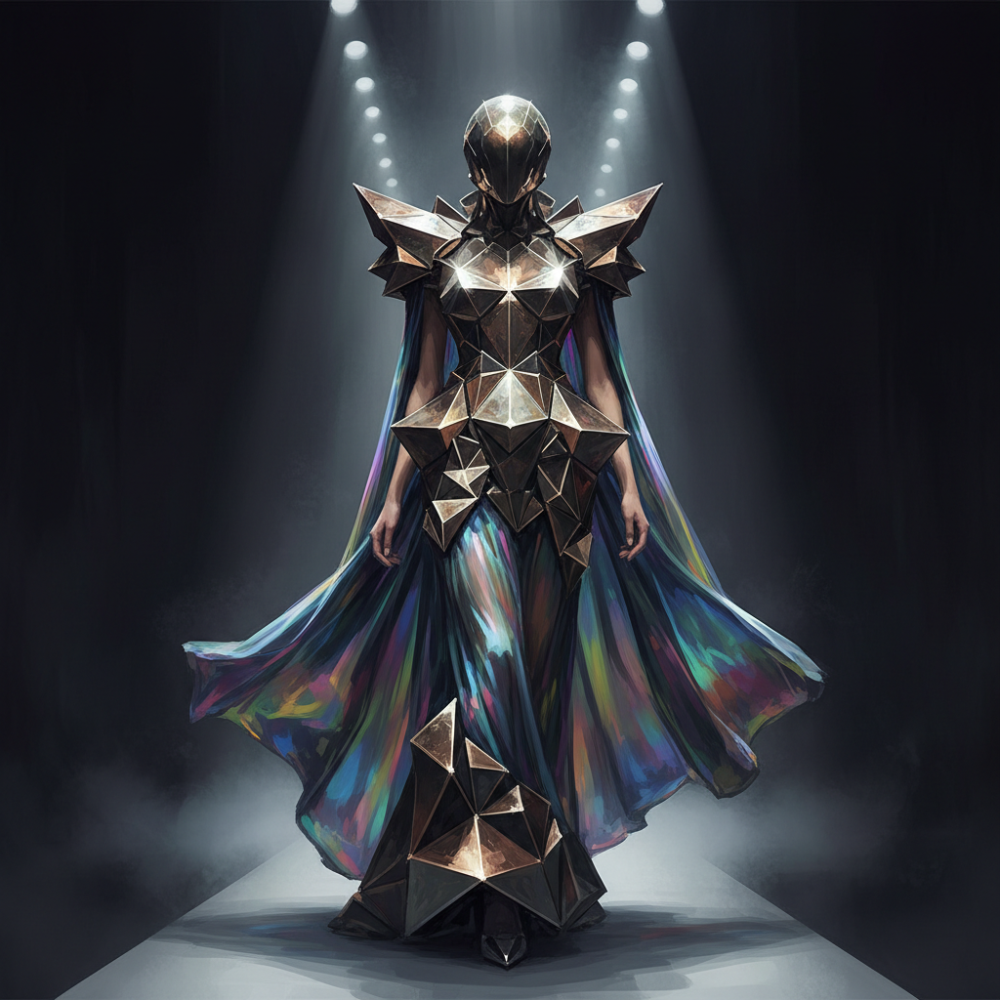

# Wearable Art 可穿戴艺术

> "Fashion is not art, but wearable art is both — it lives on the body." — Alexander McQueen

## 概述

可穿戴艺术（Wearable Art）是将人体作为展示平台的艺术形式——创作可以穿戴在身上的艺术品，超越时装的功能性和商业性，追求纯粹的艺术表达。从Issey Miyake的褶皱雕塑到Iris van Herpen的3D打印礼服，可穿戴艺术模糊了时装、雕塑和表演的界限。

可穿戴艺术的独特之处在于它与人体的关系——作品不是静态的展示，而是随着身体的运动而变化，与穿戴者共同构成一个动态的整体。

## 核心特征

| 特征 | 描述 |
|------|------|
| 身体性 | 以人体为展示平台 |
| 艺术性 | 超越功能——追求艺术表达 |
| 动态性 | 随身体运动而变化 |
| 材料创新 | 使用非传统材料 |
| 雕塑性 | 具有三维雕塑的品质 |
| 表演性 | 穿戴即是表演 |

## 视觉特征

- **结构**：建筑般的结构和造型
- **材料**：金属、塑料、纸、电子元件
- **体量**：夸张的体量和比例
- **运动**：随身体运动的变化
- **光影**：材料与光线的互动
- **戏剧性**：强烈的视觉冲击力

## 代表作品

| 作品/艺术家 | 年代 | 特征 |
|-------------|------|------|
| Issey Miyake | 1980s-至今 | 褶皱技术——布料的建筑 |
| Alexander McQueen | 1990s-2010 | 时装秀作为戏剧——骷髅与浪漫 |
| Iris van Herpen | 2010s+ | 3D打印和激光切割的未来时装 |
| Hussein Chalayan | 2000s+ | 科技与时装的融合 |
| Nick Cave (Soundsuits) | 1992-至今 | 全身覆盖的声音雕塑服 |
| World of WearableArt | 1987-至今 | 新西兰可穿戴艺术大赛 |

## 历史时间线

| 时期 | 事件 |
|------|------|
| 1960s | 太空时代时装——Courrèges、Rabanne |
| 1980s | 日本设计师——解构时装 |
| 1987 | World of WearableArt大赛创立 |
| 1990s | McQueen——时装秀作为艺术事件 |
| 2000s | 科技面料和智能服装 |
| 2010s | 3D打印时装——van Herpen |
| 2020s | 数字时装和虚拟可穿戴 |

## 中国语境

中国的可穿戴艺术在近年来快速发展——从中国设计师在国际时装周上的表现到本土的可穿戴艺术展览。中国传统服饰（如京剧戏服、少数民族盛装）本身就具有可穿戴艺术的品质。当代中国设计师如郭培等将中国传统工艺与当代艺术结合，创造出具有国际影响力的可穿戴艺术作品。

## AI生成概念图

## 与其他风格的关系

- **Sculpture** → 可穿戴艺术是身体上的雕塑
- **Performance Art** → 穿戴即是表演
- **Textile Art** → 纺织技术是可穿戴艺术的基础
- **Body Art** → 身体作为艺术的载体
- **Fiber Art** → 纤维是可穿戴艺术的核心材料
- **Digital Art** → 智能面料和数字时装

---

*浮光艺志 | Chronicle of Artistry*
