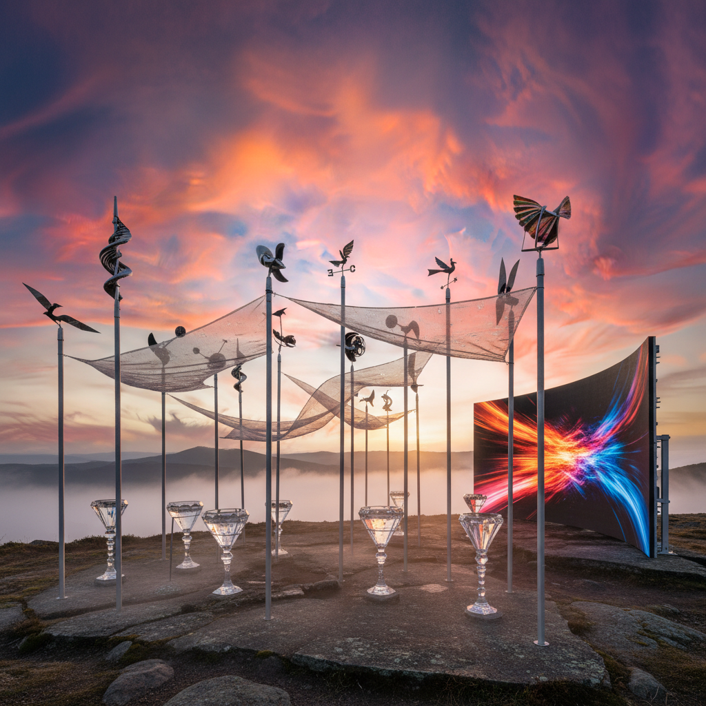

# Weather Art 气象艺术

> "Weather art surrenders to the atmosphere — it recognizes that the sky is the greatest canvas ever stretched, that clouds are sculptures no human hand could shape, that lightning is drawing at the speed of light, that rain is the earth's own printmaking process, and that the artist's role is not to compete with these forces but to collaborate with them, to make visible the invisible dynamics of pressure, temperature, and moisture that paint our world anew every moment." — Unknown

## 概述

气象艺术（Weather Art）是以天气现象——风、雨、雪、雾、云、闪电、彩虹等——为媒介、主题和合作者的艺术实践。气象艺术将天气不仅视为背景或主题，而是视为一种积极的创作力量——让大气过程直接参与艺术的生成。

气象艺术的实践包括：1）天气作为媒介——让雨水冲刷颜料、让风吹动装置、让霜冻形成图案；2）气象数据的艺术化——将温度、气压、湿度、风速等数据转化为视觉或听觉作品；3）天气预报美学——将天气预报的视觉语言（等压线、锋面、卫星云图）作为美学元素；4）气候变化艺术——用天气数据的长期变化来表达气候危机；5）大气光学——利用大气中的光学现象（彩虹、日晕、海市蜃楼）进行创作。

## 核心特征

| 特征 | 描述 |
|------|------|
| 大气 | 大气现象 |
| 变化 | 持续变化 |
| 力量 | 自然力量 |
| 数据 | 气象数据 |
| 不可控 | 不可控制 |
| 体验 | 身体体验 |

## 视觉特征

- **云**：云的形态和光影
- **水**：雨、雾、露的效果
- **光**：大气光学现象
- **风**：风的可视化
- **图表**：气象图表美学
- **变化**：持续变化的状态

## 代表作品

| 作品 | 艺术家 | 年代 | 意义 |
|------|--------|------|------|
| *The Weather Project* | Olafur Eliasson | 2003 | 人造太阳 |
| *Rain Room* | Random International | 2012 | 雨屋 |
| *Cloud installations* | Various | 2010年代 | 云装置 |
| *Climate data art* | Various | 2010年代 | 气候数据艺术 |
| *Fog sculptures* | Fujiko Nakaya | 1970年代至今 | 雾雕塑 |

## 历史时间线

| 时期 | 事件 |
|------|------|
| 1820年代 | Constable的云研究 |
| 1970年代 | Fujiko Nakaya的雾雕塑 |
| 2003 | Eliasson的Weather Project |
| 2012 | Rain Room |
| 当代 | 气候变化推动的气象艺术 |

## 中国语境

气象艺术在中国有极其深厚的文化传统。中国传统绘画中，"气"是最核心的美学概念之一——"气韵生动"是绘画的最高标准。中国山水画本质上就是一种气象艺术——云雾、烟雨、风雪是山水画的灵魂。中国传统文化中对天气的敏感——二十四节气、农历、天象观测——构成了一种精细的"气象美学"。中国当代的一些艺术家在探索气象艺术：将中国传统的"烟雨"美学与当代装置技术结合、用中国城市的空气质量数据创作气候艺术、以及将中国传统的"观天"智慧与当代气象科学对话。

## AI生成概念图

## 与其他风格的关系

- **Land Art** → 大地艺术
- **Eco-Art** → 生态艺术
- **Light Art** → 光艺术
- **Kinetic Art** → 动态艺术
- **Data Art** → 数据艺术
- **Atmospheric Art** → 大气艺术

---

*浮光艺志 | Chronicle of Artistry*
