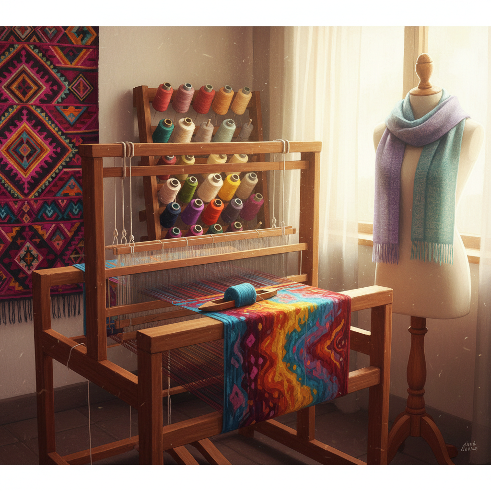

# Weaving 编织

> "Weaving is the original algorithm — warp and weft, over and under, the binary code that builds cloth from thread." — Unknown

## 概述

编织（Weaving）是将经线（warp）和纬线（weft）以直角交叉穿插形成织物的最基本纺织技法。编织是人类最古老的技术之一——比陶器更早，几乎与农业同时出现。从简单的平纹到复杂的提花，从手工腰机到电脑控制的提花织机，编织的基本原理数千年未变：经纬交织。编织不仅是实用技术，更是文化表达——从秘鲁的安第斯编织到日本的西阵织，每种文化都有自己独特的编织传统。

编织的哲学在于：二元的无限——仅有"上"和"下"两种状态，通过排列组合创造出无穷的图案和结构，如同二进制代码构建整个数字世界。

## 核心特征

| 特征 | 描述 |
|------|------|
| 经纬 | 经线与纬线的交织 |
| 直角 | 线以直角交叉 |
| 织机 | 使用各种织机 |
| 结构 | 结构性的织物 |
| 古老 | 最古老的纺织技术 |
| 普遍 | 全球普遍的技术 |

## 视觉特征

- **纹理**：经纬交织的纹理
- **图案**：几何性的图案
- **色彩**：经纬配色的效果
- **结构**：结构性的织物质感
- **规律**：规律的重复单元
- **平面**：平面的织物

## 代表作品

| 作品 | 艺术家 | 年代 | 意义 |
|------|--------|------|------|
| *Andean textiles* | 匿名 | 传统 | 安第斯编织传统 |
| *Navajo blankets* | 匿名 | 传统 | 纳瓦霍毯子 |
| *Bauhaus weaving* | Anni Albers | 1920s-60s | 包豪斯编织 |
| *Nishijin-ori* | 匿名 | 传统 | 日本西阵织 |
| *Sheila Hicks installations* | Sheila Hicks | 1960s+ | 当代编织装置 |

## 历史时间线

| 时期 | 事件 |
|------|------|
| 公元前7000年 | 最早的编织证据 |
| 古代 | 各文明的编织发展 |
| 中世纪 | 欧洲织布行会 |
| 1801 | 雅卡尔提花织机 |
| 1920s | 包豪斯编织工坊 |
| 当代 | 手工编织的艺术复兴 |

## 中国语境

中国是世界上最早掌握编织技术的文明之一——丝绸编织是中国对世界文明最重要的贡献之一。从商代的丝织品到宋代的缂丝，从明代的云锦到清代的织金，中国的编织传统博大精深。中国的四大名锦（云锦、蜀锦、宋锦、壮锦）和缂丝都是世界级的编织艺术。当代中国的手工编织也在复兴——从少数民族的传统编织到当代纤维艺术家的创作。

## AI生成概念图

## 与其他风格的关系

- **Tapestry** → 挂毯编织
- **Knitting** → 棒针编织
- **Textile Art** → 纺织艺术
- **Fiber Art** → 纤维艺术
- **Ikat** → 扎染编织
- **Jacquard** → 提花编织

---

*浮光艺志 | Chronicle of Artistry*
