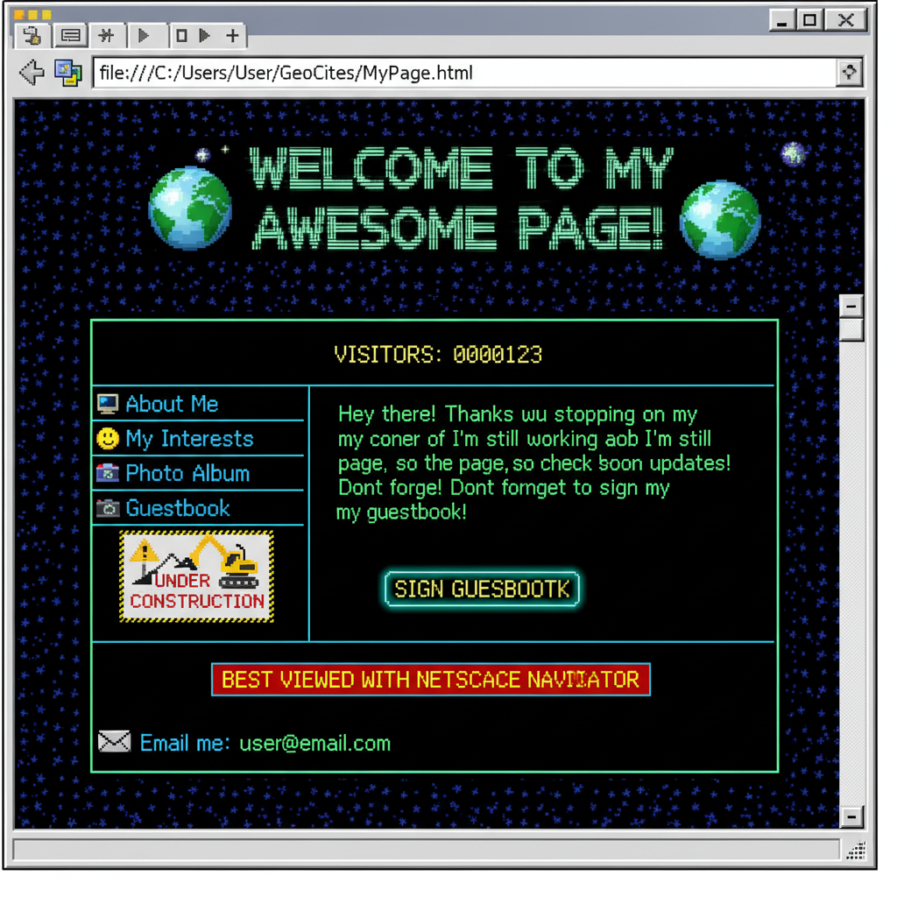

# Webcore / Old Web

> **别名**：Early Internet, Retro Web, Web 1.0, "Wild West" Internet Era  
> **活跃年代**：1995 – 2005（原生期）；2018 – 至今（怀旧复兴期）  
> **关键平台**：GeoCities、Angelfire、Tripod、早期论坛、个人主页

---

## 一句话定义

Webcore 是对早期互联网视觉文化的怀旧美学——那个充满动态 GIF、访客计数器、"Under Construction"标志、霓虹背景和蓝色下划线链接的时代，代表着互联网尚未被公司化、算法化之前的**野生个人主义**。

---

## 视觉语言

| 元素 | 描述 |
|------|------|
| 动态 GIF | 旋转的信封图标、跳舞的婴儿、燃烧的文字 |
| 像素化图形 | 低分辨率剪贴画、像素字体、马赛克背景 |
| 霓虹色彩 | 亮绿色文字配黑色背景、彩虹渐变横幅 |
| HTML 表格布局 | 嵌套表格、框架页面、滚动字幕 `<marquee>` |
| 交互元素 | 访客计数器、留言簿、"Sign My Guestbook" 按钮 |
| 施工标志 | "Under Construction" 配一个挖掘机 GIF |
| ASCII Art | 用字符拼成的图案和签名 |

---

## 历史时间线

| 时期 | 事件 |
|------|------|
| 1994-1996 | GeoCities 上线，个人主页文化爆发 |
| 1996-2000 | 个人网站黄金期：每个人都有自己的"数字房间" |
| 2001-2004 | 博客兴起，个人主页开始衰落 |
| 2004-2007 | MySpace 继承了部分自定义精神 |
| 2009 | Yahoo 关闭 GeoCities，大量页面永久消失 |
| 2018+ | Neocities 复兴运动，Webcore 作为美学标签流行 |

---

## 文化内核

### 数字房间：互联网作为个人空间

早期互联网的核心隐喻是**房间**——你的个人主页就是你的数字卧室。你可以：
- 选择壁纸（背景图片）
- 摆放家具（GIF 装饰）
- 贴海报（喜欢的乐队/动漫图片）
- 邀请朋友来签名（留言簿）

这种空间感在 Facebook/Instagram 的时间线界面中完全消失了。

### 技术限制即美学

Webcore 的视觉特征很多源于技术限制：
- 256 色 GIF 是因为带宽有限
- 像素字体是因为屏幕分辨率低
- 表格布局是因为 CSS 还不成熟
- 闪烁文字是因为 `<blink>` 标签是当时最酷的"动画"

但这些限制反而创造了一种独特的、不可复制的视觉语言。

### 去中心化的乌托邦

早期互联网没有算法推荐、没有信息流、没有"关注"按钮。你需要**主动寻找**内容——通过 Web Ring（网站环）、链接页面、搜索引擎。这种结构鼓励了探索和发现，而不是被动消费。

---

## 子风格

| 子风格 | 特征 |
|--------|------|
| **GeoCities Nostalgia** | 最纯粹的个人主页怀旧 |
| **Digital Oddity** | 强调早期网络的怪异和超现实 |
| **Old Meme** | 怀念 2000s 初期的 meme 文化（Dancing Baby、Hamster Dance） |
| **Neocities Revival** | 当代人用现代技术重建 90s 风格网站 |

---

## 与其他风格的关系

- **Vaporwave**：共享对旧技术的怀旧，但 Vaporwave 更批判性、更超现实
- **Glitter Graphics**：Webcore 的一个视觉子集，专注于闪光装饰
- **Frutiger Aero**：Webcore 的"下一代"——Web 2.0 时代的光泽设计
- **Liminal Space**：共享对废弃数字空间的迷恋

---

## 为什么它在 2020s 回潮？

1. **对算法的厌倦**：人们怀念不被推荐系统控制的互联网
2. **对个性的渴望**：千篇一律的社交媒体模板 vs. 完全自定义的个人主页
3. **数字考古**：Internet Archive 让人们重新发现被遗忘的网站
4. **Neocities 运动**：新一代年轻人开始手写 HTML，重建个人网站

---

## 代表性视觉参考

- GeoCities 存档（archive.org/web/geocities）
- Cameron's World（cameronsworld.net）——GeoCities 内容拼贴艺术
- Neocities.org 上的当代复古网站
- 早期中文互联网：个人主页、Flash 动画、QQ 空间

---

## 延伸阅读

- [Aesthetics Wiki - Webcore](https://aesthetics.fandom.com/wiki/Webcore)
- [One Terabyte of Kilobyte Age](https://blog.geocities.institute/) — GeoCities 研究项目
- 本项目相关：[Glitter Graphics](glitter-graphics.md) | [Vaporwave](vaporwave.md) | [Frutiger Aero](frutiger-aero.md)
