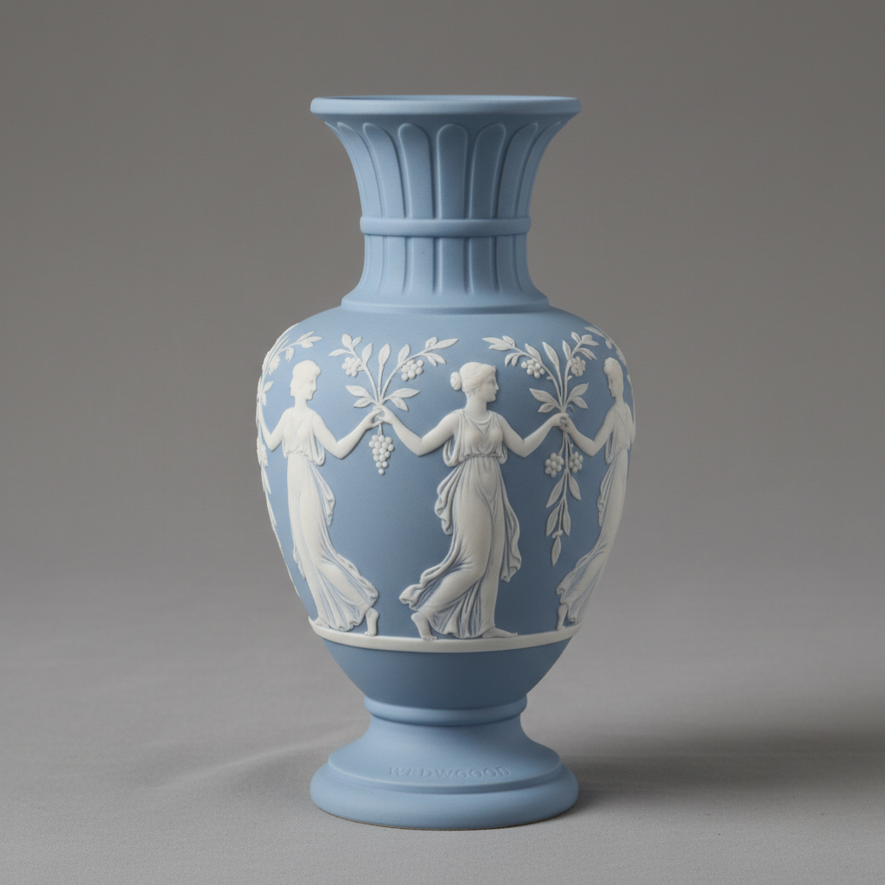

# Wedgwood Art 韦奇伍德艺术

> "Wedgwood is the Enlightenment made ceramic — Josiah Wedgwood transformed English pottery from rustic craft into industrial art through scientific experimentation, neoclassical taste, and marketing genius, creating jasperware, basalt, and creamware that democratized elegance, proving that beauty and commerce could advance together, the potter who became a Fellow of the Royal Society and whose name remains synonymous with refined tableware two and a half centuries later." — Unknown

## 概述

韦奇伍德艺术（Wedgwood Art）是18世纪英国陶瓷大师Josiah Wedgwood（1730-1795）创立的陶瓷艺术传统。韦奇伍德是工业革命时期最伟大的陶瓷创新者——他将科学实验方法引入陶瓷生产，发明了多种新型陶瓷材料，并将新古典主义美学与工业化生产完美结合。韦奇伍德最著名的产品包括碧玉炻器（Jasperware）、玄武岩炻器（Black Basalt）和奶油色陶器（Creamware/Queen's Ware）。

韦奇伍德艺术的核心要素包括：1）科学创新——科学方法驱动的创新；2）新古典主义——古典美学的现代诠释；3）碧玉炻器——标志性的蓝白浮雕；4）工业化——工业化生产的先驱；5）品牌意识——最早的品牌营销；6）民主化——让优雅走入普通家庭；7）持续传承——250年不断的传承。

## 核心特征

| 特征 | 描述 |
|------|------|
| 科学创新 | 科学方法驱动创新 |
| 新古典主义 | 古典美学现代诠释 |
| 碧玉炻器 | 标志性蓝白浮雕 |
| 工业化 | 工业化生产先驱 |
| 品牌意识 | 最早的品牌营销 |
| 民主化 | 让优雅走入普通家庭 |

## 视觉特征

- **蓝白配色**：经典的蓝底白色浮雕
- **古典浮雕**：希腊罗马风格浮雕
- **简洁优雅**：简洁优雅的造型
- **哑光质感**：无釉的哑光表面
- **精确工艺**：精确的工业化工艺
- **品牌标识**：清晰的品牌标识

## 代表作品

| 作品 | 艺术家/文化 | 年代 | 意义 |
|------|-------------|------|------|
| *波特兰花瓶复制品* | Wedgwood | 1790年 | 碧玉炻器巅峰 |
| *Queen's Ware* | Wedgwood | 1765年 | 奶油色陶器 |
| *碧玉炻器浮雕* | Wedgwood | 1775年起 | 标志性产品 |
| *黑色玄武岩* | Wedgwood | 1768年 | 黑色炻器 |
| *废奴运动徽章* | Wedgwood | 1787年 | 社会影响 |

## 历史时间线

| 时期 | 事件 |
|------|------|
| 1759年 | Josiah Wedgwood创立公司 |
| 1765年 | Queen's Ware的成功 |
| 1775年 | 碧玉炻器的发明 |
| 19世纪 | 韦奇伍德的持续发展 |
| 当代 | 韦奇伍德品牌的延续 |

## 中国语境

韦奇伍德与中国陶瓷有复杂的历史关系。18世纪的欧洲对中国瓷器有巨大的需求——韦奇伍德的创业动机之一就是要生产能与中国瓷器竞争的英国陶瓷。韦奇伍德的奶油色陶器（Creamware）虽然不是瓷器，但其品质和价格使其成功地替代了部分中国外销瓷的市场。韦奇伍德对中国陶瓷的态度是既学习又竞争——他研究中国瓷器的技术和美学，但最终走出了一条完全不同的道路。韦奇伍德的碧玉炻器选择了新古典主义而非中国风格——这标志着欧洲陶瓷开始摆脱对中国审美的依赖。韦奇伍德的工业化生产模式也与中国传统的手工作坊模式形成了对比——代表了两种不同的陶瓷生产哲学。韦奇伍德品牌至今仍在生产——是世界上历史最悠久的陶瓷品牌之一。

## AI生成概念图

## 与其他风格的关系

- **Jasperware** → 碧玉炻器
- **Basalt Ware** → 玄武岩炻器
- **Neoclassicism** → 新古典主义
- **Creamware** → 奶油色陶器
- **Industrial Revolution** → 工业革命
- **British Ceramics** → 英国陶瓷

---

*浮光艺志 | Chronicle of Artistry*
