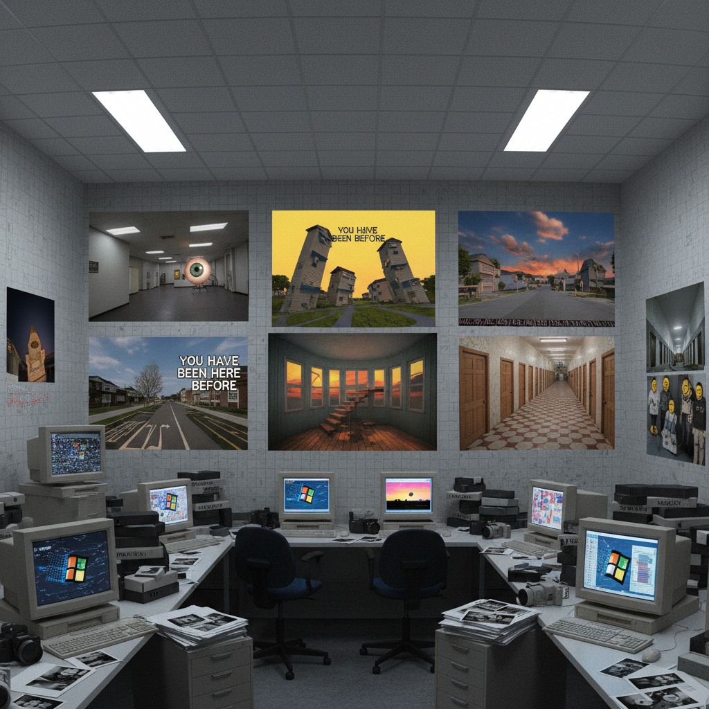

# Weirdcore Art 怪核艺术

> "Weirdcore is the internet's fever dream — images that feel like corrupted memories from a computer that dreamed of being human, low-resolution photographs of impossible spaces overlaid with cryptic text in Comic Sans, eyeballs in the sky and smiling faces where faces should not be, an aesthetic that weaponizes the uncanny valley of early internet graphics and forgotten digital spaces to create a feeling that something is fundamentally wrong with reality itself." — Unknown

## 概述

怪核（Weirdcore）是2020年代兴起的一种互联网美学风格，通过故意制造视觉上的"不对劲"感来营造一种深层的不安和超现实体验。Weirdcore的图像通常使用低分辨率的照片、早期互联网的图形风格、不协调的元素组合、以及令人不安的文字叠加来创造一种"现实出了故障"的感觉。

Weirdcore与Dreamcore（梦核）密切相关但更加极端——如果说Dreamcore是"奇怪的梦"，那么Weirdcore就是"噩梦的边缘"。Weirdcore的视觉语言包括：扭曲的透视、不可能的空间、眼睛和面孔出现在不应该出现的地方、早期3D渲染的诡异质感、以及带有威胁性或荒诞性的文字信息。Weirdcore的美学根源可以追溯到早期互联网的"诡异谷"——那些低多边形的3D世界、像素化的纹理和原始的数字图像处理。

## 核心特征

| 特征 | 描述 |
|------|------|
| 诡异 | 深层的诡异感 |
| 低分辨率 | 低分辨率的质感 |
| 不可能 | 不可能的空间 |
| 故障 | 现实的"故障" |
| 早期网络 | 早期互联网美学 |
| 不安 | 深层的不安感 |

## 视觉特征

- **低分辨率**：像素化和模糊
- **眼睛**：不该出现的眼睛
- **文字**：诡异的文字叠加
- **空间**：不可能的空间
- **面孔**：扭曲的面孔
- **色彩**：不自然的过饱和色彩

## 代表作品

| 作品 | 艺术家 | 年代 | 意义 |
|------|--------|------|------|
| *Weirdcore edits* | Various creators | 2020起 | 互联网怪核创作 |
| *Backrooms* | Anonymous | 2019 | 后室的怪核空间 |
| *Windows 95/98 aesthetics* | Various | 2020年代 | 早期Windows的诡异化 |
| *LSD: Dream Emulator* | Asmik Ace | 1998 | 早期3D的梦境游戏 |
| *Petscop* | Tony Domenico | 2017 | 诡异的游戏解谜 |

## 历史时间线

| 时期 | 事件 |
|------|------|
| 1998 | LSD: Dream Emulator发布 |
| 2017 | Petscop系列开始 |
| 2019 | Backrooms概念诞生 |
| 2020 | Weirdcore美学的命名 |
| 当代 | Weirdcore的持续发展 |

## 中国语境

怪核在中国年轻人中有活跃的创作社区。中国的创作者利用中国特有的视觉元素创造怪核作品——如将中国90年代的学校、医院、商场等空间进行怪核化处理。中国早期互联网（如QQ空间、百度贴吧）的视觉记忆也成为中国怪核的独特素材。中国的"阴间滤镜"（一种让照片看起来诡异的修图风格）可以被视为一种本土化的怪核实践。中国传统文化中的"鬼故事"美学和"聊斋"式的超自然想象也为中国怪核提供了文化资源。

## AI生成概念图

## 与其他风格的关系

- **Dreamcore** → 梦核
- **Liminal Space** → 阈限空间
- **Surrealism** → 超现实主义
- **Glitch Art** → 故障艺术
- **Vaporwave** → 蒸汽波
- **Creepypasta** → 网络恐怖故事

---

*浮光艺志 | Chronicle of Artistry*
