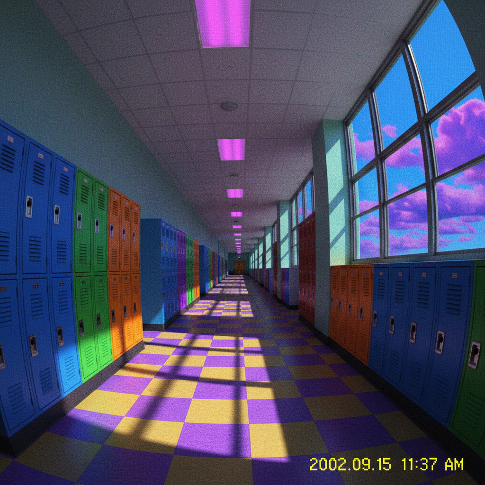

# Weirdcore 怪核



> **"低分辨率走廊、错位的天空、不存在的记忆——熟悉感中的深层恐惧。"**

## 概述

| 维度 | 描述 |
|------|------|
| 时期 | 2020–至今 |
| 别名 | Weirdcore, Oddcore, Uncanny Aesthetic |
| 核心色彩 | 过饱和色、失真色、不自然的蓝/绿/黄 |
| 关键元素 | 低分辨率图像、空旷空间、错位物体、不自然光线 |
| 代表人物 | Tumblr/TikTok 社区、Backrooms 创作者 |
| 关联风格 | Dreamcore, Liminal Space, Traumacore, Backrooms |

---

## 历史脉络

| 年份 | 事件 |
|------|------|
| 2000s | 早期互联网低质量图片——无意中的"怪异" |
| 2019 | Backrooms creepypasta——"阈限空间"概念爆发 |
| 2020 | Weirdcore 作为独立美学在 Tumblr/TikTok 兴起 |
| 2021 | 与 Dreamcore 分化——Weirdcore 更"不安" |
| 2022 | 成为互联网恐怖美学的主流分支 |

### 核心哲学

Weirdcore 的精神是**"这里很熟悉，但有什么不对——恐怖谷效应的视觉化"**：
- 熟悉 + 错位 = 不安（uncanny valley）
- 低分辨率 = 记忆的不可靠
- 空旷 = 孤独（"这里应该有人，但没有"）
- "你以前来过这里吗？"
- 现实 ≠ 真实

---

## 视觉语法

### 色彩系统

```
主色：
  过饱和蓝 (#0066FF) — 不自然的天空
  过饱和绿 (#00FF00) — 不自然的草地
  黄色 (#FFFF00) — 不自然的光线
  白色 (#FFFFFF) — 过曝
  黑色 (#000000) — 阴影中的未知

规则：
  - 颜色"不太对"
  - 过饱和或过曝
  - 色彩组合让人不舒服
  - 像是相机出了问题
  - 像是记忆出了问题

质感：
  低分辨率 — 像素化、模糊
  过曝 — 白色溢出
  噪点 — 早期数码相机
  失真 — 色差、变形
```

### 标志性元素

| 类别 | 元素 |
|------|------|
| 空间 | 空走廊、空教室、空停车场、空泳池 |
| 天空 | 不自然的蓝色、多个太阳、错位的云 |
| 物体 | 错位的家具、漂浮的物体、不该在那里的东西 |
| 文字 | "你还记得吗？"、"这不是真的"、"醒来" |
| 图像 | 低分辨率、过曝、色差、像素化 |
| 态度 | 不安、困惑、孤独、似曾相识 |

---

## 与千禧怀旧的关系

### 早期互联网的"意外美学"
- 2000s 低质量数码照片 = Weirdcore 的视觉来源
- 早期互联网的"粗糙感"被重新诠释
- "怀旧"+ "恐惧"= Weirdcore 的情感核心
- "我记得这个地方，但它不存在"

### 与 Liminal Space 的关系
- Liminal Space = 过渡空间（走廊、候车室）
- Weirdcore = Liminal Space + 超现实元素
- 两者共享"空旷"和"不安"
- Weirdcore 更主动地"制造错误"

---

## 中国语境

- 与中国"诡异"/"细思极恐"文化的交叉
- 中国城市中的阈限空间（空商场、空地下通道）
- 与中国恐怖游戏美学的关系
- 抖音上的 Weirdcore 内容

---

## 设计应用

| 场景 | 应用方式 |
|------|----------|
| 游戏 | 恐怖游戏+心理恐怖+环境叙事 |
| 音乐 | 实验电子+ambient+恐怖配乐 |
| 视频 | ARG+恐怖短片+互联网艺术 |
| 数字 | 故障效果+低分辨率+不安的UI |

---

## 相关风格

← [Dreamcore 梦核](dreamcore-weirdcore.md) | [Liminal Space 阈限空间](liminal-space.md) →

↑ [返回千禧怀旧目录](README.md) | [返回总目录](../README.md)
