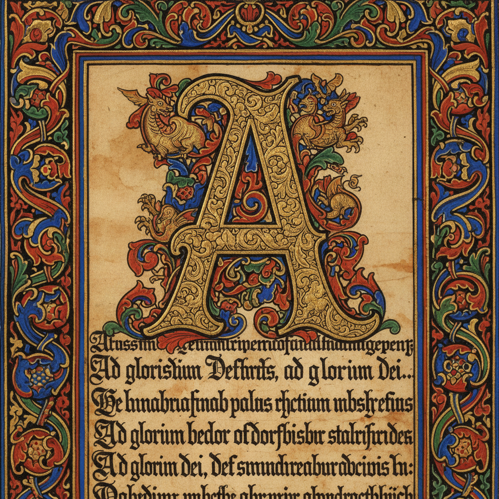

# Western Calligraphy 西方书法

> **时期：** 3世纪–至今  
> **关键词：** 宽笔书写、哥特体、意大利体、手抄本、字体设计

## 概述

Western Calligraphy（西方书法）是使用宽头笔或尖头笔书写拉丁字母的艺术传统。从罗马大写体到中世纪手抄本的哥特体，从文艺复兴的人文主义体到当代的实验书法，西方书法既是实用的书写技艺，也是探索字母形态美感的视觉艺术——笔尖的角度决定了笔画的粗细变化和节奏。

## 风格特征

- **宽笔技法**：笔尖角度决定笔画粗细
- **字体系统**：安色尔、哥特、意大利斜体等
- **装饰首字**：手抄本中的华丽大写字母
- **节奏韵律**：笔画间距和字距的音乐性
- **工具多样**：宽头笔、尖头笔、刷笔等

## 代表人物与作品

- 爱德华·约翰斯顿（现代西方书法之父）
- 赫尔曼·察普夫（书法家+字体设计师）
- 《凯尔经》（中世纪手抄本杰作）
- 布罗迪·诺伊恩施万德（当代实验书法）

## 概念图

