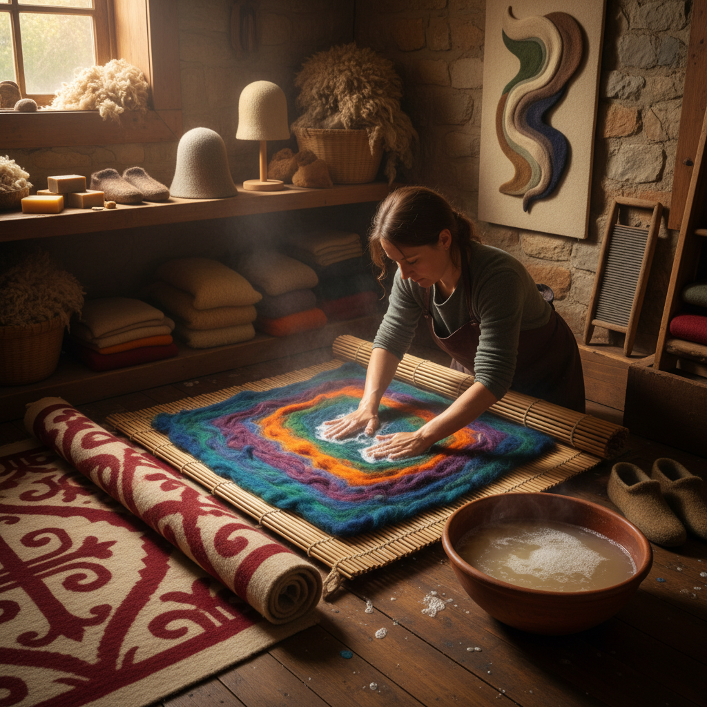

# Wet Felting 湿毡

> "Wet felting is the oldest textile — no loom, no needle, no spinning required, just wool, water, soap, and the patient friction of hands transforming loose fiber into solid cloth through the magic of scale and entanglement." — Unknown

## 概述

湿毡（Wet Felting）是使用水、肥皂（或碱性溶液）和摩擦力使羊毛纤维相互缠结、收缩成为致密织物的工艺。湿毡是人类最古老的纺织技术之一——比编织和针织都要古老，因为它不需要先将纤维纺成纱线。湿毡的原理是：羊毛纤维表面有鳞片（scales），在碱性环境和摩擦作用下，鳞片张开并相互钩连，纤维不可逆地缠结在一起，形成致密的毡布。

湿毡的应用范围极广：从中亚游牧民族的毡房（yurt）和毡毯，到当代的毡帽、毡鞋、毡包和纤维艺术。湿毡可以制作平面织物（flat felt），也可以通过模具制作三维形状（如帽子、容器）。当代的湿毡艺术已发展出极其精美的作品——从写实的风景画到抽象的雕塑。

## 核心特征

| 特征 | 描述 |
|------|------|
| 水 | 需要水和肥皂 |
| 摩擦 | 通过摩擦缠结 |
| 收缩 | 纤维收缩成密 |
| 古老 | 最古老的纺织技术 |
| 无纺 | 不需要纺纱或编织 |
| 不可逆 | 毡化不可逆 |

## 视觉特征

- **密实**：密实的质感
- **温暖**：温暖的视觉感
- **柔软**：柔软的表面
- **无缝**：无缝的整体
- **色彩**：可混合多种颜色
- **厚实**：有厚度和重量

## 代表作品

| 作品 | 艺术家 | 年代 | 意义 |
|------|--------|------|------|
| *Central Asian yurts* | 游牧民族 | 古代 | 毡房传统 |
| *Felt carpets (shyrdak)* | 吉尔吉斯 | 传统 | 中亚毡毯 |
| *Felt hats* | 匿名 | 传统 | 毡帽传统 |
| *Contemporary felt art* | Various | 当代 | 当代毡艺术 |
| *Felt installations* | Various | 当代 | 毡装置艺术 |

## 历史时间线

| 时期 | 事件 |
|------|------|
| 公元前6000年+ | 最早的毡化证据 |
| 古代 | 中亚游牧民族的毡文化 |
| 中世纪 | 欧洲毡帽行业 |
| 工业革命 | 工业毡的生产 |
| 1970s+ | 手工湿毡的复兴 |
| 当代 | 湿毡作为艺术形式 |

## 中国语境

湿毡在中国有着悠久的传统——中国的蒙古族、哈萨克族、柯尔克孜族等游牧民族有着深厚的毡文化。蒙古包（毡房）的覆盖物就是湿毡制成的。中国新疆、内蒙古等地的传统毡毯、毡靴、毡帽等都是湿毡工艺的产物。这些传统毡制品被列为非物质文化遗产。当代中国的纤维艺术爱好者群体中，湿毡作为一种创意手工活动越来越流行。一些中国的设计师将传统毡工艺与现代设计结合。

## AI生成概念图

## 与其他风格的关系

- **Needle Felting** → 针毡
- **Nuno Felting** → 布毡
- **Fiber Art** → 纤维艺术
- **Textile Art** → 纺织艺术
- **Nomadic Craft** → 游牧工艺
- **Spinning** → 纺纱

---

*浮光艺志 | Chronicle of Artistry*
