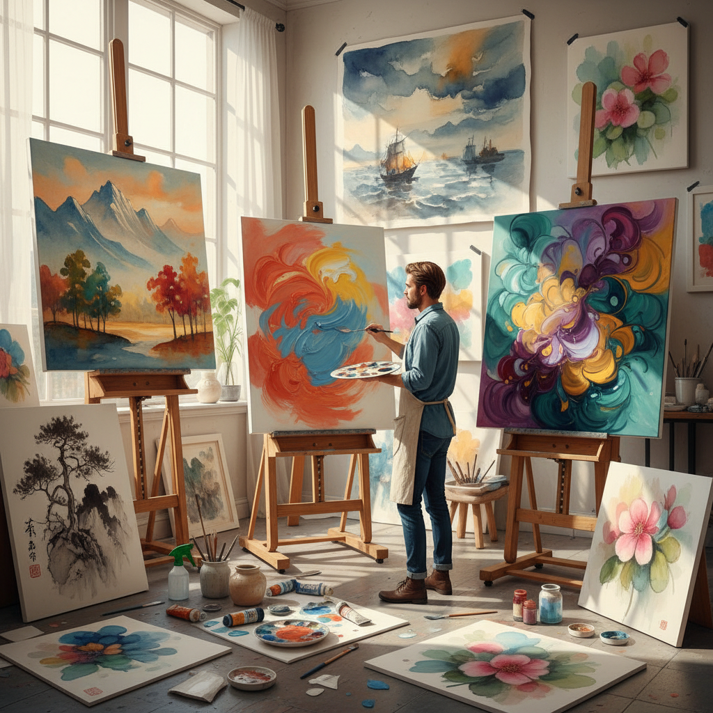

# Wet-on-Wet Painting 湿上湿画法

> "Wet-on-wet is painting as conversation — each new color meeting the last while both are still fluid, blending and pushing and merging at their boundaries in ways the artist can guide but never fully control, creating transitions so natural they seem to have grown rather than been painted, the technique that turns a canvas into a living surface where colors breathe into one another like watercolors on a rainy window." — Unknown

## 概述

湿上湿画法（Wet-on-Wet），也称为"湿画法"，是一种在尚未干燥的颜料层上继续涂抹新颜料的绘画技法。当湿颜料遇到湿颜料时，两者会在接触处自然融合和混合，创造出柔和的过渡和不可预测的色彩交融效果。这种技法在油画、水彩画和丙烯画中都有应用。

Wet-on-wet在油画中与alla prima（一次完成画法）密切相关，但两者不完全相同——alla prima强调一次完成，而wet-on-wet强调的是颜料的湿润状态和相互融合。在水彩画中，wet-on-wet是最基本和最重要的技法之一——将颜料涂在预先润湿的纸面上，颜料会自然扩散和融合。Bob Ross将油画的wet-on-wet技法通过电视节目推广到了全世界——他的"快乐的小树"就是用wet-on-wet技法画的。

## 核心特征

| 特征 | 描述 |
|------|------|
| 湿润 | 在湿颜料上作画 |
| 融合 | 颜色自然融合 |
| 柔和 | 柔和的过渡效果 |
| 不可控 | 部分不可预测 |
| 快速 | 需要快速作画 |
| 自然 | 自然的色彩过渡 |

## 视觉特征

- **柔和**：柔和的色彩过渡
- **融合**：颜色的自然融合
- **流动**：流动的色彩效果
- **自然**：自然的边缘
- **新鲜**：新鲜湿润的质感
- **有机**：有机的形态

## 代表作品

| 作品 | 艺术家 | 年代 | 意义 |
|------|--------|------|------|
| *Bob Ross landscapes* | Bob Ross | 1980-90年代 | Bob Ross的湿上湿风景 |
| *Turner watercolors* | J.M.W. Turner | 19世纪 | 特纳的湿上湿水彩 |
| *Watercolor florals* | Various | 传统-当代 | 湿上湿花卉水彩 |
| *Impressionist landscapes* | Various | 19世纪 | 印象派湿上湿风景 |
| *Contemporary wet-on-wet* | Various | 当代 | 当代湿上湿实践 |

## 历史时间线

| 时期 | 事件 |
|------|------|
| 古代 | 湿壁画（fresco）的湿上湿 |
| 18-19世纪 | 水彩画中的湿上湿发展 |
| 印象派 | 油画湿上湿的广泛应用 |
| 1980年代 | Bob Ross推广湿上湿油画 |
| 当代 | 湿上湿的全球流行 |

## 中国语境

湿上湿画法在中国有极其深厚的传统——中国水墨画本质上就是一种"湿上湿"的艺术。中国画在生宣纸上作画时，墨和水在湿润的纸面上自然扩散和融合，创造出"墨韵"和"水韵"的效果。中国画中的"破墨法"（在未干的墨上加不同浓度的墨）就是典型的wet-on-wet技法。中国的水彩画教育中也大量教授wet-on-wet技法。Bob Ross的电视节目在中国也有广泛的影响。

## AI生成概念图

## 与其他风格的关系

- **Alla Prima** → 一次完成画法
- **Watercolor** → 水彩画
- **Impressionism** → 印象派
- **Bob Ross** → Bob Ross风格
- **Chinese Ink Wash** → 中国水墨
- **Fresco** → 湿壁画

---

*浮光艺志 | Chronicle of Artistry*
