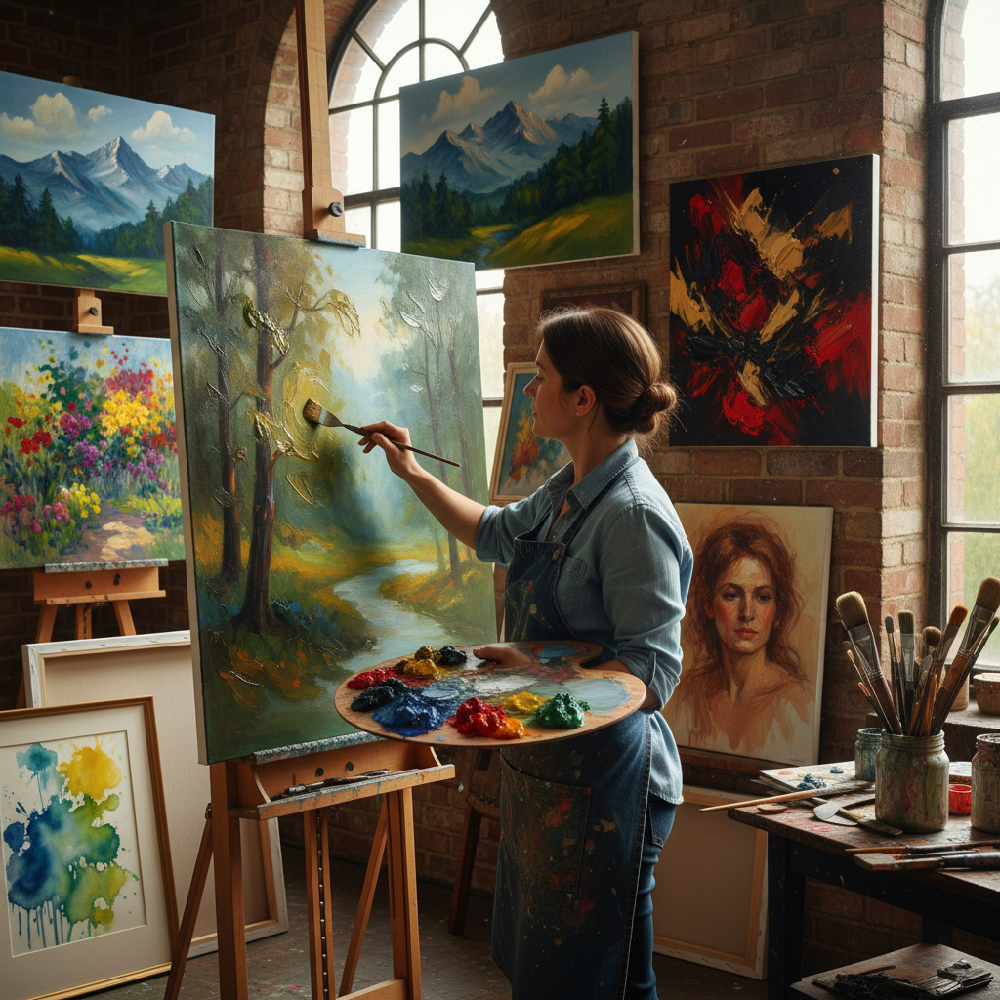

# Wet-on-Wet 湿画法

> "Wet-on-wet is painting at the speed of thought — fresh color laid into fresh color before either can dry, the pigments mingling and bleeding on the surface in ways that capture the fleeting impression of a moment with an immediacy no layered technique can match." — Unknown

## 概述

湿画法（Wet-on-Wet，也称alla prima的一种形式）是一种在未干燥的颜料层上继续添加新颜料的绘画技法。在湿画法中，颜料在画面上直接混合——新的笔触与下方未干的颜料相互融合，产生柔和的过渡和自然的色彩混合效果。湿画法可以用于油画和水彩画。

在油画中，湿画法意味着在一次作画过程中完成整幅画（或大部分），不等待中间层干燥。Bob Ross通过其电视节目使油画湿画法广为人知。在水彩画中，湿画法（wet-in-wet）是将颜料涂在湿润的纸面或未干的颜料上，产生柔和的扩散和渗透效果。湿画法的魅力在于其即时性、自发性和不可预测性。

## 核心特征

| 特征 | 描述 |
|------|------|
| 湿润 | 在湿润表面作画 |
| 混合 | 颜料直接混合 |
| 即时 | 即时完成 |
| 自发 | 自发性的表达 |
| 柔和 | 柔和的过渡 |
| 快速 | 快速的工作方式 |

## 视觉特征

- **柔和**：柔和的色彩过渡
- **融合**：色彩的自然融合
- **流动**：流动的笔触
- **即时**：即时的表达感
- **大胆**：大胆的色彩
- **自然**：自然的混合效果

## 代表作品

| 作品 | 艺术家 | 年代 | 意义 |
|------|--------|------|------|
| *Impressionist landscapes* | Monet | 19世纪 | 印象派湿画法 |
| *Bob Ross paintings* | Bob Ross | 1980s-90s | 电视湿画法教学 |
| *Watercolor wet-in-wet* | J.M.W. Turner | 19世纪 | 水彩湿画法大师 |
| *Alla prima portraits* | John Singer Sargent | 19世纪 | 一次完成肖像 |
| *Contemporary wet-on-wet* | Various | 当代 | 当代湿画法 |

## 历史时间线

| 时期 | 事件 |
|------|------|
| 传统 | 湿画法在各种绘画传统中的使用 |
| 17世纪 | 荷兰画家的alla prima技法 |
| 19世纪 | 印象派对湿画法的推广 |
| 1980s | Bob Ross电视节目的普及 |
| 当代 | 湿画法在各种媒介中的应用 |
| 当代 | 社交媒体上的湿画法教程流行 |

## 中国语境

湿画法在中国的绘画教育和创作中有广泛的应用。中国的水彩画教学中，湿画法（湿接湿）是基础技法之一。中国的油画教学中，alla prima/湿画法也是重要的训练内容。中国的水墨画传统中，"破墨法"和"泼墨法"与湿画法有相似之处——都是在湿润的表面上让颜料自然流动和混合。Bob Ross的湿画法教程在中国也有大量粉丝。中国的户外写生活动中，湿画法因其快速完成的特点而受欢迎。

## AI生成概念图

## 与其他风格的关系

- **Alla Prima** → 一次完成画法
- **Impressionism** → 印象派
- **Watercolor** → 水彩画
- **Oil Painting** → 油画
- **Plein Air** → 户外写生
- **Bob Ross Style** → Bob Ross风格

---

*浮光艺志 | Chronicle of Artistry*
