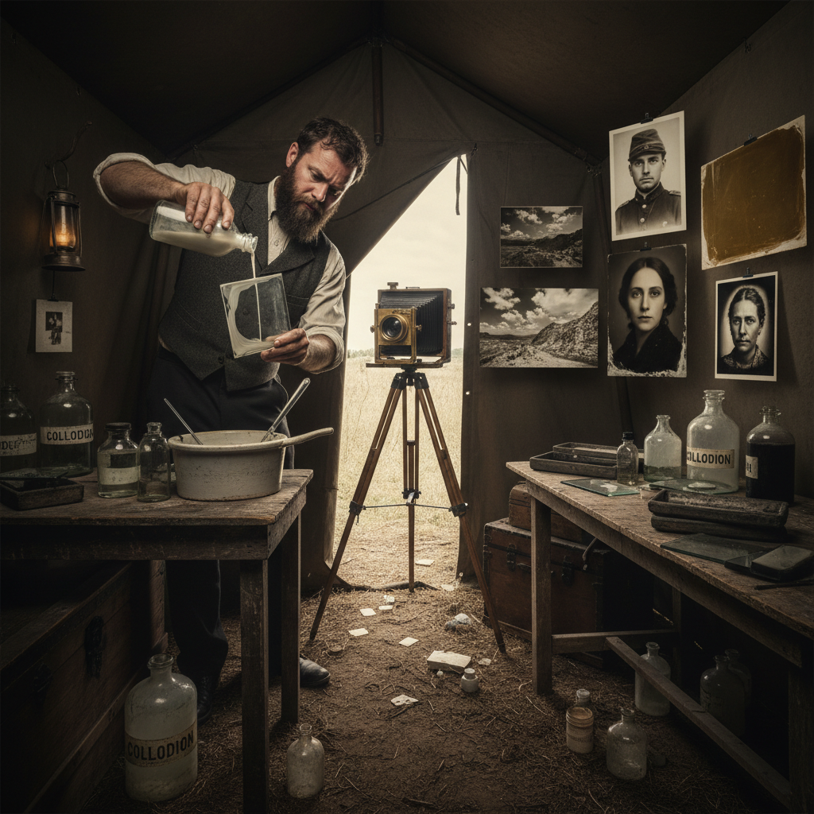

# Wet Plate Collodion 湿版火棉胶

> "Wet plate collodion is photography as performance — a race against time as the photographer coats, sensitizes, exposes, and develops the plate before the collodion dries, producing images of breathtaking clarity and depth that no digital sensor can replicate." — Unknown

## 概述

湿版火棉胶（Wet Plate Collodion）是19世纪中期最重要的摄影工艺之一——由弗雷德里克·斯科特·阿彻（Frederick Scott Archer）于1851年发明。其过程是将火棉胶（collodion，硝化纤维素溶于乙醚和酒精的溶液）涂布在玻璃板或金属板上，趁湿浸入硝酸银溶液使其感光，然后在湿润状态下曝光和显影——整个过程必须在约15分钟内完成，否则火棉胶干燥后失去感光性。

湿版火棉胶的优势在于：极高的分辨率和细节表现力、丰富的影调层次、独特的美学质感。其缺点是操作复杂——需要随身携带暗房（暗箱车）。湿版法在1851-1880年代主导了摄影界，美国内战的大部分照片都是用湿版法拍摄的。当代湿版摄影作为一种艺术媒介经历了强劲的复兴。

## 核心特征

| 特征 | 描述 |
|------|------|
| 湿润 | 必须在湿润状态操作 |
| 玻璃 | 通常使用玻璃板 |
| 高清 | 极高的分辨率 |
| 即时 | 必须即时处理 |
| 独特 | 每张都独一无二 |
| 复杂 | 操作过程复杂 |

## 视觉特征

- **锐利**：极高的锐度
- **影调**：丰富的影调层次
- **银色**：银灰色的色调
- **瑕疵**：边缘的流挂痕迹
- **深度**：三维般的深度感
- **古典**：古典的质感

## 代表作品

| 作品 | 艺术家 | 年代 | 意义 |
|------|--------|------|------|
| *Civil War photographs* | Mathew Brady | 1860s | 美国内战记录 |
| *Yosemite views* | Carleton Watkins | 1860s | 美国西部风景 |
| *Portraits* | Julia Margaret Cameron | 1860s | 维多利亚肖像 |
| *Contemporary wet plate* | Sally Mann | 当代 | 当代湿版艺术 |
| *Tintype portraits* | Various | 当代 | 当代湿版肖像 |

## 历史时间线

| 时期 | 事件 |
|------|------|
| 1851 | Archer发明湿版火棉胶法 |
| 1850s-60s | 湿版法迅速取代达盖尔法 |
| 1860s | 美国内战摄影的黄金时代 |
| 1870s | 干版法开始取代湿版法 |
| 1880s | 湿版法的商业衰落 |
| 当代 | 湿版摄影的艺术复兴 |

## 中国语境

湿版火棉胶在中国的当代摄影艺术圈中经历了显著的复兴。中国的一些摄影艺术家和工作室专门从事湿版摄影创作。中国的摄影节和艺术展览中，湿版摄影作品因其独特的美学质感而受到关注。中国的一些城市有专门的湿版摄影体验工作室，为公众提供湿版肖像拍摄服务。中国的摄影教育中，湿版法作为摄影史和替代工艺的重要内容被教授。

## AI生成概念图

## 与其他风格的关系

- **Daguerreotype** → 达盖尔银版法
- **Tintype** → 锡版摄影
- **Ambrotype** → 安布罗法
- **Salt Printing** → 盐纸印相
- **Large Format** → 大画幅摄影
- **Alternative Process** → 替代工艺

---

*浮光艺志 | Chronicle of Artistry*
