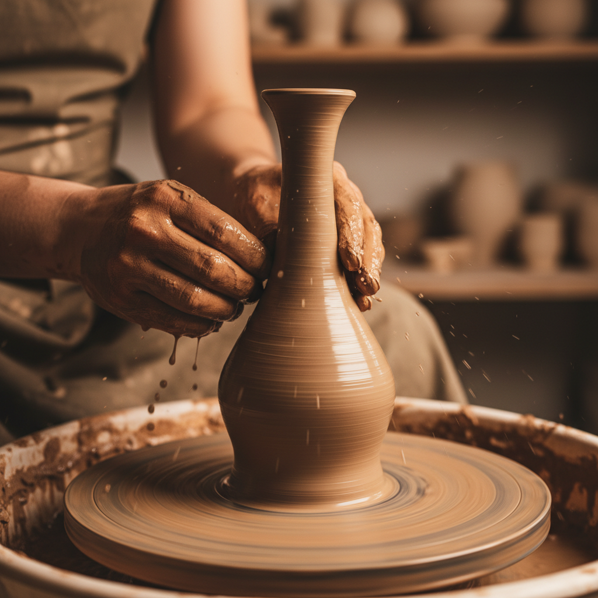

# Wheel Throwing Art 拉坯艺术

> "Wheel throwing is centrifugal meditation — a lump of clay centered on a spinning disc, the potter's wet hands opening and lifting the walls upward in a continuous spiral, the vessel rising from formlessness into form in minutes through the dialogue between centripetal force and the gentle pressure of fingertips, each piece carrying the memory of rotation in its circular symmetry and the throwing rings left by rising hands." — Unknown

## 概述

拉坯艺术（Wheel Throwing Art）是一种利用旋转的陶轮（辘轳）将粘土拉制成型的陶瓷成型技法。拉坯是陶瓷制作中最具标志性的技法——陶工将粘土置于旋转的轮盘上，用双手的压力和水的润滑将粘土向上拉起，形成圆形器物。拉坯需要高度的技巧和身体协调，是陶瓷艺术中最需要练习和经验的技法之一。

拉坯艺术的核心要素包括：1）陶轮——旋转的轮盘提供离心力；2）定中心——将粘土精确定位在轮心；3）开口——用拇指在中心按出凹陷；4）拉壁——将器壁向上拉薄拉高；5）造型——控制器物的轮廓曲线；6）修坯——干燥后在轮上修整底部；7）旋转对称——拉坯作品的圆形特征。

## 核心特征

| 特征 | 描述 |
|------|------|
| 旋转成型 | 利用陶轮的旋转力成型 |
| 圆形对称 | 作品具有旋转对称性 |
| 技巧要求 | 需要大量练习和经验 |
| 速度效率 | 可快速制作器物 |
| 拉坯纹 | 手指上升留下的螺旋纹 |
| 身体协调 | 需要全身的协调配合 |

## 视觉特征

- **圆形对称**：完美的旋转对称形态
- **拉坯纹**：手指留下的水平螺旋纹
- **流畅曲线**：连续流畅的轮廓线
- **均匀壁厚**：相对均匀的器壁
- **底部修痕**：修坯留下的同心圆纹
- **旋转韵律**：旋转运动的视觉韵律

## 代表作品

| 作品 | 艺术家/文化 | 年代 | 意义 |
|------|-------------|------|------|
| *中国龙泉窑青瓷* | 龙泉窑 | 宋代 | 拉坯技艺的巅峰 |
| *Bernard Leach拉坯* | Bernard Leach | 20世纪 | 工作室陶艺拉坯 |
| *Lucie Rie作品* | Lucie Rie | 20世纪 | 现代拉坯美学 |
| *韩国月亮罐* | 韩国李朝 | 17-18世纪 | 大型拉坯器物 |
| *当代拉坯* | 各地陶艺家 | 当代 | 拉坯的现代演绎 |

## 历史时间线

| 时期 | 事件 |
|------|------|
| 公元前4500年 | 最早的陶轮出现（美索不达米亚） |
| 公元前3000年 | 快轮的发明和普及 |
| 古代 | 拉坯在各大文明中普及 |
| 宋代 | 中国拉坯技艺的巅峰 |
| 当代 | 拉坯在全球陶艺中的核心地位 |

## 中国语境

拉坯在中国陶瓷史上有核心地位。中国的陶轮（辘轳）技术发展很早，商代已有成熟的轮制陶器。中国历代名窑的精品——从越窑青瓷到景德镇白瓷——都依赖精湛的拉坯技艺。景德镇的拉坯工匠（"利坯"工）能将瓷胎拉到极薄——薄胎瓷的壁厚仅有0.5毫米。中国传统的"七十二道工序"中，拉坯是最关键的环节之一。今天，景德镇仍然保持着世界最高水平的拉坯技艺，拉坯师傅的技能通过师徒传承延续。

## AI生成概念图

## 与其他风格的关系

- **Coil Building** → 盘筑
- **Slab Building** → 泥板成型
- **Trimming** → 修坯
- **Porcelain** → 瓷器
- **Studio Pottery** → 工作室陶艺
- **Jingdezhen** → 景德镇传统

---

*浮光艺志 | Chronicle of Artistry*
