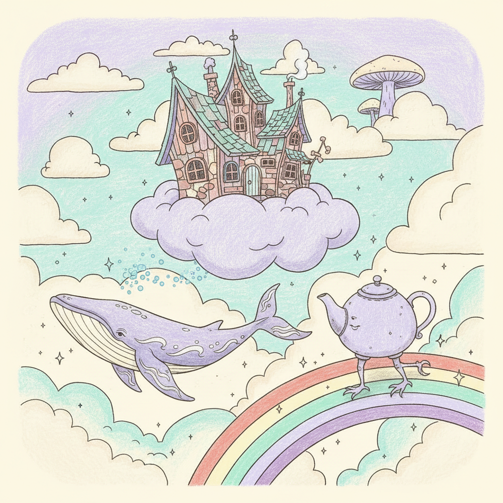

# Whimsical Design 异想天开设计



> **"不对称的房子、会飞的鲸鱼、长了腿的茶壶——当设计决定不再'正经'。"**

## 概述

| 维度 | 描述 |
|------|------|
| 时期 | 跨时代（1900s–至今）/2010s数字复兴 |
| 别名 | Whimsical, Playful Design, Fantasy Illustration, 童趣设计 |
| 核心色彩 | 柔和粉彩、薰衣草紫、薄荷绿、暖黄、珊瑚粉 |
| 关键元素 | 不对称、拟人化、梦幻场景、手绘质感、叙事性 |
| 代表人物 | Mary Blair, Oliver Jeffers, Jon Klassen, Shaun Tan |
| 关联风格 | Storybook Illustration, Naive Art, Kawaii, Surrealism |

---

## 历史脉络

| 年份 | 事件 |
|------|------|
| 1900s | Edward Lear, Lewis Carroll——文学中的whimsy |
| 1950s | Mary Blair 为迪士尼创造的色彩世界 |
| 1990s | Tim Burton——暗黑whimsical美学 |
| 2000s | Oliver Jeffers, Jon Klassen——当代绘本黄金期 |
| 2010s | 数字插画中whimsical风格爆发 |
| 2020s | 品牌设计中的"playful"趋势 |

### 核心哲学

Whimsical设计的精神是**"世界不必按规则运行——想象力才是最高法则"**：
- 不对称 = 生命力（"完美对称是死的——不对称是活的"）
- 拟人 = 共情（"当茶壶有了表情——你会对它温柔"）
- 梦幻 = 自由（"重力是可选的——逻辑是建议"）
- 手绘 = 温度（"不完美的线条比完美的曲线更有灵魂"）
- "Whimsical不是幼稚——是选择用孩子的眼睛看世界"

---

## 视觉语法

### 色彩系统

```
主色：
  薰衣草 (#E6E6FA) — 梦幻、柔和
  薄荷绿 (#98FB98) — 清新、奇幻
  暖黄 (#FFE4B5) — 温暖、快乐
  珊瑚粉 (#FF7F7F) — 活泼、可爱

辅色：
  天蓝 (#87CEEB) — 天空、想象
  奶油白 (#FFFDD0) — 纸张、温暖
  深蓝 (#191970) — 夜晚、神秘

规则：
  - 柔和但不苍白
  - 意外的色彩组合
  - 手绘质感的色彩
  - 留白是呼吸

质感：
  手绘 — 铅笔、水彩、蜡笔
  纸张 — 纹理、温暖
  不完美 — 溢出、歪斜
  层叠 — 拼贴感
```

### 标志性元素

| 类别 | 元素 |
|------|------|
| 角色 | 拟人化物品、奇怪生物、不成比例的人物 |
| 场景 | 不可能的建筑、漂浮的岛屿、瓶中世界 |
| 线条 | 手绘、不完美、有性格 |
| 构图 | 不对称、意外、叙事性 |
| 文字 | 手写、歪斜、与画面融合 |
| 态度 | 快乐、好奇、温柔、幽默、想象 |

---

## 与千禧怀旧的关系

### 数字时代的"手工温度"
- 在AI和3D渲染的时代——手绘whimsical变得珍贵
- 品牌选择whimsical = "我们有温度、有个性"
- Notion, Slack, Mailchimp——科技品牌的whimsical插画
- "越是数字化的世界——越需要手绘的温暖"

### 与Storybook的区别
- Storybook = 为儿童讲故事的插画传统
- Whimsical = 更广泛的"不正经"设计态度
- Whimsical可以是成人的、讽刺的、暗黑的
- "Tim Burton是whimsical——但不是storybook"

---

## 中国语境

- 中国绘本插画的whimsical实践
- 中国品牌设计中的"萌趣"趋势
- 与中国"国潮"中的趣味元素交叉
- 中国独立插画师的whimsical作品

---

## 设计应用

| 场景 | 应用方式 |
|------|----------|
| 品牌 | 科技品牌插画+温度+个性+亲和 |
| 绘本 | 儿童/成人绘本+叙事+想象+手绘 |
| UI | 空状态插画+引导页+加载动画 |
| 包装 | 食品/礼品+趣味+手绘+故事 |

---

## 相关风格

← [Storybook Illustration 故事书插画](storybook-illustration.md) | [Naive Art 稚拙艺术](naive-art.md) →

↑ [返回千禧怀旧目录](README.md) | [返回总目录](../README.md)
