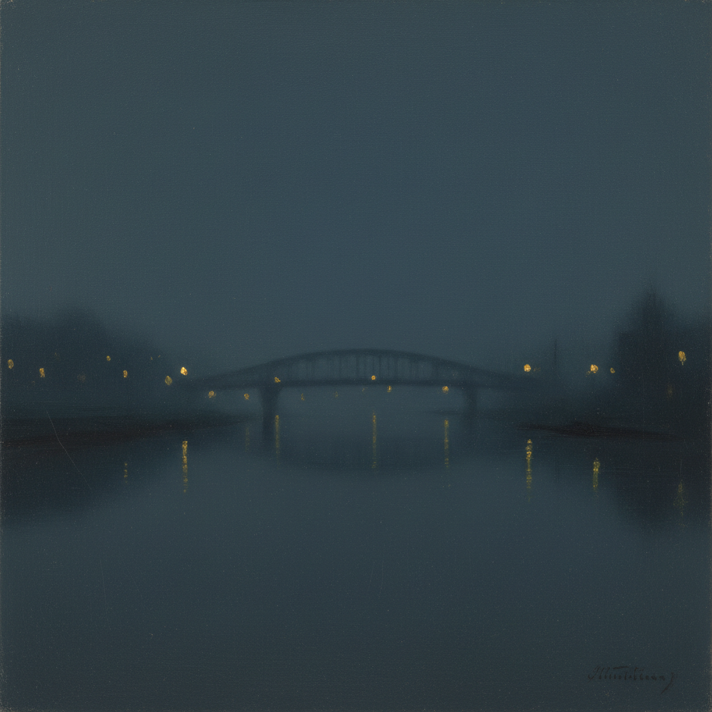

# James McNeill Whistler 惠斯勒

> "Art should be independent of all claptrap — should stand alone, and appeal to the artistic sense of eye or ear, without confounding this with emotions entirely foreign to it." — James McNeill Whistler

## 概述

詹姆斯·艾博特·麦克尼尔·惠斯勒（James Abbott McNeill Whistler，1834–1903）是美国出生、活跃于英国和法国的画家，唯美主义运动（Aestheticism）的核心人物。他以音乐术语命名画作（"夜曲"、"和声"、"交响曲"），主张绘画应如音乐般追求纯粹的形式美，而非叙事或道德说教。

惠斯勒是"为艺术而艺术"（Art for Art's Sake）理念的最激进倡导者，他与评论家罗斯金的著名诽谤诉讼（1878年）成为现代艺术自主性的里程碑事件。

## 核心特征

| 特征 | 描述 |
|------|------|
| 音乐性命名 | 以 Nocturne、Harmony、Symphony、Arrangement 命名 |
| 色调统一 | 追求画面整体的色调和谐 |
| 极简构图 | 减少细节，追求本质 |
| 日本影响 | 深受浮世绘的构图和装饰性影响 |
| 薄涂技法 | 极薄的颜料层，朦胧的效果 |
| 反叙事 | 拒绝文学性内容，追求纯视觉体验 |

## 视觉特征

- **色调**：统一的灰蓝、银灰、黑色为主
- **笔触**：极薄的涂层，几乎透明
- **形体**：朦胧的轮廓，融入背景
- **构图**：极简，大面积留白或单色
- **光线**：微弱的暮光、月光、烟火
- **装饰**：画框也是作品的一部分（自己设计画框）

## 代表作品

| 作品 | 年代 | 意义 |
|------|------|------|
| *Arrangement in Grey and Black No.1 (Whistler's Mother)* | 1871 | 美国最著名画作之一 |
| *Nocturne in Blue and Gold: Old Battersea Bridge* | 1872 | 夜曲系列代表作 |
| *Nocturne in Black and Gold: The Falling Rocket* | 1875 | 引发与罗斯金的诉讼 |
| *Symphony in White, No. 1: The White Girl* | 1862 | 早期唯美主义宣言 |
| *Nocturne: Blue and Silver – Chelsea* | 1871 | 泰晤士河夜景 |
| *The Princess from the Land of Porcelain* | 1864 | 日本主义影响 |

## 真实作品（公共领域）

惠斯勒的作品已进入公共领域：

| 作品 | 来源 |
|------|------|
| *Whistler's Mother* | [Musée d'Orsay](https://www.musee-orsay.fr/) / [Wikimedia](https://commons.wikimedia.org/wiki/File:Whistlers_Mother_high_res.jpg) |
| *Nocturne: Blue and Gold – Old Battersea Bridge* | [Tate](https://www.tate.org.uk/art/artworks/whistler-nocturne-blue-and-gold-old-battersea-bridge-n01959) |
| *The Falling Rocket* | [Detroit Institute of Arts](https://www.dia.org/) |

> ⚠️ 本条目优先使用真实作品。如需本地图片，请从上述来源手动下载后放入 `assets/artworks/whistler/` 并压缩。

## AI生成概念图（备用）

## Whistler vs Ruskin 诉讼（1878）

这是艺术史上最著名的法律事件之一：

- **起因**：罗斯金评论惠斯勒的《坠落的烟火》是"往公众脸上扔一罐颜料"
- **惠斯勒的辩护**："我要求200基尼不是为了两天的劳动，而是为了一生的知识"
- **判决**：惠斯勒胜诉，但仅获赔1法新（象征性赔偿）
- **意义**：确立了艺术家有权追求纯形式美，不必服务于道德或叙事

## 历史背景

1. **1834年**：出生于马萨诸塞州洛厄尔
2. **1855年**：定居巴黎，受库尔贝和日本艺术影响
3. **1859年**：移居伦敦
4. **1860年代**：发展出独特的色调主义风格
5. **1870年代**：创作夜曲系列，与格里姆肖同时代
6. **1878年**：Whistler v. Ruskin 诉讼
7. **1880年代**：在切尔西与格里姆肖相邻画室
8. **1903年**：在伦敦去世

## 与其他风格的关系

- **Aestheticism** → 唯美主义运动的核心人物
- **Japonisme** → 深受日本艺术影响的先驱
- **Tonalism** → 美国色调主义的直接灵感
- **Nocturne Painting** → 夜曲画派的命名者和代表
- **Impressionism** → 与印象派同时代但独立发展
- **Grimshaw** → 同为夜景画家，惠斯勒承认格里姆肖的月光更胜一筹
- **Abstract Art** → 对纯形式的追求预示了抽象艺术

---

*浮光艺志 | Chronicle of Artistry*
