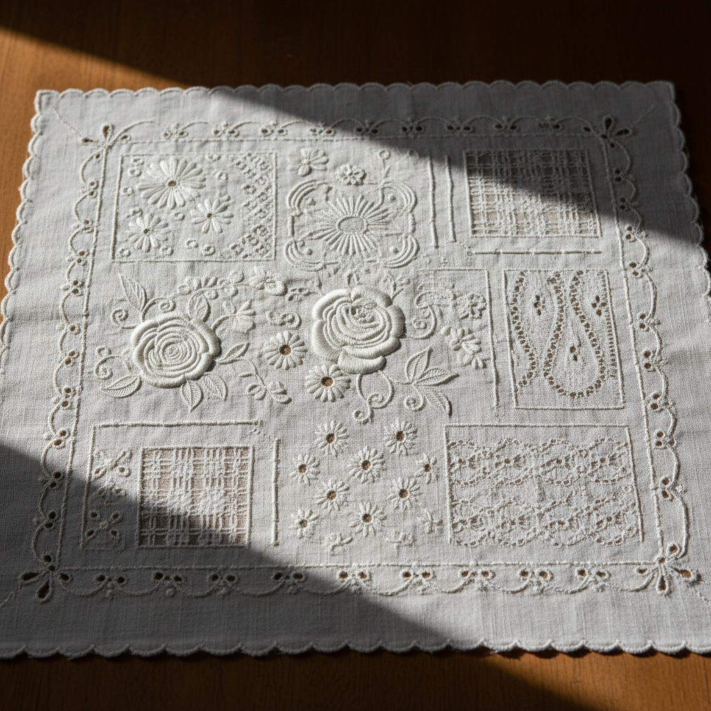

# Whitework Art 白色刺绣艺术

> "Whitework is embroidery distilled to its purest essence — white thread on white fabric, where all drama comes from texture, relief, and the play of light and shadow. Without color to guide the eye, the viewer must look more closely, discovering raised surfaces, pulled holes, padded shapes, and cut edges that create a world of subtle beauty visible only to the attentive observer." — Unknown

## 概述

白色刺绣艺术（Whitework Art）是所有使用白色线在白色织物上进行刺绣的技法的总称——包括各种通过纹理、浮雕、镂空和拉线创造图案的白色刺绣形式。白色刺绣是刺绣艺术中最精致和最考验技艺的类别之一，完全依赖光影和纹理来表现美感。

白色刺绣艺术的实践包括：1）Mountmellick——爱尔兰的浮雕白色刺绣；2）Broderie anglaise——英式镂空绣；3）Schwalm——德国施瓦尔姆白色刺绣；4）Ayrshire——苏格兰艾尔郡白色刺绣；5）Dresden——德累斯顿拉线绣；6）Shadow work——影绣；7）Candlewicking——烛芯绣；8）当代白色刺绣——将传统技法与现代设计结合的创作。

## 核心特征

| 特征 | 描述 |
|------|------|
| 单色 | 白线白布的纯粹 |
| 纹理 | 完全依赖纹理表现 |
| 光影 | 光影是唯一的色彩 |
| 精致 | 极其精致的工艺 |
| 多样 | 包含多种子技法 |
| 优雅 | 极致优雅的美感 |

## 视觉特征

- **纯白**：白色的纯粹和宁静
- **浮雕**：凸起的立体纹理
- **镂空**：精美的镂空效果
- **光影**：微妙的光影变化
- **精细**：极其精细的针法
- **素雅**：极致素雅的美感

## 代表作品

| 作品 | 艺术家/文化 | 年代 | 意义 |
|------|-------------|------|------|
| *Ayrshire christening gowns* | 苏格兰 | 19世纪 | 洗礼袍 |
| *Mountmellick work* | 爱尔兰 | 19世纪 | 蒙特梅利克绣 |
| *Broderie anglaise* | 英国 | 19世纪 | 英式镂空绣 |
| *Schwalm embroidery* | 德国 | 17世纪至今 | 施瓦尔姆绣 |
| *Contemporary whitework* | 当代 | 当代 | 当代白色刺绣 |

## 历史时间线

| 时期 | 事件 |
|------|------|
| 中世纪 | 教会白色刺绣的发展 |
| 16-17世纪 | 各地白色刺绣传统的形成 |
| 18-19世纪 | 白色刺绣的黄金时代 |
| 20世纪 | 机器生产对手工的冲击 |
| 当代 | 白色刺绣的艺术复兴 |

## 中国语境

白色刺绣艺术在中国有独特的表现形式。中国传统的"白绣"（白线绣）在一些地区有悠久的传统——特别是在婴儿服饰和嫁妆中。中国的抽纱和镂空绣本质上属于白色刺绣的范畴——以白线在白布上创造图案。中国苗族的一些刺绣传统中有白色刺绣的元素——在白色或浅色底布上用白线绣出精美的纹理图案。中国当代的一些刺绣艺术家开始探索白色刺绣——将其作为一种极简主义的表达方式。中国的婚纱和高级定制服装中，白色刺绣是重要的装饰元素——将中国传统刺绣技法与西方白色刺绣美学结合。中国的一些刺绣教育机构开始教授西方白色刺绣技法——作为拓展刺绣技能的选择。

## AI生成概念图

## 与其他风格的关系

- **Drawn Thread Work** → 抽线绣
- **Hardanger** → 哈当厄尔刺绣
- **Cutwork** → 镂空绣
- **Broderie Anglaise** → 英式镂空绣
- **Shadow Work** → 影绣
- **Mountmellick** → 蒙特梅利克绣

---

*浮光艺志 | Chronicle of Artistry*
