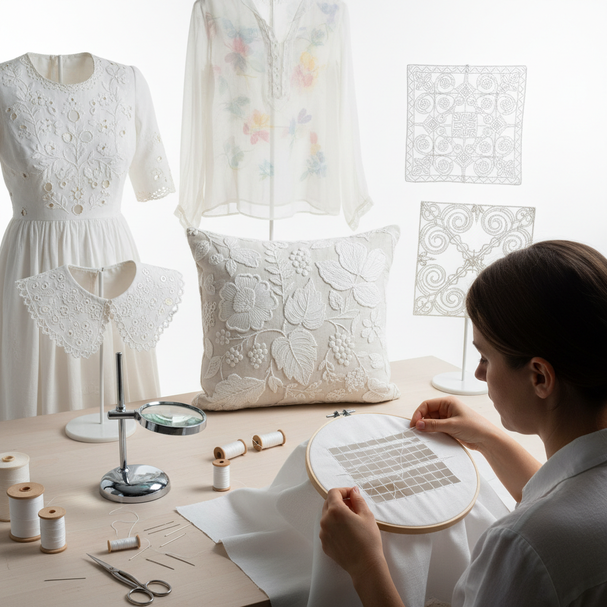

# Whitework 白色刺绣

> "Whitework is embroidery distilled to its essence — white thread on white fabric, where the only language is texture, where light and shadow replace color, where pulled threads create transparency and satin stitches create opacity, proving that limitation is the mother of infinite beauty." — Unknown

## 概述

白色刺绣（Whitework）是一个总称，涵盖所有使用白色线在白色织物上进行的刺绣技法。白色刺绣完全依靠纹理、透明度和光影效果来创造视觉美感——没有颜色的帮助，只有针法的变化。白色刺绣的主要类型包括：

- **Broderie Anglaise**（英式镂空绣）：在织物上剪出小孔并用扣眼针法包边
- **Mountmellick**（蒙特梅利克绣）：使用粗棉线在棉缎上创造高浮雕效果
- **Schwalm**（施瓦尔姆绣）：德国传统的抽丝和表面刺绣结合
- **Dresden**（德累斯顿绣）：极其精细的抽丝绣
- **Ayrshire**（艾尔郡绣）：苏格兰的精细白色刺绣
- **Shadow Work**（影绣）：在透明织物背面刺绣产生影子效果

白色刺绣在18-19世纪的欧洲达到鼎盛——用于婴儿洗礼服、婚纱、内衣和桌布。

## 核心特征

| 特征 | 描述 |
|------|------|
| 白色 | 白线白布 |
| 纹理 | 依靠纹理表现 |
| 光影 | 光影创造效果 |
| 透明 | 抽丝的透明效果 |
| 精细 | 极其精细的工艺 |
| 纯净 | 纯净的美学 |

## 视觉特征

- **纯白**：纯白的优雅
- **纹理**：丰富的纹理变化
- **光影**：光影的戏剧效果
- **透明**：透明与不透明的对比
- **精细**：极其精细的细节
- **典雅**：古典的典雅气质

## 代表作品

| 作品 | 艺术家 | 年代 | 意义 |
|------|--------|------|------|
| *Ayrshire christening gowns* | 苏格兰工匠 | 19世纪 | 艾尔郡洗礼服 |
| *Broderie Anglaise* | 欧洲工匠 | 18-19世纪 | 英式镂空绣 |
| *Mountmellick embroidery* | 爱尔兰工匠 | 19世纪 | 蒙特梅利克绣 |
| *Schwalm embroidery* | 德国工匠 | 传统 | 施瓦尔姆绣 |
| *Contemporary whitework* | Various | 当代 | 当代白色刺绣 |

## 历史时间线

| 时期 | 事件 |
|------|------|
| 中世纪 | 白色刺绣在欧洲的早期发展 |
| 16-17世纪 | 各地方风格的形成 |
| 18-19世纪 | 白色刺绣的鼎盛时期 |
| 20世纪 | 机器生产的冲击 |
| 当代 | 白色刺绣的艺术化复兴 |

## 中国语境

白色刺绣在中国有相关的传统——中国的"抽纱"（drawn thread work）和"雕绣"（cutwork）属于白色刺绣的范畴。汕头抽纱是国家级非物质文化遗产——使用白色线在白色织物上创造透空效果。中国的温州瓯绣中也有白色刺绣的传统。当代中国的婚纱和高端内衣设计中使用白色刺绣技法。中国的一些刺绣教育机构教授各种白色刺绣技法。

## AI生成概念图

## 与其他风格的关系

- **Embroidery** → 刺绣
- **Needle Lace** → 针绣蕾丝
- **Drawn Thread Work** → 抽丝绣
- **Cutwork** → 雕绣
- **Hardanger** → 哈当厄尔绣
- **Broderie Anglaise** → 英式镂空绣

---

*浮光艺志 | Chronicle of Artistry*
