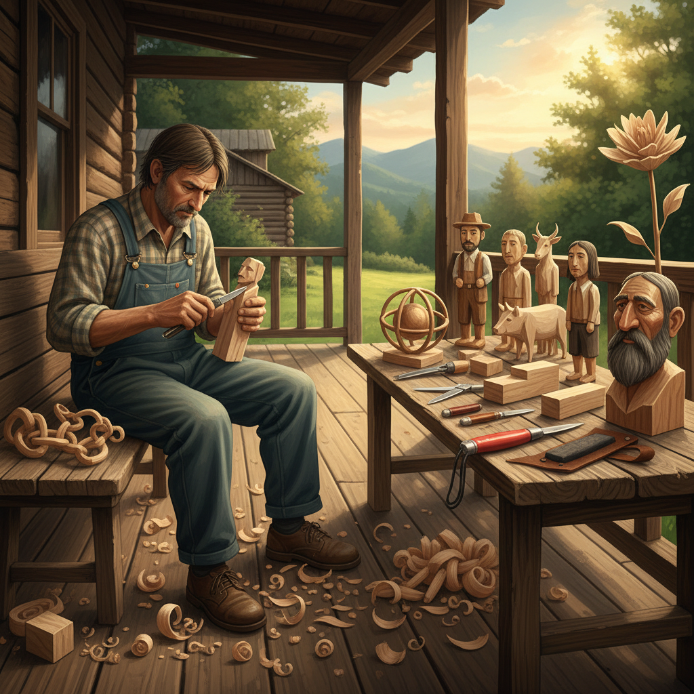

# Whittling Art 削木雕刻

> "Whittling is the most democratic of arts — requiring nothing more than a sharp knife and a piece of wood, the shavings curling away to reveal a figure that was always hiding inside, each cut a small decision that cannot be undone, teaching patience and presence one slice at a time on a porch, a park bench, or wherever hands need something meaningful to do." — Unknown

## 概述

削木雕刻（Whittling）是一种仅使用小刀（通常是折叠刀或专用削木刀）从一块木头上逐步削去木屑来创造形状和雕塑的木雕艺术。Whittling是最简单、最原始的木雕形式——不需要锤子、凿子或电动工具，只需要一把锋利的刀和一块合适的木头。

Whittling有着深厚的民间传统——在北欧（特别是斯堪的纳维亚）、北美阿巴拉契亚山区和许多农村文化中，Whittling是一种普遍的消遣活动和民间艺术。传统的Whittling题材包括：链条（从一块木头削出连环链条）、球在笼中（笼子里的自由滚动的球）、人物、动物、哨子等。当代Whittling已经发展出极其精细的艺术作品——有些艺术家能够用小刀削出令人难以置信的细节。

## 核心特征

| 特征 | 描述 |
|------|------|
| 小刀 | 仅使用小刀 |
| 减法 | 纯粹的减法雕刻 |
| 手持 | 手持木块操作 |
| 简单 | 工具极其简单 |
| 民间 | 民间艺术传统 |
| 便携 | 随时随地可做 |

## 视觉特征

- **刀痕**：可见的刀削痕迹
- **圆润**：圆润的形态
- **小型**：通常为小型作品
- **质朴**：质朴的民间风格
- **木色**：天然木色
- **简洁**：简洁的造型

## 代表作品

| 作品 | 艺术家 | 年代 | 意义 |
|------|--------|------|------|
| *Appalachian whittled figures* | 阿巴拉契亚工匠 | 传统 | 阿巴拉契亚削木人物 |
| *Scandinavian flat-plane carving* | 北欧工匠 | 传统 | 北欧平面削木 |
| *Chain and ball-in-cage* | 民间工匠 | 传统 | 链条和笼中球 |
| *Caricature whittling* | Various | 当代 | 漫画风格削木 |
| *Contemporary fine whittling* | Various | 当代 | 当代精细削木 |

## 历史时间线

| 时期 | 事件 |
|------|------|
| 史前 | 削木的起源 |
| 中世纪 | 北欧削木传统的形成 |
| 18-19世纪 | 美国阿巴拉契亚削木传统 |
| 20世纪 | 削木作为休闲爱好的普及 |
| 当代 | 削木的艺术化发展 |

## 中国语境

削木雕刻在中国有相关的传统——中国民间的木雕玩具（如木偶、陀螺、木剑）传统上就是用刀削制的。中国的根雕传统中也有类似Whittling的手工削制过程。当代中国的木工爱好者通过网络学习西方Whittling技法。中国的一些户外和手工社区推广Whittling作为一种放松和创意活动。中国传统的竹雕中也有类似的用刀削制的技法。

## AI生成概念图

## 与其他风格的关系

- **Wood Carving** → 木雕
- **Chip Carving** → 切片雕刻
- **Folk Art** → 民间艺术
- **Sculpture** → 雕塑
- **Knife Making** → 刀具制作
- **Relief Carving** → 浮雕

---

*浮光艺志 | Chronicle of Artistry*
