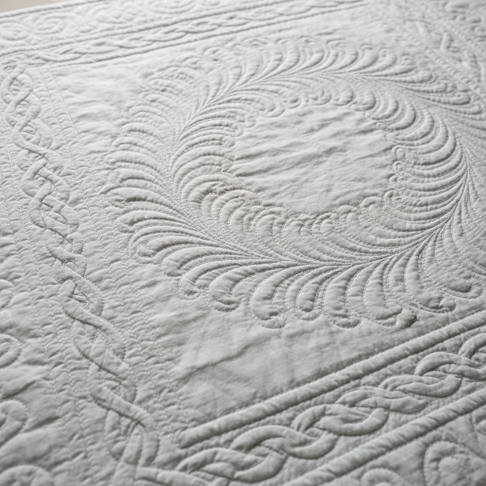

# Whole Cloth Quilting Art 整布绗缝艺术

> "Whole cloth quilting is drawing with thread on a single expanse of fabric — no patchwork, no appliqué, just the interplay of stitched line and unstitched ground creating pattern through texture alone. The quilter's needle traces feathers, cables, and medallions across the cloth, and the batting beneath rises between the stitched channels like bread between scoring lines, transforming a plain surface into a landscape of light and shadow." — Unknown

## 概述

整布绗缝艺术（Whole Cloth Quilting Art）是一种在单块完整织物上通过绗缝针法创造图案的纺织技法——不使用拼布或贴布，完全依靠缝线的图案和填充物的起伏来创造视觉效果。整布绗缝是绗缝艺术中最纯粹的形式，以其精细的针法图案和光影效果著称。

整布绗缝艺术的实践包括：1）羽毛图案（Feather Quilting）——经典的羽毛卷曲图案；2）绳索图案（Cable Quilting）——扭转的绳索图案；3）奖章图案（Medallion）——中心放射的圆形图案；4）钻石网格（Diamond Grid）——交叉的菱形网格；5）自由曲线——自由流动的曲线图案；6）北英格兰传统——达勒姆和威尔士的整布绗缝传统；7）当代整布绗缝——将传统技法与现代设计结合的创作。

## 核心特征

| 特征 | 描述 |
|------|------|
| 整布 | 单块完整织物 |
| 针法 | 纯粹的针法图案 |
| 光影 | 依靠光影显现 |
| 纹理 | 丰富的表面纹理 |
| 精细 | 极其精细的针脚 |
| 传统 | 英国北部传统 |

## 视觉特征

- **纹理**：丰富的绗缝纹理
- **光影**：光影创造的图案
- **流动**：流动的曲线图案
- **精细**：精细均匀的针脚
- **单色**：单色的纯净美学
- **立体**：微妙的立体起伏

## 代表作品

| 作品 | 艺术家/文化 | 年代 | 意义 |
|------|-------------|------|------|
| *Durham quilts* | 英国北部 | 19世纪 | 达勒姆整布绗缝 |
| *Welsh quilts* | 威尔士 | 19世纪 | 威尔士整布绗缝 |
| *Amish whole cloth* | 美国 | 19世纪 | 阿米什整布绗缝 |
| *White-on-white quilts* | 美国 | 传统 | 白色整布绗缝 |
| *Contemporary whole cloth* | 国际 | 当代 | 当代整布绗缝 |

## 历史时间线

| 时期 | 事件 |
|------|------|
| 中世纪 | 绗缝技法的早期发展 |
| 18世纪 | 英国北部整布绗缝传统的形成 |
| 19世纪 | 达勒姆和威尔士绗缝的黄金时代 |
| 20世纪 | 绗缝复兴运动 |
| 当代 | 整布绗缝的艺术化发展 |

## 中国语境

整布绗缝与中国的传统绗缝有直接的关联。中国的传统棉被绗缝——在整块布面上缝制图案固定棉花——是整布绗缝的一种形式。中国北方的绗缝传统中，在棉袄和棉被上缝制菱形或方形网格——是最基本的整布绗缝。中国的刺绣传统中，满绣（全面覆盖的刺绣）——与整布绗缝的全面覆盖理念相似。中国当代的绗缝艺术家将传统绗缝与现代设计结合——创造出具有当代感的整布绗缝作品。中国的家纺产业中，绗缝作为重要的工艺——在被褥和家居用品中广泛应用。

## AI生成概念图

## 与其他风格的关系

- **Trapunto** → 浮雕绗缝
- **Boutis** → 普罗旺斯白绣
- **Patchwork** → 拼布
- **Sashiko** → 刺子绣
- **Textile Art** → 纺织艺术
- **Quilting** → 绗缝

---

*浮光艺志 | Chronicle of Artistry*
