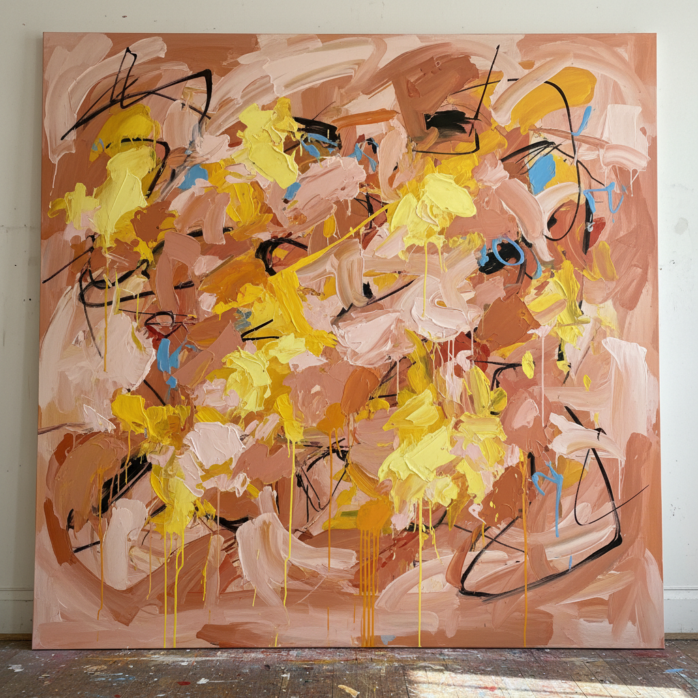

# Willem de Kooning 威廉·德·库宁

> **流派**: 抽象表现主义 · 行动绘画  
> **时期**: 1904–1997 荷兰/美国  
> **关键词**: 狂暴笔触、女性形象、肉色与粉色、能量爆发

## 概述

威廉·德·库宁是抽象表现主义运动中最具争议性的人物之一。他拒绝在具象与抽象之间做出选择，以狂暴的笔触和肉感的色彩创造出一种介于两者之间的绘画语言。他的"女人"系列将传统女性形象撕碎又重组，至今仍引发激烈讨论。

## 视觉特征

- **狂暴笔触**: 宽大的画笔以极大力量扫过画布
- **肉色调**: 粉色、肉色、黄色构成独特的身体感
- **模糊边界**: 形象在出现与消失之间不断振荡
- **多层覆盖**: 反复涂抹、刮除、再覆盖的痕迹
- **空间扭曲**: 没有固定的上下前后，空间不断流动

## 代表作品

- 《女人 I》(1950–52)
- 《挖掘》(1950)
- 《粉色天使》(1945)
- 《无题 XI》(1975)

## 历史影响

德·库宁证明了抽象与具象不是非此即彼的选择，绘画可以同时是两者。他对身体性和物质性的强调影响了后来的新表现主义和当代绘画。

## 相关风格

- [Abstract Expressionism 抽象表现主义](abstract-expressionism.md)
- [Franz Kline 弗朗茨·克莱因](franz-kline.md)
- [Francis Bacon 弗朗西斯·培根](francis-bacon.md)
