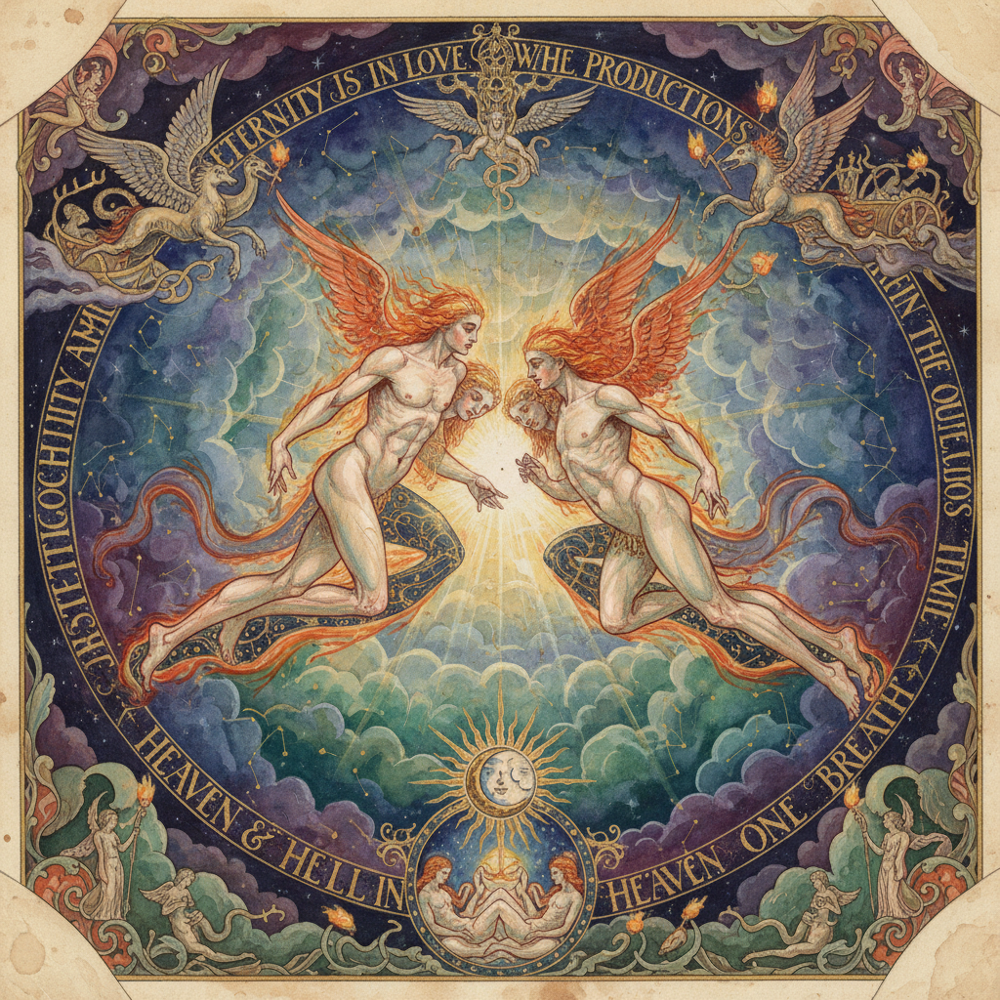

# William Blake 威廉·布莱克

> "To see a World in a Grain of Sand, And a Heaven in a Wild Flower." — William Blake

## 概述

威廉·布莱克（William Blake，1757–1827）是英国诗人、画家和版画家，浪漫主义的先驱和神秘主义的视觉天才。他以独特的"照明印刷"技术和充满幻象的水彩画闻名——将诗歌与图像融为一体，创造了一个充满天使、恶魔和宇宙力量的个人神话世界。

## 核心特征

| 特征 | 描述 |
|------|------|
| 幻象世界 | 天使、恶魔、宇宙力量 |
| 诗画合一 | 文字与图像的有机融合 |
| 肌肉人体 | 米开朗基罗式的强壮身体 |
| 火焰线条 | 燃烧般的轮廓线 |
| 个人神话 | 自创的宇宙观和神话体系 |
| 照明印刷 | 独创的彩色版画技术 |

## 代表作品

| 作品 | 年代 | 意义 |
|------|------|------|
| *The Ancient of Days* | 1794 | 创世者的标志性形象 |
| *The Great Red Dragon* | 1805–10 | 启示录的恐怖崇高 |
| *Songs of Innocence and Experience* | 1789–94 | 诗画合一的杰作 |
| *Newton* | 1795 | 理性主义的批判 |

## AI生成概念图

## 与其他风格的关系

- **Romanticism** → 英国浪漫主义的先驱
- **Symbolism** → 预示了象征主义
- **Visionary Art** → 幻象艺术的源头
- **Art Nouveau** → 影响了新艺术运动的线条
