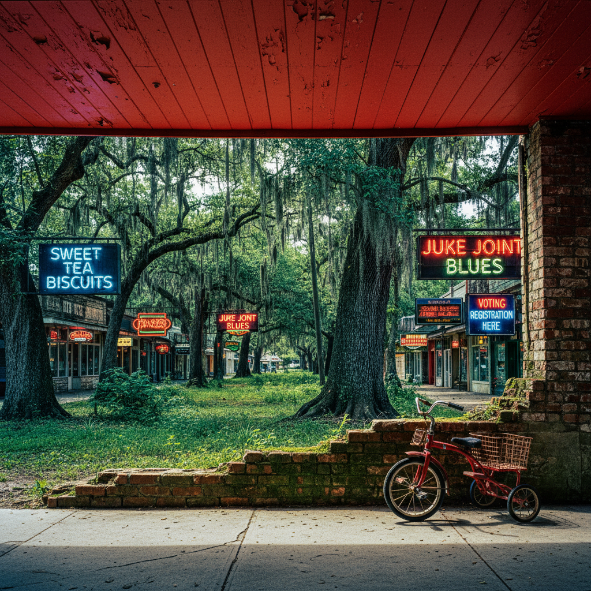

# William Eggleston 威廉·埃格尔斯顿

> **时期：** 1939–至今  
> **关键词：** 彩色摄影之父、美国南方、染料转印、民主森林

## 概述

William Eggleston 被誉为"彩色摄影之父"，1976年在MoMA的个展标志着彩色摄影正式进入艺术殿堂。他拍摄美国南方的日常物品——天花板、购物车、三轮车、霓虹灯——以一种看似随意实则精确的方式，揭示平凡事物中隐藏的色彩戏剧。

## 风格特征

- **染料转印**：饱和、浓郁的色彩质感
- **民主视角**：任何事物都值得被拍摄，无等级之分
- **美国南方**：孟菲斯及周边的日常景观
- **倾斜构图**：略微倾斜或偏离中心的取景
- **色彩主导**：颜色本身成为照片的主题

## 代表作品

- *The Red Ceiling*（1973）
- *Tricycle*（1970）
- *The Democratic Forest*（1989）
- *Los Alamos*（1965–1974）

## 概念图

