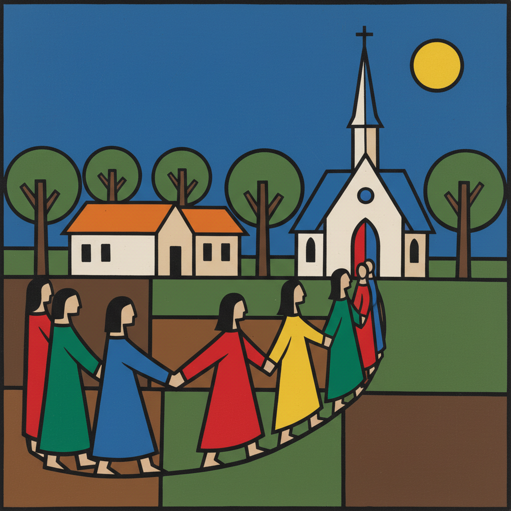

# William H. Johnson 威廉·H·约翰逊

> **时期：** 1901–1970  
> **关键词：** 原始主义简化、民间现代主义、色彩平面、黑人生活史诗

## 概述

William H. Johnson 是美国画家，早期在欧洲以表现主义风格获得认可，1938年回到美国后彻底转变风格，采用刻意简化的"原始主义"手法描绘非裔美国人的生活——从南方农村到北方城市，从教堂到军营。他的晚期风格以大胆的平面色彩和儿童画般的直接性著称。

## 风格特征

- **刻意简化**：人物和场景被简化为基本形状和轮廓线
- **平面色彩**：大面积的纯色填充，拒绝明暗渐变
- **叙事系列**：以系列形式记录黑人生活的各个方面
- **民间艺术精神**：借鉴民间艺术的直接性和装饰性
- **双重风格**：早期欧洲表现主义与晚期美国民间现代主义形成鲜明对比

## 代表作品

- *Jitterbugs*系列（约1941–1942）
- *Going to Church*（约1940–1941）
- *Fighters for Freedom*系列（约1945）
- *Café*（约1939–1940）

## 历史意义

Johnson 的风格转变是20世纪美国艺术中最戏剧性的之一——从学院派表现主义到民间现代主义。他的晚期作品预示了后来的新表现主义和涂鸦艺术，是黑人日常生活最完整的视觉编年史之一。

## 概念图

