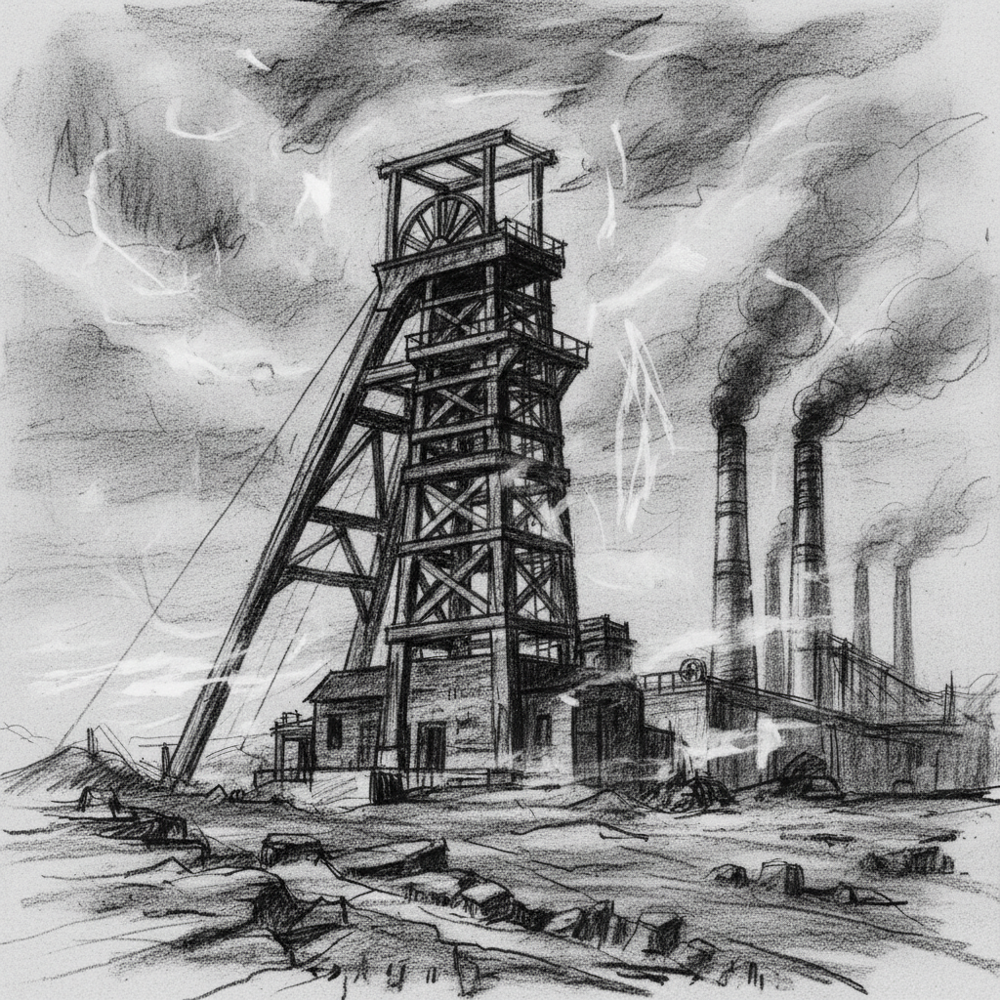

# William Kentridge 威廉·肯特里奇

> **流派**: 当代艺术 · 动画绘画 · 装置艺术  
> **时期**: 1955–至今 南非  
> **关键词**: 炭笔动画、擦除与重绘、种族隔离、记忆与遗忘

## 概述

威廉·肯特里奇是南非最重要的当代艺术家。他发明了独特的"擦除动画"技法——用炭笔在纸上绘画，拍摄一帧，然后部分擦除再重新绘制，如此反复。最终的动画保留了所有擦除的痕迹，画面始终带着幽灵般的残影。这种技法完美隐喻了南非种族隔离的历史——过去从未真正消失，它的痕迹永远留在当下。

## 视觉特征

- **炭笔与色粉**: 黑白为主，偶尔加入蓝色或红色
- **擦除痕迹**: 画面上可见反复修改的灰色残影
- **工业景观**: 矿山、工厂、荒原的南非风景
- **剪影人物**: 行走的黑色人形剪影
- **拼贴元素**: 旧书页、地图、报纸碎片

## 代表作品

- 《约翰内斯堡，仅次于巴黎的最伟大城市》(1989)
- 《费利克斯在流亡中》(Felix in Exile, 1994)
- 《历史的重负》(History of the Main Complaint, 1996)
- 《鼻子》(The Nose, 2010) — 歌剧

## 历史影响

肯特里奇将绘画、动画、戏剧和政治融为一体，创造了一种全新的叙事艺术形式。他的"擦除"美学为理解创伤记忆、历史正义和时间的不可逆性提供了视觉语言。

## 相关风格

- [Kara Walker 卡拉·沃克](kara-walker.md)
- [Animation Art 动画艺术](animation-art.md)
- [Charcoal Drawing 炭笔画](charcoal-drawing.md)
