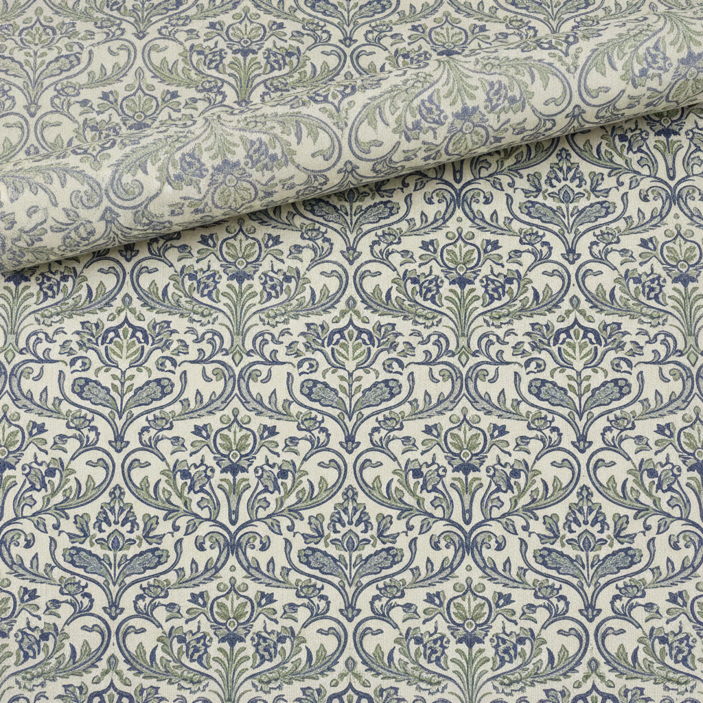

# William Morris 威廉·莫里斯

> "Have nothing in your houses that you do not know to be useful, or believe to be beautiful." — William Morris

## 概述

威廉·莫里斯（William Morris，1834–1896）是英国设计师、诗人和社会活动家，艺术与工艺运动（Arts and Crafts Movement）的创始人。他以精美的壁纸、织物和书籍设计闻名——将中世纪手工艺的精神与自然界的有机形式融合，反对工业化的粗制滥造，主张艺术应融入日常生活。

## 核心特征

| 特征 | 描述 |
|------|------|
| 自然纹样 | 花卉、藤蔓、鸟类的重复图案 |
| 手工精神 | 反对机器生产的工艺复兴 |
| 中世纪理想 | 哥特式的浪漫回归 |
| 整体设计 | 从壁纸到家具的统一美学 |
| 平面装饰 | 二维化的自然形式 |
| 社会理想 | 艺术为大众服务 |

## 代表作品

| 作品 | 年代 | 意义 |
|------|------|------|
| *Strawberry Thief* | 1883 | 最著名的织物设计 |
| *Kelmscott Chaucer* | 1896 | 书籍设计的巅峰 |
| *Trellis* | 1862 | 第一款壁纸设计 |
| *Red House* | 1859 | 艺术与工艺运动的建筑宣言 |

## AI生成概念图

## 与其他风格的关系

- **Arts and Crafts** → 艺术与工艺运动创始人
- **Pre-Raphaelite** → 前拉斐尔派的盟友
- **Art Nouveau** → 直接影响了新艺术运动
- **Bauhaus** → 设计改革的精神先驱
