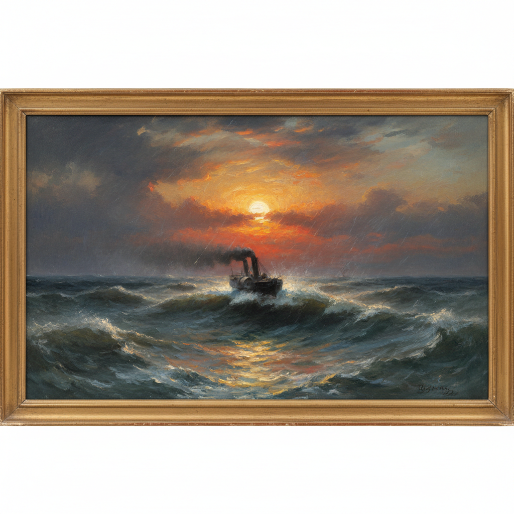

# J.M.W. Turner 透纳

> "The sun is God." — J.M.W. Turner

## 概述

约瑟夫·马洛德·威廉·透纳（J.M.W. Turner，1775–1851）是英国浪漫主义画家，被誉为"光之画家"。他以描绘光线、大气和自然力量的壮丽风景闻名——从暴风雨中的海洋到燃烧的日落，用越来越抽象的笔触将自然的崇高转化为纯粹的色彩与光的交响曲，预示了印象派的诞生。

## 核心特征

| 特征 | 描述 |
|------|------|
| 光的崇拜 | 阳光穿透大气的神圣效果 |
| 大气透视 | 雾气、蒸汽、烟雾的朦胧 |
| 自然力量 | 暴风雨、海浪、火焰的崇高 |
| 色彩解放 | 越来越抽象的色彩实验 |
| 速度与现代 | 蒸汽火车和轮船的新时代 |
| 水彩技法 | 油画中融入水彩的透明感 |

## 代表作品

| 作品 | 年代 | 意义 |
|------|------|------|
| *The Fighting Temeraire* | 1839 | 旧时代的挽歌 |
| *Rain, Steam and Speed* | 1844 | 现代性的视觉宣言 |
| *Snow Storm: Steam-Boat off a Harbour's Mouth* | 1842 | 自然力量的漩涡 |
| *The Slave Ship* | 1840 | 崇高与道德的交汇 |

## AI生成概念图

## 与其他风格的关系

- **Romanticism** → 英国浪漫主义的巅峰
- **Impressionism** → 预示了印象派的光色实验
- **Abstract Art** → 晚期作品接近纯抽象
- **Constable** → 同代英国风景画家
